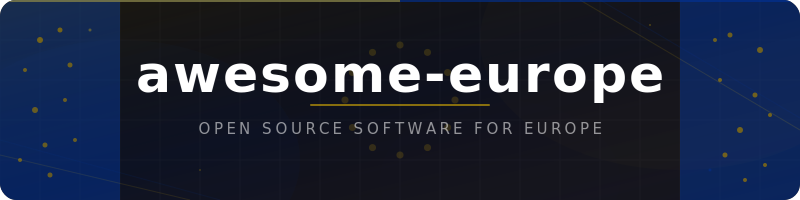

<div align="center">
  
  <br><br>
  <a href="https://awesome.re"></a>
  <br><br>
  <p>A curated list of open source software that provides support specifically for Europe — its institutions, regulations, standards, and cross-border infrastructure.</p>
</div>

## Contents

<!--lint disable awesome-list-item-->

- [Accessibility](#accessibility)
- [Agriculture and Food Safety](#agriculture-and-food-safety)
- [Anti-Money Laundering and Compliance](#anti-money-laundering-and-compliance)
- [Central Banking and Monetary Policy](#central-banking-and-monetary-policy)
- [Country-Specific Awesome Lists](#country-specific-awesome-lists)
- [Cybersecurity](#cybersecurity)
- [Democracy and Governance](#democracy-and-governance)
- [Digital Regulation](#digital-regulation)
- [Education and Research](#education-and-research)
- [eIDAS and Digital Identity](#eidas-and-digital-identity)
- [Electronic Invoicing](#electronic-invoicing)
- [Energy and Electricity](#energy-and-electricity)
- [European Utilities](#european-utilities)
- [Finance and Capital Markets](#finance-and-capital-markets)
- [GDPR and Data Protection](#gdpr-and-data-protection)
- [Geospatial and Earth Observation](#geospatial-and-earth-observation)
- [Health and Pharmaceuticals](#health-and-pharmaceuticals)
- [Intellectual Property](#intellectual-property)
- [Interoperability and Digital Infrastructure](#interoperability-and-digital-infrastructure)
- [Legal and Legislation](#legal-and-legislation)
- [Open Data and Statistics](#open-data-and-statistics)
- [Payments and Banking](#payments-and-banking)
- [Public Procurement](#public-procurement)
- [Space and Aviation](#space-and-aviation)
- [Sustainability and ESG](#sustainability-and-esg)
- [Transport and Mobility](#transport-and-mobility)
- [VAT, Customs, and Trade](#vat-customs-and-trade)

<!--lint enable awesome-list-item-->

**Legend:** Each entry shows:  stars ·  activity ·  ·  · [](https://eur-lex.europa.eu/eli/reg/2016/679/oj) EU regulation · ([Demo](https://github.com/GeiserX/awesome-europe)) live demo. All badges are clickable and auto-update. EU tags link to official regulation pages.

## Accessibility

European Accessibility Act (EAA), EN 301 549, EU Web Accessibility Directive, and accessibility conformance testing.

- [ACT Rules](https://github.com/act-rules/act-rules.github.io) [](https://github.com/act-rules/act-rules.github.io/stargazers) [](https://github.com/act-rules/act-rules.github.io/commits/develop) [](https://github.com/act-rules/act-rules.github.io) [](https://github.com/act-rules/act-rules.github.io/blob/develop/LICENSE.md) [](https://eur-lex.europa.eu/eli/dir/2019/882/oj) [](https://www.etsi.org/deliver/etsi_en/301500_301599/301549/) - Community-maintained accessibility conformance testing rules used to harmonize EU EN 301 549 compliance evaluation.
- [Alfa](https://github.com/Siteimprove/alfa) [](https://github.com/Siteimprove/alfa/stargazers) [](https://github.com/Siteimprove/alfa/commits/main) [](https://github.com/Siteimprove/alfa) [](https://github.com/Siteimprove/alfa/blob/main/LICENSE.md) [](https://eur-lex.europa.eu/eli/dir/2019/882/oj) [](https://www.etsi.org/deliver/etsi_en/301500_301599/301549/) - Standards-based accessibility conformance testing suite implementing ACT Rules for EN 301 549 and WCAG.
- [BIK Web Test](https://github.com/BIK-BITV/BIK-Web-Test) [](https://github.com/BIK-BITV/BIK-Web-Test/stargazers) [](https://github.com/BIK-BITV/BIK-Web-Test/commits/main) [](https://github.com/BIK-BITV/BIK-Web-Test) [](https://github.com/BIK-BITV/BIK-Web-Test) [](https://eur-lex.europa.eu/eli/dir/2019/882/oj) [](https://www.etsi.org/deliver/etsi_en/301500_301599/301549/) - Test procedures for evaluating web accessibility against WCAG 2.1 and EN 301 549 criteria.
- [RAAM](https://github.com/accessibility-luxembourg/ReferentielAccessibiliteMobile) [](https://github.com/accessibility-luxembourg/ReferentielAccessibiliteMobile/stargazers) [](https://github.com/accessibility-luxembourg/ReferentielAccessibiliteMobile/commits/main) [](https://github.com/accessibility-luxembourg/ReferentielAccessibiliteMobile) [](https://github.com/accessibility-luxembourg/ReferentielAccessibiliteMobile/blob/main/LICENSE.md) [](https://eur-lex.europa.eu/eli/dir/2019/882/oj) [](https://www.etsi.org/deliver/etsi_en/301500_301599/301549/) - Mobile app accessibility assessment framework covering all EN 301 549 criteria.
- [RAWEB](https://github.com/accessibility-luxembourg/ReferentielAccessibiliteWeb) [](https://github.com/accessibility-luxembourg/ReferentielAccessibiliteWeb/stargazers) [](https://github.com/accessibility-luxembourg/ReferentielAccessibiliteWeb/commits/main) [](https://github.com/accessibility-luxembourg/ReferentielAccessibiliteWeb) [](https://github.com/accessibility-luxembourg/ReferentielAccessibiliteWeb) [](https://eur-lex.europa.eu/eli/dir/2019/882/oj) [](https://www.etsi.org/deliver/etsi_en/301500_301599/301549/) - Web accessibility assessment framework covering all EN 301 549 criteria for website evaluation.
- [SimplA11yMonit](https://github.com/accessibility-luxembourg/simplA11yMonit) [](https://github.com/accessibility-luxembourg/simplA11yMonit/stargazers) [](https://github.com/accessibility-luxembourg/simplA11yMonit/commits/master) [](https://github.com/accessibility-luxembourg/simplA11yMonit) [](https://github.com/accessibility-luxembourg/simplA11yMonit/blob/master/LICENSE) [](https://eur-lex.europa.eu/eli/dir/2019/882/oj) - Tool implementing the EU simplified accessibility monitoring method from Commission Decision 2018/1524.
- [SimplA11yPDFCrawler](https://github.com/accessibility-luxembourg/simplA11yPDFCrawler) [](https://github.com/accessibility-luxembourg/simplA11yPDFCrawler/stargazers) [](https://github.com/accessibility-luxembourg/simplA11yPDFCrawler/commits/main) [](https://github.com/accessibility-luxembourg/simplA11yPDFCrawler) [](https://github.com/accessibility-luxembourg/simplA11yPDFCrawler/blob/main/LICENSE) [](https://eur-lex.europa.eu/eli/dir/2019/882/oj) - Crawler that downloads PDFs from websites and analyses their accessibility against EU standards.

## Agriculture and Food Safety

EFSA, Common Agricultural Policy (CAP), RASFF, EU food labeling, and pan-European agricultural data.

- [EFSA Catalogue Browser](https://github.com/openefsa/catalogue-browser) [](https://github.com/openefsa/catalogue-browser/stargazers) [](https://github.com/openefsa/catalogue-browser/commits/master) [](https://github.com/openefsa/catalogue-browser) [](https://github.com/openefsa/catalogue-browser/blob/master/LICENSE) - Java application for browsing EFSA food safety catalogues and FoodEx2 classifications.
- [JRC Checks by Monitoring](https://github.com/ec-jrc/cbm) [](https://github.com/ec-jrc/cbm/stargazers) [](https://github.com/ec-jrc/cbm/commits/main) [](https://github.com/ec-jrc/cbm) [](https://github.com/ec-jrc/cbm/blob/main/LICENSE) [](https://agriculture.ec.europa.eu/common-agricultural-policy_en) [](https://www.copernicus.eu/) - JRC toolkit for CAP area-based checks by monitoring using Copernicus Sentinel data.
- [Nutri-Score Calculator](https://github.com/food-nutrients/nutri-score) [](https://github.com/food-nutrients/nutri-score/stargazers) [](https://github.com/food-nutrients/nutri-score/commits/master) [](https://github.com/food-nutrients/nutri-score) [](https://github.com/food-nutrients/nutri-score) [](https://eur-lex.europa.eu/eli/reg/2011/1169/oj) - Library for calculating EU Nutri-Score food nutrition labels.
- [Open Food Facts Folksonomy](https://github.com/openfoodfacts/folksonomy_api) [](https://github.com/openfoodfacts/folksonomy_api/stargazers) [](https://github.com/openfoodfacts/folksonomy_api/commits/main) [](https://github.com/openfoodfacts/folksonomy_api) [](https://github.com/openfoodfacts/folksonomy_api/blob/main/LICENSE) - REST API for the Open Food Facts folksonomy engine for tagging food products.
- [Open Food Facts Mobile](https://github.com/openfoodfacts/smooth-app) [](https://github.com/openfoodfacts/smooth-app/stargazers) [](https://github.com/openfoodfacts/smooth-app/commits/develop) [](https://github.com/openfoodfacts/smooth-app) [](https://github.com/openfoodfacts/smooth-app/blob/develop/LICENSE) [](https://eur-lex.europa.eu/eli/reg/2011/1169/oj) - Mobile application for scanning and contributing to the food products database with EU Nutri-Score support.
- [Open Food Facts Python](https://github.com/openfoodfacts/openfoodfacts-python) [](https://github.com/openfoodfacts/openfoodfacts-python/stargazers) [](https://github.com/openfoodfacts/openfoodfacts-python/commits/develop) [](https://github.com/openfoodfacts/openfoodfacts-python) [](https://github.com/openfoodfacts/openfoodfacts-python/blob/develop/LICENSE) [](https://eur-lex.europa.eu/eli/reg/2011/1169/oj) - Python package for accessing the Open Food Facts database including EU Nutri-Score and food labeling data.
- [Open Food Facts Server](https://github.com/openfoodfacts/openfoodfacts-server) [](https://github.com/openfoodfacts/openfoodfacts-server/stargazers) [](https://github.com/openfoodfacts/openfoodfacts-server/commits/main) [](https://github.com/openfoodfacts/openfoodfacts-server) [](https://github.com/openfoodfacts/openfoodfacts-server/blob/main/LICENSE) - Database, API and web interface for the collaborative food products database with EU nutrition labeling support.
- [Robotoff](https://github.com/openfoodfacts/robotoff) [](https://github.com/openfoodfacts/robotoff/stargazers) [](https://github.com/openfoodfacts/robotoff/commits/main) [](https://github.com/openfoodfacts/robotoff) [](https://github.com/openfoodfacts/robotoff/blob/main/LICENCE) - Machine learning prediction service for Open Food Facts product categorization and quality checks.
- [Sen4CAP](https://github.com/Sen4CAP/Sen4CAP) [](https://github.com/Sen4CAP/Sen4CAP/stargazers) [](https://github.com/Sen4CAP/Sen4CAP/commits/master) [](https://github.com/Sen4CAP/Sen4CAP) [](https://github.com/Sen4CAP/Sen4CAP/blob/master/LICENSE.txt) [](https://agriculture.ec.europa.eu/common-agricultural-policy_en) [](https://www.copernicus.eu/) - ESA-funded Sentinels for Common Agricultural Policy monitoring system.

## Anti-Money Laundering and Compliance

EU Anti-Money Laundering Directives (AMLD), sanctions screening, KYC/KYB, beneficial ownership, and LEI tools.

- [Beneficial Ownership Data Standard](https://github.com/openownership/data-standard) [](https://github.com/openownership/data-standard/stargazers) [](https://github.com/openownership/data-standard/commits/main) [](https://github.com/openownership/data-standard) [](https://github.com/openownership/data-standard/blob/main/LICENSE) [](https://finance.ec.europa.eu/financial-crime/anti-money-laundering-and-countering-financing-terrorism_en) - Open standard for publishing beneficial ownership data, aligned with EU AMLD transparency requirements.
- [Follow the Money](https://github.com/alephdata/followthemoney) [](https://github.com/alephdata/followthemoney/stargazers) [](https://github.com/alephdata/followthemoney/commits/main) [](https://github.com/alephdata/followthemoney) [](https://github.com/alephdata/followthemoney/blob/main/LICENSE) [](https://finance.ec.europa.eu/financial-crime/anti-money-laundering-and-countering-financing-terrorism_en) - Data model and processing tools for investigative entity data used in EU AML compliance.
- [Memorious](https://github.com/alephdata/memorious) [](https://github.com/alephdata/memorious/stargazers) [](https://github.com/alephdata/memorious/commits/main) [](https://github.com/alephdata/memorious) [](https://github.com/alephdata/memorious/blob/main/LICENSE) [](https://finance.ec.europa.eu/financial-crime/anti-money-laundering-and-countering-financing-terrorism_en) - Lightweight web scraping toolkit for documents and structured data used in investigative compliance.
- [Nomenklatura](https://github.com/opensanctions/nomenklatura) [](https://github.com/opensanctions/nomenklatura/stargazers) [](https://github.com/opensanctions/nomenklatura/commits/main) [](https://github.com/opensanctions/nomenklatura) [](https://github.com/opensanctions/nomenklatura/blob/main/LICENSE) [](https://finance.ec.europa.eu/financial-crime/anti-money-laundering-and-countering-financing-terrorism_en) - Framework for integrating FollowTheMoney entity data from multiple sources for EU AML compliance.
- [OpenAleph](https://github.com/openaleph/openaleph) [](https://github.com/openaleph/openaleph/stargazers) [](https://github.com/openaleph/openaleph/commits/main) [](https://github.com/openaleph/openaleph) [](https://github.com/openaleph/openaleph/blob/main/LICENSE.txt) [](https://finance.ec.europa.eu/financial-crime/anti-money-laundering-and-countering-financing-terrorism_en) - Open source investigative data platform for securely cross-referencing datasets using the FollowTheMoney schema.
- [OpenSanctions](https://github.com/opensanctions/opensanctions) [](https://github.com/opensanctions/opensanctions/stargazers) [](https://github.com/opensanctions/opensanctions/commits/main) [](https://github.com/opensanctions/opensanctions) [](https://github.com/opensanctions/opensanctions/blob/main/LICENSE) [](https://finance.ec.europa.eu/financial-crime/anti-money-laundering-and-countering-financing-terrorism_en) - Open database of international sanctions data, persons of interest and politically exposed persons, including EU sanctions lists.
- [pygleif](https://github.com/ggravlingen/pygleif) [](https://github.com/ggravlingen/pygleif/stargazers) [](https://github.com/ggravlingen/pygleif/commits/main) [](https://github.com/ggravlingen/pygleif) [](https://github.com/ggravlingen/pygleif/blob/main/LICENSE) [](https://finance.ec.europa.eu/financial-crime/anti-money-laundering-and-countering-financing-terrorism_en) - Python client for the GLEIF Legal Entity Identifier API used in EU regulatory compliance.
- [Yente](https://github.com/opensanctions/yente) [](https://github.com/opensanctions/yente/stargazers) [](https://github.com/opensanctions/yente/commits/main) [](https://github.com/opensanctions/yente) [](https://github.com/opensanctions/yente/blob/main/LICENSE) [](https://finance.ec.europa.eu/financial-crime/anti-money-laundering-and-countering-financing-terrorism_en) - Entity matching and search API for OpenSanctions data, supporting EU sanctions screening and KYC workflows.

## Central Banking and Monetary Policy

ECB APIs, TARGET2/T2S/TIPS, Euribor/ESTR, euro exchange rates, and Eurosystem tools.

- [CurrencyConverter](https://github.com/alexprengere/currencyconverter) [](https://github.com/alexprengere/currencyconverter/stargazers) [](https://github.com/alexprengere/currencyconverter/commits/master) [](https://github.com/alexprengere/currencyconverter) [](https://github.com/alexprengere/currencyconverter/blob/master/LICENSE) - Python currency converter using historical exchange rate data from the European Central Bank.
- [ecb](https://github.com/expersso/ecb) [](https://github.com/expersso/ecb/stargazers) [](https://github.com/expersso/ecb/commits/master) [](https://github.com/expersso/ecb) [](https://github.com/expersso/ecb) - R interface to the European Central Bank Statistical Data Warehouse API.
- [eu_central_bank](https://github.com/RubyMoney/eu_central_bank) [](https://github.com/RubyMoney/eu_central_bank/stargazers) [](https://github.com/RubyMoney/eu_central_bank/commits/main) [](https://github.com/RubyMoney/eu_central_bank) [](https://github.com/RubyMoney/eu_central_bank/blob/main/LICENSE) - Ruby gem that calculates exchange rates using published rates from the European Central Bank.
- [Euribor](https://github.com/datasets/euribor) [](https://github.com/datasets/euribor/stargazers) [](https://github.com/datasets/euribor/commits/main) [](https://github.com/datasets/euribor) [](https://github.com/datasets/euribor) - Open dataset of Euribor rates by year and granularity.
- [Frankfurter](https://github.com/lineofflight/frankfurter) [](https://github.com/lineofflight/frankfurter/stargazers) [](https://github.com/lineofflight/frankfurter/commits/main) [](https://github.com/lineofflight/frankfurter) [](https://github.com/lineofflight/frankfurter/blob/main/LICENSE) - Currency data API built on top of ECB exchange rates.
- [Swap](https://github.com/florianv/swap) [](https://github.com/florianv/swap/stargazers) [](https://github.com/florianv/swap/commits/master) [](https://github.com/florianv/swap) [](https://github.com/florianv/swap/blob/master/LICENSE) - Currency exchange rates library supporting ECB and other European central bank providers.

## Country-Specific Awesome Lists

Awesome lists focused on individual European countries.

- [awesome-germany](https://github.com/bundestag/awesome-germany) [](https://github.com/bundestag/awesome-germany/stargazers) [](https://github.com/bundestag/awesome-germany/commits/master) [](https://github.com/bundestag/awesome-germany) [](https://github.com/bundestag/awesome-germany/blob/master/LICENSE) - Fiscally financed German public projects relevant to citizens.
- [awesome-italian-public-datasets](https://github.com/italia/awesome-italian-public-datasets) [](https://github.com/italia/awesome-italian-public-datasets/stargazers) [](https://github.com/italia/awesome-italian-public-datasets/commits/master) [](https://github.com/italia/awesome-italian-public-datasets) [](https://github.com/italia/awesome-italian-public-datasets) - Open datasets from Italian public administration.
- [awesome-portugal-data](https://github.com/rgllm/awesome-portugal-data) [](https://github.com/rgllm/awesome-portugal-data/stargazers) [](https://github.com/rgllm/awesome-portugal-data/commits/trunk) [](https://github.com/rgllm/awesome-portugal-data) [](https://github.com/rgllm/awesome-portugal-data/blob/trunk/LICENSE) - Open data repositories in Portugal.
- [awesome-spain](https://github.com/GeiserX/awesome-spain) [](https://github.com/GeiserX/awesome-spain/stargazers) [](https://github.com/GeiserX/awesome-spain/commits/main) [](https://github.com/GeiserX/awesome-spain) [](https://github.com/GeiserX/awesome-spain/blob/main/LICENSE) - Open source software for Spain.

## Cybersecurity

NIS2 directive, ENISA, EU Cybersecurity Act, Cyber Resilience Act, and European cyber frameworks.

- [AIL Framework](https://github.com/ail-project/ail-framework) [](https://github.com/ail-project/ail-framework/stargazers) [](https://github.com/ail-project/ail-framework/commits/master) [](https://github.com/ail-project/ail-framework) [](https://github.com/ail-project/ail-framework/blob/master/LICENSE) - Analysis of Information Leaks framework developed by CIRCL Luxembourg for threat intelligence.
- [AIL Typo-Squatting](https://github.com/ail-project/ail-typo-squatting) [](https://github.com/ail-project/ail-typo-squatting/stargazers) [](https://github.com/ail-project/ail-typo-squatting/commits/main) [](https://github.com/ail-project/ail-typo-squatting) [](https://github.com/ail-project/ail-typo-squatting/blob/main/LICENSE) - Domain name permutation engine for detecting typo-squatting, developed by CIRCL Luxembourg.
- [ALTCHA](https://github.com/altcha-org/altcha) [](https://github.com/altcha-org/altcha/stargazers) [](https://github.com/altcha-org/altcha/commits/main) [](https://github.com/altcha-org/altcha) [](https://github.com/altcha-org/altcha/blob/main/LICENSE.txt) [](https://eur-lex.europa.eu/eli/dir/2019/882/oj) [](https://eur-lex.europa.eu/eli/reg/2016/679/oj) - GDPR and EAA compliant, self-hosted CAPTCHA alternative with proof-of-work mechanism.
- [Artemis](https://github.com/CERT-Polska/Artemis) [](https://github.com/CERT-Polska/Artemis/stargazers) [](https://github.com/CERT-Polska/Artemis/commits/main) [](https://github.com/CERT-Polska/Artemis) [](https://github.com/CERT-Polska/Artemis/blob/main/LICENSE) [](https://csirtsnetwork.eu/) - Modular vulnerability scanner with automatic report generation developed by CERT Polska.
- [Awesome NIS2 Directive](https://github.com/CyberAlbSecOP/Awesome_NIS2_Directive) [](https://github.com/CyberAlbSecOP/Awesome_NIS2_Directive/stargazers) [](https://github.com/CyberAlbSecOP/Awesome_NIS2_Directive/commits/main) [](https://github.com/CyberAlbSecOP/Awesome_NIS2_Directive) [](https://github.com/CyberAlbSecOP/Awesome_NIS2_Directive) [](https://eur-lex.europa.eu/eli/dir/2022/2555/oj) - Curated resources, information, and tools for the EU NIS2 Directive on network and information security.
- [BGP Ranking](https://github.com/CIRCL/bgp-ranking) [](https://github.com/CIRCL/bgp-ranking/stargazers) [](https://github.com/CIRCL/bgp-ranking/commits/master) [](https://github.com/CIRCL/bgp-ranking) [](https://github.com/CIRCL/bgp-ranking/blob/master/LICENSE) ([Demo](https://bgpranking.circl.lu)) - Security ranking tool for Internet Service Providers developed by CIRCL Luxembourg.
- [Cortex](https://github.com/TheHive-Project/Cortex) [](https://github.com/TheHive-Project/Cortex/stargazers) [](https://github.com/TheHive-Project/Cortex/commits/master) [](https://github.com/TheHive-Project/Cortex) [](https://github.com/TheHive-Project/Cortex/blob/master/LICENSE) [](https://csirtsnetwork.eu/) - Observable analysis and active response engine used by European CERTs for automated threat analysis.
- [Cortex Analyzers](https://github.com/TheHive-Project/Cortex-Analyzers) [](https://github.com/TheHive-Project/Cortex-Analyzers/stargazers) [](https://github.com/TheHive-Project/Cortex-Analyzers/commits/master) [](https://github.com/TheHive-Project/Cortex-Analyzers) [](https://github.com/TheHive-Project/Cortex-Analyzers/blob/master/LICENSE) [](https://csirtsnetwork.eu/) - Repository of analyzers and responders for the Cortex observable analysis engine used by European CERTs.
- [CSAF Distribution](https://github.com/csaf-poc/csaf_distribution) [](https://github.com/csaf-poc/csaf_distribution/stargazers) [](https://github.com/csaf-poc/csaf_distribution/commits/main) [](https://github.com/csaf-poc/csaf_distribution) [](https://github.com/csaf-poc/csaf_distribution/blob/main/LICENSES) - Tools for downloading and providing Common Security Advisory Framework documents.
- [Cyberismo EU CRA](https://github.com/CyberismoCom/module-eu-cra) [](https://github.com/CyberismoCom/module-eu-cra/stargazers) [](https://github.com/CyberismoCom/module-eu-cra/commits/main) [](https://github.com/CyberismoCom/module-eu-cra) [](https://github.com/CyberismoCom/module-eu-cra/blob/main/LICENSE) [](https://eur-lex.europa.eu/eli/reg/2024/2847/oj) - Content module helping product manufacturers comply with the EU Cyber Resilience Act.
- [DRAKVUF Sandbox](https://github.com/CERT-Polska/drakvuf-sandbox) [](https://github.com/CERT-Polska/drakvuf-sandbox/stargazers) [](https://github.com/CERT-Polska/drakvuf-sandbox/commits/master) [](https://github.com/CERT-Polska/drakvuf-sandbox) [](https://github.com/CERT-Polska/drakvuf-sandbox/blob/master/LICENSE) [](https://csirtsnetwork.eu/) - Automated hypervisor-level malware analysis system developed by CERT Polska.
- [Flowintel](https://github.com/flowintel/flowintel) [](https://github.com/flowintel/flowintel/stargazers) [](https://github.com/flowintel/flowintel/commits/main) [](https://github.com/flowintel/flowintel) [](https://github.com/flowintel/flowintel/blob/main/LICENSE) [](https://csirtsnetwork.eu/) [](https://eur-lex.europa.eu/eli/dir/2022/2555/oj) - Open source case and task management platform for security analysts, developed by CIRCL Luxembourg under the EU FETTA project.
- [GCVE](https://github.com/gcve-eu/gcve) [](https://github.com/gcve-eu/gcve/stargazers) [](https://github.com/gcve-eu/gcve/commits/main) [](https://github.com/gcve-eu/gcve) [](https://github.com/gcve-eu/gcve/blob/main/COPYING) [](https://csirtsnetwork.eu/) [](https://gcve.eu/) - Python client for the Global CVE allocation system, a decentralized vulnerability numbering alternative developed by CIRCL Luxembourg.
- [GCVE.eu](https://github.com/gcve-eu/gcve.eu) [](https://github.com/gcve-eu/gcve.eu/stargazers) [](https://github.com/gcve-eu/gcve.eu/commits/main) [](https://github.com/gcve-eu/gcve.eu) [](https://github.com/gcve-eu/gcve.eu/blob/main/COPYING) [](https://csirtsnetwork.eu/) [](https://gcve.eu/) ([Demo](https://gcve.eu)) - Standards and website for the Global CVE allocation system, a European-led decentralized vulnerability identification framework.
- [Hfinger](https://github.com/CERT-Polska/hfinger) [](https://github.com/CERT-Polska/hfinger/stargazers) [](https://github.com/CERT-Polska/hfinger/commits/master) [](https://github.com/CERT-Polska/hfinger) [](https://github.com/CERT-Polska/hfinger/blob/master/LICENSE) [](https://csirtsnetwork.eu/) - HTTP request fingerprinting tool developed by CERT Polska for malware traffic analysis.
- [IntelMQ](https://github.com/certtools/intelmq) [](https://github.com/certtools/intelmq/stargazers) [](https://github.com/certtools/intelmq/commits/develop) [](https://github.com/certtools/intelmq) [](https://github.com/certtools/intelmq/blob/develop/LICENSE) [](https://csirtsnetwork.eu/) - Security feed processing framework for CERTs, developed by Austrian CERT for European cybersecurity operations.
- [IntelMQ Manager](https://github.com/certtools/intelmq-manager) [](https://github.com/certtools/intelmq-manager/stargazers) [](https://github.com/certtools/intelmq-manager/commits/develop) [](https://github.com/certtools/intelmq-manager) [](https://github.com/certtools/intelmq-manager/blob/develop/LICENSES) - Web interface for managing IntelMQ security feed processing configurations.
- [Karton](https://github.com/CERT-Polska/karton) [](https://github.com/CERT-Polska/karton/stargazers) [](https://github.com/CERT-Polska/karton/commits/master) [](https://github.com/CERT-Polska/karton) [](https://github.com/CERT-Polska/karton/blob/master/LICENSE) [](https://csirtsnetwork.eu/) - Distributed malware processing framework developed by CERT Polska.
- [Lacus](https://github.com/ail-project/lacus) [](https://github.com/ail-project/lacus/stargazers) [](https://github.com/ail-project/lacus/commits/main) [](https://github.com/ail-project/lacus) [](https://github.com/ail-project/lacus/blob/main/LICENSE) - Web capture service using Playwright, developed by CIRCL Luxembourg for threat intelligence.
- [Lookyloo](https://github.com/Lookyloo/lookyloo) [](https://github.com/Lookyloo/lookyloo/stargazers) [](https://github.com/Lookyloo/lookyloo/commits/main) [](https://github.com/Lookyloo/lookyloo) [](https://github.com/Lookyloo/lookyloo/blob/main/LICENSE) ([Demo](https://www.lookyloo.eu)) - Web interface for capturing and analysing website page request trees, developed by CIRCL.
- [Malduck](https://github.com/CERT-Polska/malduck) [](https://github.com/CERT-Polska/malduck/stargazers) [](https://github.com/CERT-Polska/malduck/commits/master) [](https://github.com/CERT-Polska/malduck) [](https://github.com/CERT-Polska/malduck/blob/master/LICENSE) [](https://csirtsnetwork.eu/) - Malware analysis companion library developed by CERT Polska.
- [MISP](https://github.com/MISP/MISP) [](https://github.com/MISP/MISP/stargazers) [](https://github.com/MISP/MISP/commits/2.5) [](https://github.com/MISP/MISP) [](https://github.com/MISP/MISP/blob/2.5/LICENSE) [](https://csirtsnetwork.eu/) ([Demo](https://www.misp-project.org)) - Open source threat intelligence and sharing platform used by EU-CERTs and endorsed by ENISA.
- [MISP Galaxy](https://github.com/MISP/misp-galaxy) [](https://github.com/MISP/misp-galaxy/stargazers) [](https://github.com/MISP/misp-galaxy/commits/main) [](https://github.com/MISP/misp-galaxy) [](https://github.com/MISP/misp-galaxy/blob/main/LICENSE.md) [](https://csirtsnetwork.eu/) ([Demo](https://misp-galaxy.org)) - Galaxy clusters of threat actors, tools and campaigns for the MISP threat intelligence ecosystem.
- [MISP Modules](https://github.com/MISP/misp-modules) [](https://github.com/MISP/misp-modules/stargazers) [](https://github.com/MISP/misp-modules/commits/main) [](https://github.com/MISP/misp-modules) [](https://github.com/MISP/misp-modules/blob/main/LICENSE) [](https://csirtsnetwork.eu/) - Expansion, enrichment, import and export modules for the MISP threat intelligence platform.
- [MISP Objects](https://github.com/MISP/misp-objects) [](https://github.com/MISP/misp-objects/stargazers) [](https://github.com/MISP/misp-objects/commits/main) [](https://github.com/MISP/misp-objects) [](https://github.com/MISP/misp-objects/blob/main/LICENSE.md) [](https://csirtsnetwork.eu/) - Object templates for structured threat intelligence in the MISP platform.
- [MISP Taxonomies](https://github.com/MISP/misp-taxonomies) [](https://github.com/MISP/misp-taxonomies/stargazers) [](https://github.com/MISP/misp-taxonomies/commits/main) [](https://github.com/MISP/misp-taxonomies) [](https://github.com/MISP/misp-taxonomies/blob/main/LICENSE.md) [](https://csirtsnetwork.eu/) - Machine-readable taxonomies for classifying threat intelligence in MISP.
- [MISP Warninglists](https://github.com/MISP/misp-warninglists) [](https://github.com/MISP/misp-warninglists/stargazers) [](https://github.com/MISP/misp-warninglists/commits/main) [](https://github.com/MISP/misp-warninglists) [](https://github.com/MISP/misp-warninglists) [](https://csirtsnetwork.eu/) - Warning lists for false-positive prevention in MISP threat intelligence sharing.
- [MISP-STIX](https://github.com/MISP/misp-stix) [](https://github.com/MISP/misp-stix/stargazers) [](https://github.com/MISP/misp-stix/commits/main) [](https://github.com/MISP/misp-stix) [](https://github.com/MISP/misp-stix/blob/main/LICENSE) [](https://csirtsnetwork.eu/) - Python library for converting between MISP and STIX threat intelligence formats.
- [MWDB Core](https://github.com/CERT-Polska/mwdb-core) [](https://github.com/CERT-Polska/mwdb-core/stargazers) [](https://github.com/CERT-Polska/mwdb-core/commits/master) [](https://github.com/CERT-Polska/mwdb-core) [](https://github.com/CERT-Polska/mwdb-core/blob/master/LICENSE) [](https://csirtsnetwork.eu/) - Malware repository component for samples and static configuration developed by CERT Polska.
- [n6](https://github.com/CERT-Polska/n6) [](https://github.com/CERT-Polska/n6/stargazers) [](https://github.com/CERT-Polska/n6/commits/master) [](https://github.com/CERT-Polska/n6) [](https://github.com/CERT-Polska/n6/blob/master/LICENSE.txt) [](https://csirtsnetwork.eu/) - Automated handling of data feeds for security teams, developed by CERT Polska.
- [OpenCTI](https://github.com/OpenCTI-Platform/opencti) [](https://github.com/OpenCTI-Platform/opencti/stargazers) [](https://github.com/OpenCTI-Platform/opencti/commits/master) [](https://github.com/OpenCTI-Platform/opencti) [](https://github.com/OpenCTI-Platform/opencti/blob/master/LICENSE) [](https://csirtsnetwork.eu/) ([Demo](https://demo.opencti.io)) - Open cyber threat intelligence platform used by European CERTs and security agencies.
- [OpenCTI Connectors](https://github.com/OpenCTI-Platform/connectors) [](https://github.com/OpenCTI-Platform/connectors/stargazers) [](https://github.com/OpenCTI-Platform/connectors/commits/master) [](https://github.com/OpenCTI-Platform/connectors) [](https://github.com/OpenCTI-Platform/connectors/blob/master/LICENSE) - Data connectors for ingesting and enriching threat intelligence in the OpenCTI platform.
- [Pandora](https://github.com/pandora-analysis/pandora) [](https://github.com/pandora-analysis/pandora/stargazers) [](https://github.com/pandora-analysis/pandora/commits/main) [](https://github.com/pandora-analysis/pandora) [](https://github.com/pandora-analysis/pandora/blob/main/LICENSE) - File analysis framework for discovering suspicious content, developed by CIRCL Luxembourg.
- [PyMISP](https://github.com/MISP/PyMISP) [](https://github.com/MISP/PyMISP/stargazers) [](https://github.com/MISP/PyMISP/commits/main) [](https://github.com/MISP/PyMISP) [](https://github.com/MISP/PyMISP/blob/main/LICENSE) [](https://csirtsnetwork.eu/) - Python library for the MISP threat intelligence platform REST API.
- [TARA Tool](https://github.com/SCHUNK-SE-Co-KG/TARATool) [](https://github.com/SCHUNK-SE-Co-KG/TARATool/stargazers) [](https://github.com/SCHUNK-SE-Co-KG/TARATool/commits/main) [](https://github.com/SCHUNK-SE-Co-KG/TARATool) [](https://github.com/SCHUNK-SE-Co-KG/TARATool/blob/main/LICENSE) [](https://eur-lex.europa.eu/eli/reg/2024/2847/oj) - Browser-based threat analysis and risk assessment tool for EU Cyber Resilience Act compliance.
- [Vulnerability-Lookup](https://github.com/vulnerability-lookup/vulnerability-lookup) [](https://github.com/vulnerability-lookup/vulnerability-lookup/stargazers) [](https://github.com/vulnerability-lookup/vulnerability-lookup/commits/main) [](https://github.com/vulnerability-lookup/vulnerability-lookup) [](https://github.com/vulnerability-lookup/vulnerability-lookup/blob/main/LICENSE.md) - Vulnerability correlation and CVD management platform developed by CIRCL Luxembourg.

## Democracy and Governance

European Parliament, EU elections, Transparency Register, European Citizens' Initiative, and EU legislative tracking.

- [Alaveteli](https://github.com/mysociety/alaveteli) [](https://github.com/mysociety/alaveteli/stargazers) [](https://github.com/mysociety/alaveteli/commits/develop) [](https://github.com/mysociety/alaveteli) [](https://github.com/mysociety/alaveteli/blob/develop/LICENSE.txt) - Freedom of Information request platform deployed in multiple European countries.
- [Citizen OS](https://github.com/citizenos/citizenos-api) [](https://github.com/citizenos/citizenos-api/stargazers) [](https://github.com/citizenos/citizenos-api/commits/development) [](https://github.com/citizenos/citizenos-api) [](https://github.com/citizenos/citizenos-api/blob/development/LICENSE.txt) - Open source participatory democracy API used by European civic organizations.
- [Consul Democracy](https://github.com/consul/consul) [](https://github.com/consul/consul/stargazers) [](https://github.com/consul/consul/commits/master) [](https://github.com/consul/consul) [](https://github.com/consul/consul/blob/master/LICENSE-AGPLv3.txt) ([Demo](https://consuldemocracy.org)) - Open government and e-participation web platform used across European municipalities.
- [Dear MEP](https://github.com/AKVorrat/dearmep) [](https://github.com/AKVorrat/dearmep/stargazers) [](https://github.com/AKVorrat/dearmep/commits/main) [](https://github.com/AKVorrat/dearmep) [](https://github.com/AKVorrat/dearmep/blob/main/LICENSE.md) ([Demo](https://dearmep.eu)) - Tool empowering citizens to contact Members of the European Parliament about legislative debates.
- [Decidim](https://github.com/decidim/decidim) [](https://github.com/decidim/decidim/stargazers) [](https://github.com/decidim/decidim/commits/develop) [](https://github.com/decidim/decidim) [](https://github.com/decidim/decidim/blob/develop/LICENSE-AGPLv3.txt) ([Demo](https://decidim.org)) - Participatory democracy framework deployed by hundreds of European cities and institutions.
- [europarl](https://github.com/rOpenGov/europarl) [](https://github.com/rOpenGov/europarl/stargazers) [](https://github.com/rOpenGov/europarl/commits/master) [](https://github.com/rOpenGov/europarl) [](https://github.com/rOpenGov/europarl) - R tools for accessing and analyzing European Parliament data.
- [EUSurvey](https://github.com/EUSurvey/EUSURVEY) [](https://github.com/EUSurvey/EUSURVEY/stargazers) [](https://github.com/EUSurvey/EUSURVEY/commits/master) [](https://github.com/EUSurvey/EUSURVEY) [](https://github.com/EUSurvey/EUSURVEY/blob/master/LICENSE.txt) ([Demo](https://ec.europa.eu/eusurvey)) - Official European Commission open source survey tool used across EU institutions.
- [EveryPolitician Data](https://github.com/everypolitician/everypolitician-data) [](https://github.com/everypolitician/everypolitician-data/stargazers) [](https://github.com/everypolitician/everypolitician-data/commits/master) [](https://github.com/everypolitician/everypolitician-data) [](https://github.com/everypolitician/everypolitician-data) - Data for national legislatures worldwide including all EU member states.
- [FixMyStreet](https://github.com/mysociety/fixmystreet) [](https://github.com/mysociety/fixmystreet/stargazers) [](https://github.com/mysociety/fixmystreet/commits/master) [](https://github.com/mysociety/fixmystreet) [](https://github.com/mysociety/fixmystreet/blob/master/LICENSE.txt) - Map-based civic issue reporting platform deployed across European countries and regions.
- [FragDenStaat](https://github.com/okfde/fragdenstaat_de) [](https://github.com/okfde/fragdenstaat_de/stargazers) [](https://github.com/okfde/fragdenstaat_de/commits/main) [](https://github.com/okfde/fragdenstaat_de) [](https://github.com/okfde/fragdenstaat_de/blob/main/LICENSE.txt) - Freedom of information portal for government transparency requests.
- [Froide](https://github.com/okfde/froide) [](https://github.com/okfde/froide/stargazers) [](https://github.com/okfde/froide/commits/main) [](https://github.com/okfde/froide) [](https://github.com/okfde/froide/blob/main/LICENSE.txt) - Freedom of Information portal framework deployed across European countries for government transparency requests.
- [HowTheyVote](https://github.com/HowTheyVote/howtheyvote) [](https://github.com/HowTheyVote/howtheyvote/stargazers) [](https://github.com/HowTheyVote/howtheyvote/commits/main) [](https://github.com/HowTheyVote/howtheyvote) [](https://github.com/HowTheyVote/howtheyvote/blob/main/LICENSE) ([Demo](https://howtheyvote.eu)) - Tracks how Members of the European Parliament vote in plenary sessions.
- [HowTheyVote Data](https://github.com/HowTheyVote/data) [](https://github.com/HowTheyVote/data/stargazers) [](https://github.com/HowTheyVote/data/commits/main) [](https://github.com/HowTheyVote/data) [](https://github.com/HowTheyVote/data) ([Demo](https://howtheyvote.eu)) - Weekly updated roll-call-vote data from the European Parliament.
- [Parltrack](https://github.com/parltrack/parltrack) [](https://github.com/parltrack/parltrack/stargazers) [](https://github.com/parltrack/parltrack/commits/master) [](https://github.com/parltrack/parltrack) [](https://github.com/parltrack/parltrack) - Parliamentary tracker application for monitoring the European Parliament.

## Digital Regulation

EU AI Act, Digital Services Act (DSA), Digital Markets Act (DMA), and related digital regulation compliance tools.

- [AI Act Engineering](https://github.com/visenger/aiact-engineering) [](https://github.com/visenger/aiact-engineering/stargazers) [](https://github.com/visenger/aiact-engineering/commits/main) [](https://github.com/visenger/aiact-engineering) [](https://github.com/visenger/aiact-engineering/blob/main/LICENSE) [](https://eur-lex.europa.eu/eli/reg/2024/1689/oj) - Reference list for engineering practices that ensure AI systems comply with the EU AI Act.
- [AI-SBOM](https://github.com/aai-institute/AI-SBOM) [](https://github.com/aai-institute/AI-SBOM/stargazers) [](https://github.com/aai-institute/AI-SBOM/commits/main) [](https://github.com/aai-institute/AI-SBOM) [](https://github.com/aai-institute/AI-SBOM/blob/main/LICENSE) [](https://eur-lex.europa.eu/eli/reg/2024/1689/oj) - AI Software Bill of Materials specification addressing EU AI Act transparency obligations.
- [AIR Blackbox](https://github.com/airblackbox/gateway) [](https://github.com/airblackbox/gateway/stargazers) [](https://github.com/airblackbox/gateway/commits/main) [](https://github.com/airblackbox/gateway) [](https://github.com/airblackbox/gateway/blob/main/LICENSE) [](https://eur-lex.europa.eu/eli/reg/2024/1689/oj) - AI governance control plane with tamper-proof audit trails for EU AI Act compliance.
- [Awesome EU AI Act](https://github.com/morganrcu/awesome-eu-ai-act) [](https://github.com/morganrcu/awesome-eu-ai-act/stargazers) [](https://github.com/morganrcu/awesome-eu-ai-act/commits/master) [](https://github.com/morganrcu/awesome-eu-ai-act) [](https://github.com/morganrcu/awesome-eu-ai-act) [](https://eur-lex.europa.eu/eli/reg/2024/1689/oj) - Curated list of tools, frameworks, and resources for EU AI Act compliance and AI assurance.
- [Compl-AI](https://github.com/compl-ai/compl-ai) [](https://github.com/compl-ai/compl-ai/stargazers) [](https://github.com/compl-ai/compl-ai/commits/main) [](https://github.com/compl-ai/compl-ai) [](https://github.com/compl-ai/compl-ai/blob/main/LICENSE) [](https://eur-lex.europa.eu/eli/reg/2024/1689/oj) ([Demo](https://compl-ai.org)) - Compliance-centered evaluation framework for generative AI models aligned with the EU AI Act.
- [DSA Transparency Database](https://github.com/digital-services-act/transparency-database) [](https://github.com/digital-services-act/transparency-database/stargazers) [](https://github.com/digital-services-act/transparency-database/commits/main) [](https://github.com/digital-services-act/transparency-database) [](https://github.com/digital-services-act/transparency-database/blob/main/LICENCE.txt) [](https://eur-lex.europa.eu/eli/reg/2022/2065/oj) - Official Digital Services Act Transparency Database for content moderation reporting.
- [EU AI Act MCP](https://github.com/SonnyLabs/EU_AI_ACT_MCP) [](https://github.com/SonnyLabs/EU_AI_ACT_MCP/stargazers) [](https://github.com/SonnyLabs/EU_AI_ACT_MCP/commits/main) [](https://github.com/SonnyLabs/EU_AI_ACT_MCP) [](https://github.com/SonnyLabs/EU_AI_ACT_MCP/blob/main/LICENSE.txt) [](https://eur-lex.europa.eu/eli/reg/2024/1689/oj) ([Demo](https://sonnylabs.ai)) - Model Context Protocol server connecting AI agents to EU AI Act compliance checks.
- [EuConform](https://github.com/Hiepler/EuConform) [](https://github.com/Hiepler/EuConform/stargazers) [](https://github.com/Hiepler/EuConform/commits/main) [](https://github.com/Hiepler/EuConform) [](https://github.com/Hiepler/EuConform/blob/main/LICENSE) [](https://eur-lex.europa.eu/eli/reg/2024/1689/oj) - EU AI Act compliance tool for risk classification and bias testing.
- [Practical AI Act](https://github.com/aai-institute/practical-ai-act) [](https://github.com/aai-institute/practical-ai-act/stargazers) [](https://github.com/aai-institute/practical-ai-act/commits/main) [](https://github.com/aai-institute/practical-ai-act) [](https://github.com/aai-institute/practical-ai-act/blob/main/LICENSE) [](https://eur-lex.europa.eu/eli/reg/2024/1689/oj) ([Demo](https://practical-ai-act.eu)) - Reference implementation of a high-risk AI system demonstrating EU AI Act Chapter III compliance.
- [RADAR](https://github.com/CheckFirstHQ/RADAR) [](https://github.com/CheckFirstHQ/RADAR/stargazers) [](https://github.com/CheckFirstHQ/RADAR/commits/main) [](https://github.com/CheckFirstHQ/RADAR) [](https://github.com/CheckFirstHQ/RADAR/blob/main/LICENSE.html) [](https://eur-lex.europa.eu/eli/reg/2022/2065/oj) - Structured framework for assessing Digital Services Act compliance with standardized infringement tags.
- [TechOps](https://github.com/aloosley/techops) [](https://github.com/aloosley/techops/stargazers) [](https://github.com/aloosley/techops/commits/main) [](https://github.com/aloosley/techops) [](https://github.com/aloosley/techops/blob/main/LICENSE) [](https://eur-lex.europa.eu/eli/reg/2024/1689/oj) - Technical documentation templates for responsible AI systems with full EU AI Act requirement mapping.
- [Venturalitica SDK](https://github.com/Venturalitica/venturalitica-sdk) [](https://github.com/Venturalitica/venturalitica-sdk/stargazers) [](https://github.com/Venturalitica/venturalitica-sdk/commits/main) [](https://github.com/Venturalitica/venturalitica-sdk) [](https://github.com/Venturalitica/venturalitica-sdk/blob/main/LICENSE) [](https://eur-lex.europa.eu/eli/reg/2024/1689/oj) - OSCAL-native Python SDK for embedding EU AI Act and ISO 42001 governance directly into ML training pipelines.
- [VerifyWise](https://github.com/verifywise-ai/verifywise) [](https://github.com/verifywise-ai/verifywise/stargazers) [](https://github.com/verifywise-ai/verifywise/commits/develop) [](https://github.com/verifywise-ai/verifywise) [](https://github.com/verifywise-ai/verifywise/blob/develop/LICENSE.md) [](https://eur-lex.europa.eu/eli/reg/2024/1689/oj) - AI governance and evaluation platform with EU AI Act, ISO 42001, and NIST AI RMF support.

## Education and Research

ECTS, Erasmus+, Horizon Europe, CORDIS, OpenAIRE, EOSC, CERN, and European research infrastructure.

- [Awesome CERN](https://github.com/CERN/awesome-cern) [](https://github.com/CERN/awesome-cern/stargazers) [](https://github.com/CERN/awesome-cern/commits/main) [](https://github.com/CERN/awesome-cern) [](https://github.com/CERN/awesome-cern) [](https://home.cern/) - Curated list of open source frameworks, libraries and software developed by CERN.
- [B2SHARE](https://github.com/EUDAT-B2SHARE/b2share) [](https://github.com/EUDAT-B2SHARE/b2share/stargazers) [](https://github.com/EUDAT-B2SHARE/b2share/commits/master) [](https://github.com/EUDAT-B2SHARE/b2share) [](https://github.com/EUDAT-B2SHARE/b2share/blob/master/LICENSE) ([Demo](https://b2share.eudat.eu)) - EUDAT collaborative data infrastructure service for storing and sharing European research data.
- [CDS Videos](https://github.com/CERNDocumentServer/cds-videos) [](https://github.com/CERNDocumentServer/cds-videos/stargazers) [](https://github.com/CERNDocumentServer/cds-videos/commits/main) [](https://github.com/CERNDocumentServer/cds-videos) [](https://github.com/CERNDocumentServer/cds-videos/blob/main/LICENSE) [](https://home.cern/) ([Demo](https://videos.cern.ch)) - CERN Document Server for accessing articles, reports and multimedia content in high-energy physics.
- [CERN Analysis Preservation](https://github.com/cernanalysispreservation/analysispreservation.cern.ch) [](https://github.com/cernanalysispreservation/analysispreservation.cern.ch/stargazers) [](https://github.com/cernanalysispreservation/analysispreservation.cern.ch/commits/master) [](https://github.com/cernanalysispreservation/analysispreservation.cern.ch) [](https://github.com/cernanalysispreservation/analysispreservation.cern.ch/blob/master/LICENSE) [](https://home.cern/) ([Demo](https://analysispreservation.cern.ch)) - Portal for capturing, preserving and reusing physics analyses at CERN.
- [CERN C++ Course](https://github.com/hsf-training/cpluspluscourse) [](https://github.com/hsf-training/cpluspluscourse/stargazers) [](https://github.com/hsf-training/cpluspluscourse/commits/master) [](https://github.com/hsf-training/cpluspluscourse) [](https://github.com/hsf-training/cpluspluscourse/blob/master/LICENSE) [](https://home.cern/) - C++ course taught at CERN by the HEP Software Foundation.
- [CERN Open Data Portal](https://github.com/cernopendata/opendata.cern.ch) [](https://github.com/cernopendata/opendata.cern.ch/stargazers) [](https://github.com/cernopendata/opendata.cern.ch/commits/master) [](https://github.com/cernopendata/opendata.cern.ch) [](https://github.com/cernopendata/opendata.cern.ch/blob/master/LICENSE) [](https://home.cern/) ([Demo](https://opendata.cern.ch)) - Source code for the CERN Open Data portal providing access to particle physics research data.
- [CSV Validator](https://github.com/digital-preservation/csv-validator) [](https://github.com/digital-preservation/csv-validator/stargazers) [](https://github.com/digital-preservation/csv-validator/commits/master) [](https://github.com/digital-preservation/csv-validator) [](https://github.com/digital-preservation/csv-validator/blob/master/LICENSE) - CSV Validation Tool and API used in European digital preservation projects.
- [DBPTK](https://github.com/keeps/dbptk-developer) [](https://github.com/keeps/dbptk-developer/stargazers) [](https://github.com/keeps/dbptk-developer/commits/master) [](https://github.com/keeps/dbptk-developer) [](https://github.com/keeps/dbptk-developer/blob/master/LICENSE) - Database Preservation Toolkit for migrating databases to archival formats used in European digital preservation.
- [DSpace](https://github.com/DSpace/DSpace) [](https://github.com/DSpace/DSpace/stargazers) [](https://github.com/DSpace/DSpace/commits/main) [](https://github.com/DSpace/DSpace) [](https://github.com/DSpace/DSpace/blob/main/LICENSE) - Digital asset management system powering institutional repositories across European universities.
- [EBRAINS Drive](https://github.com/HumanBrainProject/ebrains-drive) [](https://github.com/HumanBrainProject/ebrains-drive/stargazers) [](https://github.com/HumanBrainProject/ebrains-drive/commits/master) [](https://github.com/HumanBrainProject/ebrains-drive) [](https://github.com/HumanBrainProject/ebrains-drive/blob/master/LICENSE) - Python client for EBRAINS Collaboratory storage in the EU Human Brain Project.
- [eduroam CAT](https://github.com/GEANT/CAT) [](https://github.com/GEANT/CAT/stargazers) [](https://github.com/GEANT/CAT/commits/master) [](https://github.com/GEANT/CAT) [](https://github.com/GEANT/CAT/blob/master/LICENSE) - Configuration Assistant Tool for eduroam enterprise Wi-Fi networks used across European universities.
- [ELIXIR RDMkit](https://github.com/elixir-europe/rdmkit) [](https://github.com/elixir-europe/rdmkit/stargazers) [](https://github.com/elixir-europe/rdmkit/commits/master) [](https://github.com/elixir-europe/rdmkit) [](https://github.com/elixir-europe/rdmkit/blob/master/LICENSE) ([Demo](https://rdmkit.elixir-europe.org)) - ELIXIR European Research Data Management Toolkit.
- [EMMO](https://github.com/emmo-repo/EMMO) [](https://github.com/emmo-repo/EMMO/stargazers) [](https://github.com/emmo-repo/EMMO/commits/master) [](https://github.com/emmo-repo/EMMO) [](https://github.com/emmo-repo/EMMO/blob/master/LICENSE) - Elementary Multiperspective Material Ontology developed by the European Materials Modelling Council.
- [ERC Starting Grant Template](https://github.com/alexfikl/erc-stg) [](https://github.com/alexfikl/erc-stg/stargazers) [](https://github.com/alexfikl/erc-stg/commits/main) [](https://github.com/alexfikl/erc-stg) [](https://github.com/alexfikl/erc-stg/blob/main/LICENSE) - LaTeX class and template for European Research Council Starting Grant proposals.
- [Europass CV](https://github.com/gmazzamuto/europasscv) [](https://github.com/gmazzamuto/europasscv/stargazers) [](https://github.com/gmazzamuto/europasscv/commits/master) [](https://github.com/gmazzamuto/europasscv) [](https://github.com/gmazzamuto/europasscv) - Unofficial LaTeX class for the Europass curriculum vitae format.
- [Europass CV Parser](https://github.com/europass/europasscv-parser-js) [](https://github.com/europass/europasscv-parser-js/stargazers) [](https://github.com/europass/europasscv-parser-js/commits/master) [](https://github.com/europass/europasscv-parser-js) [](https://github.com/europass/europasscv-parser-js/blob/master/LICENSE) - JavaScript library for parsing Europass CV documents from PDF and XML formats.
- [EWP Interinstitutional Agreements API](https://github.com/erasmus-without-paper/ewp-specs-api-iias) [](https://github.com/erasmus-without-paper/ewp-specs-api-iias/stargazers) [](https://github.com/erasmus-without-paper/ewp-specs-api-iias/commits/stable-v7) [](https://github.com/erasmus-without-paper/ewp-specs-api-iias) [](https://github.com/erasmus-without-paper/ewp-specs-api-iias/blob/stable-v7/LICENSE) [](https://erasmus-plus.ec.europa.eu/) - Specifications of the Erasmus Without Paper Interinstitutional Agreements API for cross-border student mobility.
- [Geant4](https://github.com/geant4/geant4) [](https://github.com/geant4/geant4/stargazers) [](https://github.com/geant4/geant4/commits/master) [](https://github.com/geant4/geant4) [](https://github.com/geant4/geant4/blob/master/LICENSE) [](https://home.cern/) - CERN toolkit for simulating the passage of particles through matter.
- [HEPData](https://github.com/HEPData/hepdata) [](https://github.com/HEPData/hepdata/stargazers) [](https://github.com/HEPData/hepdata/commits/main) [](https://github.com/HEPData/hepdata) [](https://github.com/HEPData/hepdata/blob/main/LICENSE) [](https://home.cern/) ([Demo](https://hepdata.net)) - CERN-hosted repository for publication-related high-energy physics data.
- [Indico](https://github.com/indico/indico) [](https://github.com/indico/indico/stargazers) [](https://github.com/indico/indico/commits/master) [](https://github.com/indico/indico) [](https://github.com/indico/indico/blob/master/LICENSE) [](https://home.cern/) ([Demo](https://getindico.io)) - Feature-rich event management system developed at CERN for scientific conferences and workshops.
- [INSPIRE HEP](https://github.com/inspirehep/inspire-next) [](https://github.com/inspirehep/inspire-next/stargazers) [](https://github.com/inspirehep/inspire-next/commits/master) [](https://github.com/inspirehep/inspire-next) [](https://github.com/inspirehep/inspire-next/blob/master/LICENSE) [](https://inspire.ec.europa.eu/) - High-energy physics information system serving the European and global research community.
- [InvenioRDM](https://github.com/inveniosoftware/invenio-app-rdm) [](https://github.com/inveniosoftware/invenio-app-rdm/stargazers) [](https://github.com/inveniosoftware/invenio-app-rdm/commits/master) [](https://github.com/inveniosoftware/invenio-app-rdm) [](https://github.com/inveniosoftware/invenio-app-rdm/blob/master/LICENSE) [](https://home.cern/) - CERN-developed turn-key research data management platform powering Zenodo and European institutional repositories.
- [Karabo](https://github.com/European-XFEL/karabo) [](https://github.com/European-XFEL/karabo/stargazers) [](https://github.com/European-XFEL/karabo/commits/3.0.X-hotfix) [](https://github.com/European-XFEL/karabo) [](https://github.com/European-XFEL/karabo/blob/3.0.X-hotfix/LICENSE.md) - SCADA framework for the European X-Ray Free-Electron Laser facility.
- [MGnify API](https://github.com/EBI-Metagenomics/emgapi) [](https://github.com/EBI-Metagenomics/emgapi/stargazers) [](https://github.com/EBI-Metagenomics/emgapi/commits/master) [](https://github.com/EBI-Metagenomics/emgapi) [](https://github.com/EBI-Metagenomics/emgapi/blob/master/LICENSE) - RESTful API for the MGnify metagenomics platform at the European Bioinformatics Institute.
- [Newdle](https://github.com/indico/newdle) [](https://github.com/indico/newdle/stargazers) [](https://github.com/indico/newdle/commits/master) [](https://github.com/indico/newdle) [](https://github.com/indico/newdle/blob/master/LICENSE) [](https://home.cern/) - Open source collaborative meeting scheduling tool developed at CERN.
- [OpenAIRE Guidelines for Literature Repositories](https://github.com/openaire/guidelines-literature-repositories) [](https://github.com/openaire/guidelines-literature-repositories/stargazers) [](https://github.com/openaire/guidelines-literature-repositories/commits/master) [](https://github.com/openaire/guidelines-literature-repositories) [](https://github.com/openaire/guidelines-literature-repositories) [](https://www.openaire.eu/) - Guidelines for literature repository managers based on Dublin Core and DataCite for OpenAIRE compliance.
- [OpenAIRE IIS](https://github.com/openaire/iis) [](https://github.com/openaire/iis/stargazers) [](https://github.com/openaire/iis/commits/master) [](https://github.com/openaire/iis) [](https://github.com/openaire/iis/blob/master/LICENSE) [](https://www.openaire.eu/) - Information Inference Service of the OpenAIRE European research data infrastructure.
- [OpenAIRE Interoperability Guidelines](https://github.com/openaire/guidelines) [](https://github.com/openaire/guidelines/stargazers) [](https://github.com/openaire/guidelines/commits/master) [](https://github.com/openaire/guidelines) [](https://github.com/openaire/guidelines) [](https://www.openaire.eu/) - Interoperability guidelines for integrating repositories and CRIS systems with the OpenAIRE infrastructure.
- [OpenAPC](https://github.com/OpenAPC/openapc-de) [](https://github.com/OpenAPC/openapc-de/stargazers) [](https://github.com/OpenAPC/openapc-de/commits/master) [](https://github.com/OpenAPC/openapc-de) [](https://github.com/OpenAPC/openapc-de) - Collect and disseminate information on fee-based Open Access publishing in European research.
- [OpenFisca](https://github.com/openfisca/openfisca-core) [](https://github.com/openfisca/openfisca-core/stargazers) [](https://github.com/openfisca/openfisca-core/commits/master) [](https://github.com/openfisca/openfisca-core) [](https://github.com/openfisca/openfisca-core/blob/master/LICENSE) - Rules-as-code engine for simulating tax and benefit systems used across European countries.
- [Pangeo EOSC](https://github.com/pangeo-data/pangeo-eosc) [](https://github.com/pangeo-data/pangeo-eosc/stargazers) [](https://github.com/pangeo-data/pangeo-eosc/commits/main) [](https://github.com/pangeo-data/pangeo-eosc) [](https://github.com/pangeo-data/pangeo-eosc/blob/main/LICENSE) [](https://eosc.eu/) - Deployment of the Pangeo big data geoscience stack on the European Open Science Cloud.
- [RDA DMP Common Standard](https://github.com/RDA-DMP-Common/RDA-DMP-Common-Standard) [](https://github.com/RDA-DMP-Common/RDA-DMP-Common-Standard/stargazers) [](https://github.com/RDA-DMP-Common/RDA-DMP-Common-Standard/commits/master) [](https://github.com/RDA-DMP-Common/RDA-DMP-Common-Standard) [](https://github.com/RDA-DMP-Common/RDA-DMP-Common-Standard/blob/master/LICENSE.md) - Machine-actionable data management plan standard used in European research infrastructure.
- [REANA](https://github.com/reanahub/reana) [](https://github.com/reanahub/reana/stargazers) [](https://github.com/reanahub/reana/commits/master) [](https://github.com/reanahub/reana) [](https://github.com/reanahub/reana/blob/master/LICENSE) [](https://home.cern/) - CERN-developed reusable research data analysis platform for reproducible science.
- [RODA](https://github.com/keeps/roda) [](https://github.com/keeps/roda/stargazers) [](https://github.com/keeps/roda/commits/master) [](https://github.com/keeps/roda) [](https://github.com/keeps/roda/blob/master/LICENSE) ([Demo](https://demo.roda-community.org)) - Repository of Authentic Digital Objects for long-term digital preservation in European cultural heritage institutions.
- [ROOT](https://github.com/root-project/root) [](https://github.com/root-project/root/stargazers) [](https://github.com/root-project/root/commits/master) [](https://github.com/root-project/root) [](https://github.com/root-project/root/blob/master/LICENSE) [](https://home.cern/) - CERN framework for data processing, statistical analysis and visualization in particle physics.
- [zen4R](https://github.com/eblondel/zen4R) [](https://github.com/eblondel/zen4R/stargazers) [](https://github.com/eblondel/zen4R/commits/master) [](https://github.com/eblondel/zen4R) [](https://github.com/eblondel/zen4R/blob/master/LICENSE) [](https://home.cern/) - R interface to the Zenodo REST API for managing deposits in the CERN-hosted open research repository.
- [Zenodo](https://github.com/zenodo/zenodo) [](https://github.com/zenodo/zenodo/stargazers) [](https://github.com/zenodo/zenodo/commits/master) [](https://github.com/zenodo/zenodo) [](https://github.com/zenodo/zenodo/blob/master/LICENSE) [](https://home.cern/) - CERN-hosted open research repository for EU-funded research outputs.
- [Zenodo RDM](https://github.com/zenodo/zenodo-rdm) [](https://github.com/zenodo/zenodo-rdm/stargazers) [](https://github.com/zenodo/zenodo-rdm/commits/master) [](https://github.com/zenodo/zenodo-rdm) [](https://github.com/zenodo/zenodo-rdm/blob/master/LICENSE) [](https://home.cern/) - Next generation of the CERN-hosted Zenodo open research repository, powered by InvenioRDM.
- [zenodo-upload](https://github.com/jhpoelen/zenodo-upload) [](https://github.com/jhpoelen/zenodo-upload/stargazers) [](https://github.com/jhpoelen/zenodo-upload/commits/master) [](https://github.com/jhpoelen/zenodo-upload) [](https://github.com/jhpoelen/zenodo-upload/blob/master/LICENSE) [](https://home.cern/) - Script for uploading large files to Zenodo using cURL and bash.
- [zenodo_get](https://github.com/dvolgyes/zenodo_get) [](https://github.com/dvolgyes/zenodo_get/stargazers) [](https://github.com/dvolgyes/zenodo_get/commits/master) [](https://github.com/dvolgyes/zenodo_get) [](https://github.com/dvolgyes/zenodo_get/blob/master/LICENSE.txt) [](https://home.cern/) - Downloader for Zenodo records and datasets.

## eIDAS and Digital Identity

Electronic Identification, Authentication and Trust Services regulation for cross-border digital identity, including the EU Digital Identity Wallet.

- [AltMe Wallet](https://github.com/TalaoDAO/AltMe) [](https://github.com/TalaoDAO/AltMe/stargazers) [](https://github.com/TalaoDAO/AltMe/commits/main) [](https://github.com/TalaoDAO/AltMe) [](https://github.com/TalaoDAO/AltMe/blob/main/LICENSE) [](https://eur-lex.europa.eu/eli/reg/2014/910/oj) - Open source Self Sovereign Identity wallet with EBSI conformance and EUDI wallet ARF implementation.
- [Apple eIDAS](https://github.com/apple/eidas) [](https://github.com/apple/eidas/stargazers) [](https://github.com/apple/eidas/commits/master) [](https://github.com/apple/eidas) [](https://github.com/apple/eidas/blob/master/LICENSE) [](https://eur-lex.europa.eu/eli/reg/2014/910/oj) - Tools for reading and creating eIDAS certificate signing requests.
- [eIDAS Keycloak Extension](https://github.com/grnet/eidas-keycloak-extension) [](https://github.com/grnet/eidas-keycloak-extension/stargazers) [](https://github.com/grnet/eidas-keycloak-extension/commits/main) [](https://github.com/grnet/eidas-keycloak-extension) [](https://github.com/grnet/eidas-keycloak-extension/blob/main/LICENSE.txt) [](https://eur-lex.europa.eu/eli/reg/2014/910/oj) - Keycloak Identity Provider extension supporting the eIDAS SAML v2.0 dialect.
- [eIDAS Middleware](https://github.com/Governikus/eidas-middleware) [](https://github.com/Governikus/eidas-middleware/stargazers) [](https://github.com/Governikus/eidas-middleware/commits/master) [](https://github.com/Governikus/eidas-middleware) [](https://github.com/Governikus/eidas-middleware/blob/master/LICENSE.txt) [](https://eur-lex.europa.eu/eli/reg/2014/910/oj) - Implementation of the European eIDAS middleware provided under the EUPL 1.2 by Governikus.
- [EUDI Architecture and Reference Framework](https://github.com/eu-digital-identity-wallet/eudi-doc-architecture-and-reference-framework) [](https://github.com/eu-digital-identity-wallet/eudi-doc-architecture-and-reference-framework/stargazers) [](https://github.com/eu-digital-identity-wallet/eudi-doc-architecture-and-reference-framework/commits/main) [](https://github.com/eu-digital-identity-wallet/eudi-doc-architecture-and-reference-framework) [](https://github.com/eu-digital-identity-wallet/eudi-doc-architecture-and-reference-framework/blob/main/LICENCE) [](https://eur-lex.europa.eu/eli/reg/2014/910/oj) - Architecture and reference framework for the European Digital Identity Wallet.
- [EUDI OpenID4VCI Kotlin](https://github.com/eu-digital-identity-wallet/eudi-lib-jvm-openid4vci-kt) [](https://github.com/eu-digital-identity-wallet/eudi-lib-jvm-openid4vci-kt/stargazers) [](https://github.com/eu-digital-identity-wallet/eudi-lib-jvm-openid4vci-kt/commits/main) [](https://github.com/eu-digital-identity-wallet/eudi-lib-jvm-openid4vci-kt) [](https://github.com/eu-digital-identity-wallet/eudi-lib-jvm-openid4vci-kt/blob/main/LICENSE) [](https://eur-lex.europa.eu/eli/reg/2014/910/oj) - Kotlin implementation of the OpenID for Verifiable Credential Issuance protocol for the EUDI Wallet.
- [EUDI OpenID4VP Kotlin](https://github.com/eu-digital-identity-wallet/eudi-lib-jvm-siop-openid4vp-kt) [](https://github.com/eu-digital-identity-wallet/eudi-lib-jvm-siop-openid4vp-kt/stargazers) [](https://github.com/eu-digital-identity-wallet/eudi-lib-jvm-siop-openid4vp-kt/commits/main) [](https://github.com/eu-digital-identity-wallet/eudi-lib-jvm-siop-openid4vp-kt) [](https://github.com/eu-digital-identity-wallet/eudi-lib-jvm-siop-openid4vp-kt/blob/main/LICENSE) [](https://eur-lex.europa.eu/eli/reg/2014/910/oj) - Kotlin implementation of the OpenID for Verifiable Presentations protocol for the EUDI Wallet.
- [EUDI PID Issuer](https://github.com/eu-digital-identity-wallet/eudi-srv-pid-issuer) [](https://github.com/eu-digital-identity-wallet/eudi-srv-pid-issuer/stargazers) [](https://github.com/eu-digital-identity-wallet/eudi-srv-pid-issuer/commits/main) [](https://github.com/eu-digital-identity-wallet/eudi-srv-pid-issuer) [](https://github.com/eu-digital-identity-wallet/eudi-srv-pid-issuer/blob/main/LICENSE) [](https://eur-lex.europa.eu/eli/reg/2014/910/oj) - Microservice for issuing Person Identification Data and mDL according to OpenID4VCI.
- [EUDI SD-JWT Kotlin](https://github.com/eu-digital-identity-wallet/eudi-lib-jvm-sdjwt-kt) [](https://github.com/eu-digital-identity-wallet/eudi-lib-jvm-sdjwt-kt/stargazers) [](https://github.com/eu-digital-identity-wallet/eudi-lib-jvm-sdjwt-kt/commits/main) [](https://github.com/eu-digital-identity-wallet/eudi-lib-jvm-sdjwt-kt) [](https://github.com/eu-digital-identity-wallet/eudi-lib-jvm-sdjwt-kt/blob/main/LICENSE) [](https://eur-lex.europa.eu/eli/reg/2014/910/oj) - Kotlin library for issuing and verifying SD-JWT credentials in the EUDI Wallet ecosystem.
- [EUDI Verifier Endpoint](https://github.com/eu-digital-identity-wallet/eudi-srv-verifier-endpoint) [](https://github.com/eu-digital-identity-wallet/eudi-srv-verifier-endpoint/stargazers) [](https://github.com/eu-digital-identity-wallet/eudi-srv-verifier-endpoint/commits/main) [](https://github.com/eu-digital-identity-wallet/eudi-srv-verifier-endpoint) [](https://github.com/eu-digital-identity-wallet/eudi-srv-verifier-endpoint/blob/main/LICENSE) [](https://eur-lex.europa.eu/eli/reg/2014/910/oj) - Web application that acts as a Verifier trusted endpoint for the EUDI Wallet.
- [EUDI Wallet Android](https://github.com/eu-digital-identity-wallet/eudi-app-android-wallet-ui) [](https://github.com/eu-digital-identity-wallet/eudi-app-android-wallet-ui/stargazers) [](https://github.com/eu-digital-identity-wallet/eudi-app-android-wallet-ui/commits/main) [](https://github.com/eu-digital-identity-wallet/eudi-app-android-wallet-ui) [](https://github.com/eu-digital-identity-wallet/eudi-app-android-wallet-ui/blob/main/LICENSE.txt) [](https://eur-lex.europa.eu/eli/reg/2014/910/oj) - EUDI Wallet prototype for Android.
- [EUDI Wallet Core Android](https://github.com/eu-digital-identity-wallet/eudi-lib-android-wallet-core) [](https://github.com/eu-digital-identity-wallet/eudi-lib-android-wallet-core/stargazers) [](https://github.com/eu-digital-identity-wallet/eudi-lib-android-wallet-core/commits/main) [](https://github.com/eu-digital-identity-wallet/eudi-lib-android-wallet-core) [](https://github.com/eu-digital-identity-wallet/eudi-lib-android-wallet-core/blob/main/LICENSE) [](https://eur-lex.europa.eu/eli/reg/2014/910/oj) - Core libraries for the EUDI Wallet reference implementation on Android.
- [EUDI Wallet iOS](https://github.com/eu-digital-identity-wallet/eudi-app-ios-wallet-ui) [](https://github.com/eu-digital-identity-wallet/eudi-app-ios-wallet-ui/stargazers) [](https://github.com/eu-digital-identity-wallet/eudi-app-ios-wallet-ui/commits/main) [](https://github.com/eu-digital-identity-wallet/eudi-app-ios-wallet-ui) [](https://github.com/eu-digital-identity-wallet/eudi-app-ios-wallet-ui/blob/main/LICENSE.txt) [](https://eur-lex.europa.eu/eli/reg/2014/910/oj) - EUDI Wallet prototype for iOS.
- [EUDI Wallet Kit iOS](https://github.com/eu-digital-identity-wallet/eudi-lib-ios-wallet-kit) [](https://github.com/eu-digital-identity-wallet/eudi-lib-ios-wallet-kit/stargazers) [](https://github.com/eu-digital-identity-wallet/eudi-lib-ios-wallet-kit/commits/main) [](https://github.com/eu-digital-identity-wallet/eudi-lib-ios-wallet-kit) [](https://github.com/eu-digital-identity-wallet/eudi-lib-ios-wallet-kit/blob/main/LICENSE.txt) [](https://eur-lex.europa.eu/eli/reg/2014/910/oj) - Core wallet kit library for the EUDI Wallet reference implementation on iOS.
- [EUDI Web Issuing](https://github.com/eu-digital-identity-wallet/eudi-srv-web-issuing-eudiw-py) [](https://github.com/eu-digital-identity-wallet/eudi-srv-web-issuing-eudiw-py/stargazers) [](https://github.com/eu-digital-identity-wallet/eudi-srv-web-issuing-eudiw-py/commits/main) [](https://github.com/eu-digital-identity-wallet/eudi-srv-web-issuing-eudiw-py) [](https://github.com/eu-digital-identity-wallet/eudi-srv-web-issuing-eudiw-py/blob/main/LICENSE.txt) [](https://eur-lex.europa.eu/eli/dir/2019/882/oj) [](https://eur-lex.europa.eu/eli/reg/2014/910/oj) - Python backend for issuing PID, mDL and EAA credentials via OID4VCI for the EUDI Wallet.
- [EUDI Web Verifier](https://github.com/eu-digital-identity-wallet/eudi-web-verifier) [](https://github.com/eu-digital-identity-wallet/eudi-web-verifier/stargazers) [](https://github.com/eu-digital-identity-wallet/eudi-web-verifier/commits/main) [](https://github.com/eu-digital-identity-wallet/eudi-web-verifier) [](https://github.com/eu-digital-identity-wallet/eudi-web-verifier/blob/main/LICENSE) [](https://eur-lex.europa.eu/eli/reg/2014/910/oj) - Web-based verifier application for the European Digital Identity Wallet.
- [EWC EUDI Wallet RFCs](https://github.com/EWC-consortium/eudi-wallet-rfcs) [](https://github.com/EWC-consortium/eudi-wallet-rfcs/stargazers) [](https://github.com/EWC-consortium/eudi-wallet-rfcs/commits/main) [](https://github.com/EWC-consortium/eudi-wallet-rfcs) [](https://github.com/EWC-consortium/eudi-wallet-rfcs/blob/main/LICENSE) [](https://eur-lex.europa.eu/eli/reg/2014/910/oj) - EU Digital Identity Wallet RFCs for the Large Scale Pilot use cases, co-funded by the European Union.
- [OID4VCI](https://github.com/sphereon-opensource/OID4VCI) [](https://github.com/sphereon-opensource/OID4VCI/stargazers) [](https://github.com/sphereon-opensource/OID4VCI/commits/develop) [](https://github.com/sphereon-opensource/OID4VCI) [](https://github.com/sphereon-opensource/OID4VCI/blob/develop/LICENSE) [](https://eur-lex.europa.eu/eli/reg/2014/910/oj) - TypeScript modules for OpenID for Verifiable Credential Issuance used in EUDI Wallet implementations.
- [Open Banking eIDAS Broker](https://github.com/enablebanking/open_banking_eidas_broker) [](https://github.com/enablebanking/open_banking_eidas_broker/stargazers) [](https://github.com/enablebanking/open_banking_eidas_broker/commits/master) [](https://github.com/enablebanking/open_banking_eidas_broker) [](https://github.com/enablebanking/open_banking_eidas_broker/blob/master/LICENSE) [](https://eur-lex.europa.eu/eli/dir/2015/2366/oj) [](https://eur-lex.europa.eu/eli/reg/2014/910/oj) - Microservice using eIDAS certificates for signing PSD2 API requests and accessing banks over mTLS.
- [Procivis One Core](https://github.com/procivis/one-core) [](https://github.com/procivis/one-core/stargazers) [](https://github.com/procivis/one-core/commits/main) [](https://github.com/procivis/one-core) [](https://github.com/procivis/one-core/blob/main/LICENSE) [](https://eur-lex.europa.eu/eli/reg/2014/910/oj) - Issue, hold and verify digital identities and credentials with eIDAS 2.0 compliancy.
- [Procivis One Wallet](https://github.com/procivis/one-wallet) [](https://github.com/procivis/one-wallet/stargazers) [](https://github.com/procivis/one-wallet/commits/main) [](https://github.com/procivis/one-wallet) [](https://github.com/procivis/one-wallet/blob/main/LICENSE) [](https://eur-lex.europa.eu/eli/reg/2014/910/oj) - Digital wallet with eIDAS 2.0 compliancy, ISO 18013-5 mdocs, and SD-JWT VC support.
- [pyMDOC-CBOR](https://github.com/IdentityPython/pyMDOC-CBOR) [](https://github.com/IdentityPython/pyMDOC-CBOR/stargazers) [](https://github.com/IdentityPython/pyMDOC-CBOR/commits/main) [](https://github.com/IdentityPython/pyMDOC-CBOR) [](https://github.com/IdentityPython/pyMDOC-CBOR/blob/main/LICENSE) [](https://eur-lex.europa.eu/eli/reg/2014/910/oj) - MDOC CBOR static Verifier and Issuer for EUDI Wallet PID and mDL use cases.
- [Sphereon SSI SDK](https://github.com/Sphereon-Opensource/SSI-SDK) [](https://github.com/Sphereon-Opensource/SSI-SDK/stargazers) [](https://github.com/Sphereon-Opensource/SSI-SDK/commits/develop) [](https://github.com/Sphereon-Opensource/SSI-SDK) [](https://github.com/Sphereon-Opensource/SSI-SDK/blob/develop/LICENSE) [](https://eur-lex.europa.eu/eli/reg/2014/910/oj) - Self Sovereign Identity SDK used in European digital identity wallet implementations.
- [SSI Agent](https://github.com/impierce/ssi-agent) [](https://github.com/impierce/ssi-agent/stargazers) [](https://github.com/impierce/ssi-agent/commits/beta) [](https://github.com/impierce/ssi-agent) [](https://github.com/impierce/ssi-agent/blob/beta/LICENSE) [](https://eur-lex.europa.eu/eli/reg/2014/910/oj) - Self Sovereign Identity Agent with eIDAS 2.0 compliance that connects European Identity Wallets to IT systems.
- [tl-create](https://github.com/PeculiarVentures/tl-create) [](https://github.com/PeculiarVentures/tl-create/stargazers) [](https://github.com/PeculiarVentures/tl-create/commits/master) [](https://github.com/PeculiarVentures/tl-create) [](https://github.com/PeculiarVentures/tl-create/blob/master/LICENSE) [](https://eur-lex.europa.eu/eli/reg/2014/910/oj) - Cross-platform CLI tool to create X.509 trust lists from various trust stores including eIDAS.
- [Undersign.js](https://github.com/moll/js-undersign) [](https://github.com/moll/js-undersign/stargazers) [](https://github.com/moll/js-undersign/commits/master) [](https://github.com/moll/js-undersign) [](https://github.com/moll/js-undersign/blob/master/LICENSE) [](https://eur-lex.europa.eu/eli/reg/2014/910/oj) - JavaScript library for creating eIDAS compatible XAdES signatures with support for OCSP and timestamps.
- [walt.id Identity](https://github.com/walt-id/waltid-identity) [](https://github.com/walt-id/waltid-identity/stargazers) [](https://github.com/walt-id/waltid-identity/commits/main) [](https://github.com/walt-id/waltid-identity) [](https://github.com/walt-id/waltid-identity/blob/main/LICENSE) [](https://eur-lex.europa.eu/eli/reg/2014/910/oj) - All-in-one open source identity and wallet toolkit with eIDAS 2.0 support.

## Electronic Invoicing

Peppol, EN 16931, and the EU e-invoicing directive (2014/55/EU) for cross-border electronic invoicing.

- [drafthorse](https://github.com/pretix/python-drafthorse) [](https://github.com/pretix/python-drafthorse/stargazers) [](https://github.com/pretix/python-drafthorse/commits/master) [](https://github.com/pretix/python-drafthorse) [](https://github.com/pretix/python-drafthorse/blob/master/LICENSE) [](https://eur-lex.europa.eu/eli/dir/2014/55/oj) - Pure Python ZUGFeRD and Factur-X implementation for creating EN 16931 e-invoices.
- [e-invoice-eu](https://github.com/gflohr/e-invoice-eu) [](https://github.com/gflohr/e-invoice-eu/stargazers) [](https://github.com/gflohr/e-invoice-eu/commits/main) [](https://github.com/gflohr/e-invoice-eu) [](https://github.com/gflohr/e-invoice-eu/blob/main/LICENSE) [](https://eur-lex.europa.eu/eli/dir/2014/55/oj) - Generate EN 16931 compliant e-invoices from spreadsheet data or JSON.
- [e-invoice-eu-validator](https://github.com/gflohr/e-invoice-eu-validator) [](https://github.com/gflohr/e-invoice-eu-validator/stargazers) [](https://github.com/gflohr/e-invoice-eu-validator/commits/main) [](https://github.com/gflohr/e-invoice-eu-validator) [](https://github.com/gflohr/e-invoice-eu-validator/blob/main/LICENSE) [](https://eur-lex.europa.eu/eli/dir/2014/55/oj) - Offline validator for EN 16931 compliant electronic invoices wrapping the Mustang validation engine.
- [e-invoicing (PHP)](https://github.com/easybill/e-invoicing) [](https://github.com/easybill/e-invoicing/stargazers) [](https://github.com/easybill/e-invoicing/commits/main) [](https://github.com/easybill/e-invoicing) [](https://github.com/easybill/e-invoicing/blob/main/LICENSE) [](https://eur-lex.europa.eu/eli/dir/2014/55/oj) - PHP library to generate and read EN 16931 structured XML with UBL and CII syntaxes.
- [einvoicing (JS)](https://github.com/esvit/einvoicing) [](https://github.com/esvit/einvoicing/stargazers) [](https://github.com/esvit/einvoicing/commits/main) [](https://github.com/esvit/einvoicing) [](https://github.com/esvit/einvoicing/blob/main/LICENSE) [](https://eur-lex.europa.eu/eli/dir/2014/55/oj) - JavaScript library for creating and parsing electronic invoices compliant with the eInvoicing Directive and EN 16931.
- [einvoicing (PHP)](https://github.com/josemmo/einvoicing) [](https://github.com/josemmo/einvoicing/stargazers) [](https://github.com/josemmo/einvoicing/commits/master) [](https://github.com/josemmo/einvoicing) [](https://github.com/josemmo/einvoicing/blob/master/LICENSE) [](https://eur-lex.europa.eu/eli/dir/2014/55/oj) - PHP library for reading and creating European-compliant electronic invoices (EN 16931).
- [eInvoicing-EN16931](https://github.com/ConnectingEurope/eInvoicing-EN16931) [](https://github.com/ConnectingEurope/eInvoicing-EN16931/stargazers) [](https://github.com/ConnectingEurope/eInvoicing-EN16931/commits/master) [](https://github.com/ConnectingEurope/eInvoicing-EN16931) [](https://github.com/ConnectingEurope/eInvoicing-EN16931/blob/master/LICENSE.txt) [](https://eur-lex.europa.eu/eli/dir/2014/55/oj) - Official validation artefacts for the European eInvoicing standard EN 16931.
- [en16931-cii2ubl](https://github.com/phax/en16931-cii2ubl) [](https://github.com/phax/en16931-cii2ubl/stargazers) [](https://github.com/phax/en16931-cii2ubl/commits/master) [](https://github.com/phax/en16931-cii2ubl) [](https://github.com/phax/en16931-cii2ubl/blob/master/LICENSE.txt) [](https://eur-lex.europa.eu/eli/dir/2014/55/oj) - Converter for EN 16931 electronic invoices from CII to UBL format.
- [Factur-X](https://github.com/akretion/factur-x) [](https://github.com/akretion/factur-x/stargazers) [](https://github.com/akretion/factur-x/commits/master) [](https://github.com/akretion/factur-x) [](https://github.com/akretion/factur-x/blob/master/LICENSE) [](https://eur-lex.europa.eu/eli/dir/2014/55/oj) - Python library for Factur-X, the e-invoicing standard for France and Germany based on EN 16931.
- [Mustang](https://github.com/ZUGFeRD/mustangproject) [](https://github.com/ZUGFeRD/mustangproject/stargazers) [](https://github.com/ZUGFeRD/mustangproject/commits/master) [](https://github.com/ZUGFeRD/mustangproject) [](https://github.com/ZUGFeRD/mustangproject/blob/master/LICENSE) [](https://eur-lex.europa.eu/eli/dir/2014/55/oj) - Java e-invoicing library, validator, and tool for Factur-X, ZUGFeRD, and XRechnung.
- [OpenXRechnungToolbox](https://github.com/jcthiele/OpenXRechnungToolbox) [](https://github.com/jcthiele/OpenXRechnungToolbox/stargazers) [](https://github.com/jcthiele/OpenXRechnungToolbox/commits/master) [](https://github.com/jcthiele/OpenXRechnungToolbox) [](https://github.com/jcthiele/OpenXRechnungToolbox/blob/master/LICENSE) [](https://eur-lex.europa.eu/eli/dir/2014/55/oj) - GUI for visualization and validation of XRechnung and other EN 16931-compliant e-invoices.
- [Oxalis](https://github.com/OxalisCommunity/oxalis) [](https://github.com/OxalisCommunity/oxalis/stargazers) [](https://github.com/OxalisCommunity/oxalis/commits/master) [](https://github.com/OxalisCommunity/oxalis) [](https://github.com/OxalisCommunity/oxalis/blob/master/COPYING.LGPL) [](https://eur-lex.europa.eu/eli/dir/2014/55/oj) [](https://peppol.org/) - PEPPOL Access Point open source implementation.
- [Oxalis-NG](https://github.com/OxalisCommunity/oxalis-ng) [](https://github.com/OxalisCommunity/oxalis-ng/stargazers) [](https://github.com/OxalisCommunity/oxalis-ng/commits/master) [](https://github.com/OxalisCommunity/oxalis-ng) [](https://github.com/OxalisCommunity/oxalis-ng/blob/master/COPYING.LGPL) [](https://eur-lex.europa.eu/eli/dir/2014/55/oj) [](https://peppol.org/) [](https://ec.europa.eu/digital-building-blocks/sites/display/DIGITAL/eDelivery) - Open source implementation of OpenPeppol AS4 profile (next generation).
- [Peppol BIS Invoice 3](https://github.com/OpenPEPPOL/peppol-bis-invoice-3) [](https://github.com/OpenPEPPOL/peppol-bis-invoice-3/stargazers) [](https://github.com/OpenPEPPOL/peppol-bis-invoice-3/commits/master) [](https://github.com/OpenPEPPOL/peppol-bis-invoice-3) [](https://github.com/OpenPEPPOL/peppol-bis-invoice-3) [](https://eur-lex.europa.eu/eli/dir/2014/55/oj) [](https://peppol.org/) - Official Peppol BIS 3.0 billing specifications.
- [Peppol Commons](https://github.com/phax/peppol-commons) [](https://github.com/phax/peppol-commons/stargazers) [](https://github.com/phax/peppol-commons/commits/master) [](https://github.com/phax/peppol-commons) [](https://github.com/phax/peppol-commons/blob/master/LICENSE.txt) [](https://eur-lex.europa.eu/eli/dir/2014/55/oj) [](https://peppol.org/) - Java library with shared Peppol components including identifier handling and SMP/SML clients.
- [Peppol Reporting](https://github.com/phax/peppol-reporting) [](https://github.com/phax/peppol-reporting/stargazers) [](https://github.com/phax/peppol-reporting/commits/main) [](https://github.com/phax/peppol-reporting) [](https://github.com/phax/peppol-reporting/blob/main/LICENSE.txt) [](https://eur-lex.europa.eu/eli/dir/2014/55/oj) [](https://peppol.org/) - Java library for creating and validating Peppol Reporting messages.
- [ph-schematron](https://github.com/phax/ph-schematron) [](https://github.com/phax/ph-schematron/stargazers) [](https://github.com/phax/ph-schematron/commits/master) [](https://github.com/phax/ph-schematron) [](https://github.com/phax/ph-schematron/blob/master/LICENSE.txt) [](https://eur-lex.europa.eu/eli/dir/2014/55/oj) - Java Schematron validation library used extensively in EU e-invoicing and document validation.
- [ph-ubl](https://github.com/phax/ph-ubl) [](https://github.com/phax/ph-ubl/stargazers) [](https://github.com/phax/ph-ubl/commits/master) [](https://github.com/phax/ph-ubl) [](https://github.com/phax/ph-ubl/blob/master/LICENSE.txt) [](https://eur-lex.europa.eu/eli/dir/2014/55/oj) - Java library for reading and writing UBL 2.0 through 2.4 documents used in EU e-invoicing.
- [phase4](https://github.com/phax/phase4) [](https://github.com/phax/phase4/stargazers) [](https://github.com/phax/phase4/commits/master) [](https://github.com/phax/phase4) [](https://github.com/phax/phase4/blob/master/LICENSE.txt) [](https://digital-strategy.ec.europa.eu/en/activities/connecting-europe-facility) [](https://eur-lex.europa.eu/eli/dir/2014/55/oj) [](https://peppol.org/) [](https://ec.europa.eu/digital-building-blocks/sites/display/DIGITAL/eDelivery) - AS4 client and server with built-in support for Peppol and CEF eDelivery.
- [phive](https://github.com/phax/phive) [](https://github.com/phax/phive/stargazers) [](https://github.com/phax/phive/commits/master) [](https://github.com/phax/phive) [](https://github.com/phax/phive/blob/master/LICENSE.txt) [](https://eur-lex.europa.eu/eli/dir/2014/55/oj) - Generic business document validation engine for EU e-invoicing standards.
- [phive-rules](https://github.com/phax/phive-rules) [](https://github.com/phax/phive-rules/stargazers) [](https://github.com/phax/phive-rules/commits/master) [](https://github.com/phax/phive-rules) [](https://github.com/phax/phive-rules/blob/master/LICENSE.txt) [](https://eur-lex.europa.eu/eli/dir/2014/55/oj) [](https://peppol.org/) - Preconfigured validation rules for Peppol, XRechnung, and other EU e-invoicing formats.
- [phoss Directory](https://github.com/phax/phoss-directory) [](https://github.com/phax/phoss-directory/stargazers) [](https://github.com/phax/phoss-directory/commits/main) [](https://github.com/phax/phoss-directory) [](https://github.com/phax/phoss-directory/blob/main/LICENSE.txt) [](https://eur-lex.europa.eu/eli/dir/2014/55/oj) [](https://peppol.org/) - Official Peppol Directory software.
- [phoss SMP](https://github.com/phax/phoss-smp) [](https://github.com/phax/phoss-smp/stargazers) [](https://github.com/phax/phoss-smp/commits/master) [](https://github.com/phax/phoss-smp) [](https://github.com/phax/phoss-smp) [](https://digital-strategy.ec.europa.eu/en/activities/connecting-europe-facility) [](https://eur-lex.europa.eu/eli/dir/2014/55/oj) [](https://peppol.org/) [](https://ec.europa.eu/digital-building-blocks/sites/display/DIGITAL/eDelivery) - Peppol and OASIS BDXR SMP Server, CEF eDelivery compliant.
- [Recommand Peppol](https://github.com/brbxai/recommand-peppol) [](https://github.com/brbxai/recommand-peppol/stargazers) [](https://github.com/brbxai/recommand-peppol/commits/main) [](https://github.com/brbxai/recommand-peppol) [](https://github.com/brbxai/recommand-peppol/blob/main/LICENSE) [](https://eur-lex.europa.eu/eli/dir/2014/55/oj) [](https://peppol.org/) ([Demo](https://recommand.eu)) - Open source Peppol API.
- [UBL Invoice](https://github.com/num-num/ubl-invoice) [](https://github.com/num-num/ubl-invoice/stargazers) [](https://github.com/num-num/ubl-invoice/commits/master) [](https://github.com/num-num/ubl-invoice) [](https://github.com/num-num/ubl-invoice/blob/master/LICENSE) [](https://eur-lex.europa.eu/eli/dir/2014/55/oj) [](https://peppol.org/) - PHP library to read and create valid UBL and Peppol BIS files.
- [ZUGFeRD C#](https://github.com/stephanstapel/ZUGFeRD-csharp) [](https://github.com/stephanstapel/ZUGFeRD-csharp/stargazers) [](https://github.com/stephanstapel/ZUGFeRD-csharp/commits/master) [](https://github.com/stephanstapel/ZUGFeRD-csharp) [](https://github.com/stephanstapel/ZUGFeRD-csharp/blob/master/LICENSE.txt) [](https://eur-lex.europa.eu/eli/dir/2014/55/oj) - C# library for creating and reading ZUGFeRD and Factur-X e-invoices.
- [ZUGFeRD/XRechnung Library](https://github.com/horstoeko/zugferd) [](https://github.com/horstoeko/zugferd/stargazers) [](https://github.com/horstoeko/zugferd/commits/master) [](https://github.com/horstoeko/zugferd) [](https://github.com/horstoeko/zugferd/blob/master/LICENSE) [](https://eur-lex.europa.eu/eli/dir/2014/55/oj) - PHP library for ZUGFeRD, XRechnung, and Factur-X e-invoicing formats.

## Energy and Electricity

ENTSO-E Transparency Platform, ACER, REMIT, and the European energy market.

- [atlite](https://github.com/PyPSA/atlite) [](https://github.com/PyPSA/atlite/stargazers) [](https://github.com/PyPSA/atlite/commits/master) [](https://github.com/PyPSA/atlite) [](https://github.com/PyPSA/atlite/blob/master/LICENSE) - Python package for calculating renewable power potentials and time series for the European energy system.
- [Calliope](https://github.com/calliope-project/calliope) [](https://github.com/calliope-project/calliope/stargazers) [](https://github.com/calliope-project/calliope/commits/main) [](https://github.com/calliope-project/calliope) [](https://github.com/calliope-project/calliope/blob/main/LICENSE) ([Demo](https://www.callio.pe)) - Multi-scale energy systems modelling framework used in European energy research.
- [Dispa-SET](https://github.com/energy-modelling-toolkit/Dispa-SET) [](https://github.com/energy-modelling-toolkit/Dispa-SET/stargazers) [](https://github.com/energy-modelling-toolkit/Dispa-SET/commits/master) [](https://github.com/energy-modelling-toolkit/Dispa-SET) [](https://github.com/energy-modelling-toolkit/Dispa-SET/blob/master/LICENSE) - Unit commitment and optimal dispatch model for the European power system, developed at the JRC.
- [Electricity Maps](https://github.com/electricitymaps/electricitymap-contrib) [](https://github.com/electricitymaps/electricitymap-contrib/stargazers) [](https://github.com/electricitymaps/electricitymap-contrib/commits/master) [](https://github.com/electricitymaps/electricitymap-contrib) [](https://github.com/electricitymaps/electricitymap-contrib/blob/master/LICENSE.md) ([Demo](https://app.electricitymaps.com)) - Open source data parsers powering real-time electricity generation and carbon intensity maps across Europe.
- [Energy Web Origin](https://github.com/energywebfoundation/origin) [](https://github.com/energywebfoundation/origin/stargazers) [](https://github.com/energywebfoundation/origin/commits/master) [](https://github.com/energywebfoundation/origin) [](https://github.com/energywebfoundation/origin/blob/master/LICENSE) - Toolkit for issuance and management of Energy Attribute Certificates in European energy markets.
- [ENTSO-E Home Assistant](https://github.com/JaccoR/hass-entso-e) [](https://github.com/JaccoR/hass-entso-e/stargazers) [](https://github.com/JaccoR/hass-entso-e/commits/main) [](https://github.com/JaccoR/hass-entso-e) [](https://github.com/JaccoR/hass-entso-e/blob/main/LICENSE) - Home Assistant integration for fetching day-ahead energy prices from the ENTSO-E Transparency Platform.
- [entsoe-py](https://github.com/EnergieID/entsoe-py) [](https://github.com/EnergieID/entsoe-py/stargazers) [](https://github.com/EnergieID/entsoe-py/commits/master) [](https://github.com/EnergieID/entsoe-py) [](https://github.com/EnergieID/entsoe-py/blob/master/LICENSE) - Python client for the ENTSO-E API (European Network of Transmission System Operators for Electricity).
- [ESMValTool](https://github.com/ESMValGroup/ESMValTool) [](https://github.com/ESMValGroup/ESMValTool/stargazers) [](https://github.com/ESMValGroup/ESMValTool/commits/main) [](https://github.com/ESMValGroup/ESMValTool) [](https://github.com/ESMValGroup/ESMValTool/blob/main/LICENSE) - Community diagnostic and performance metrics tool for evaluating Earth system models in European climate research.
- [FARAO](https://github.com/farao-community/farao-core) [](https://github.com/farao-community/farao-core/stargazers) [](https://github.com/farao-community/farao-core/commits/main) [](https://github.com/farao-community/farao-core) [](https://github.com/farao-community/farao-core/blob/main/LICENSE.txt) - Toolbox for coordinated capacity calculation and security analysis in European power systems.
- [FlexMeasures](https://github.com/FlexMeasures/flexmeasures) [](https://github.com/FlexMeasures/flexmeasures/stargazers) [](https://github.com/FlexMeasures/flexmeasures/commits/main) [](https://github.com/FlexMeasures/flexmeasures) [](https://github.com/FlexMeasures/flexmeasures/blob/main/LICENSE) ([Demo](https://flexmeasures.io)) - Intelligent energy management system supporting real-time flexibility applications in European energy markets.
- [Linopy](https://github.com/PyPSA/linopy) [](https://github.com/PyPSA/linopy/stargazers) [](https://github.com/PyPSA/linopy/commits/master) [](https://github.com/PyPSA/linopy) [](https://github.com/PyPSA/linopy/blob/master/LICENSE.txt) - Linear optimization with N-D labeled arrays in Python, powering European energy system models.
- [Nord Pool](https://github.com/custom-components/nordpool) [](https://github.com/custom-components/nordpool/stargazers) [](https://github.com/custom-components/nordpool/commits/master) [](https://github.com/custom-components/nordpool) [](https://github.com/custom-components/nordpool) - Home Assistant integration for fetching day-ahead energy prices from the Nord Pool European energy exchange.
- [oemof-solph](https://github.com/oemof/oemof-solph) [](https://github.com/oemof/oemof-solph/stargazers) [](https://github.com/oemof/oemof-solph/commits/dev) [](https://github.com/oemof/oemof-solph) [](https://github.com/oemof/oemof-solph/blob/dev/LICENSE) - Energy system modelling and optimisation framework widely used in European energy research.
- [Open Energy Ontology](https://github.com/OpenEnergyPlatform/ontology) [](https://github.com/OpenEnergyPlatform/ontology/stargazers) [](https://github.com/OpenEnergyPlatform/ontology/commits/dev) [](https://github.com/OpenEnergyPlatform/ontology) [](https://github.com/OpenEnergyPlatform/ontology/blob/dev/LICENSE-CC0.txt) - Ontology for energy system modelling and analysis in the European research context.
- [Open Energy Platform](https://github.com/OpenEnergyPlatform/oeplatform) [](https://github.com/OpenEnergyPlatform/oeplatform/stargazers) [](https://github.com/OpenEnergyPlatform/oeplatform/commits/develop) [](https://github.com/OpenEnergyPlatform/oeplatform) [](https://github.com/OpenEnergyPlatform/oeplatform/blob/develop/LICENSE.txt) ([Demo](https://openenergyplatform.org)) - Web platform providing an interface to open energy data and the Open Energy Ontology for European research.
- [Open Smart Grid Platform](https://github.com/OSGP/open-smart-grid-platform) [](https://github.com/OSGP/open-smart-grid-platform/stargazers) [](https://github.com/OSGP/open-smart-grid-platform/commits/development) [](https://github.com/OSGP/open-smart-grid-platform) [](https://github.com/OSGP/open-smart-grid-platform/blob/development/LICENSE) - Open source platform for smart grid management in European energy networks.
- [powerplantmatching](https://github.com/PyPSA/powerplantmatching) [](https://github.com/PyPSA/powerplantmatching/stargazers) [](https://github.com/PyPSA/powerplantmatching/commits/master) [](https://github.com/PyPSA/powerplantmatching) [](https://github.com/PyPSA/powerplantmatching/blob/master/LICENSES) - Tools to combine multiple European power plant databases.
- [PowSyBl](https://github.com/powsybl/powsybl-core) [](https://github.com/powsybl/powsybl-core/stargazers) [](https://github.com/powsybl/powsybl-core/commits/main) [](https://github.com/powsybl/powsybl-core) [](https://github.com/powsybl/powsybl-core/blob/main/LICENSE.txt) - Java framework for power system analysis used by European transmission system operators.
- [PowSyBl Diagram](https://github.com/powsybl/powsybl-diagram) [](https://github.com/powsybl/powsybl-diagram/stargazers) [](https://github.com/powsybl/powsybl-diagram/commits/main) [](https://github.com/powsybl/powsybl-diagram) [](https://github.com/powsybl/powsybl-diagram/blob/main/LICENSE) - SVG diagram generation for single-line substation and network graphs in European power systems.
- [PowSyBl Open Load Flow](https://github.com/powsybl/powsybl-open-loadflow) [](https://github.com/powsybl/powsybl-open-loadflow/stargazers) [](https://github.com/powsybl/powsybl-open-loadflow/commits/main) [](https://github.com/powsybl/powsybl-open-loadflow) [](https://github.com/powsybl/powsybl-open-loadflow/blob/main/LICENSE) - Open source power load flow implementation for European transmission system analysis.
- [PyPSA](https://github.com/PyPSA/PyPSA) [](https://github.com/PyPSA/PyPSA/stargazers) [](https://github.com/PyPSA/PyPSA/commits/master) [](https://github.com/PyPSA/PyPSA) [](https://github.com/PyPSA/PyPSA/blob/master/LICENSE) - Python framework for simulating and optimising power systems, widely used in European energy research.
- [PyPSA-Eur](https://github.com/PyPSA/pypsa-eur) [](https://github.com/PyPSA/pypsa-eur/stargazers) [](https://github.com/PyPSA/pypsa-eur/commits/master) [](https://github.com/PyPSA/pypsa-eur) [](https://github.com/PyPSA/pypsa-eur/blob/master/LICENSES) - Open optimisation model of the European energy system covering electricity, heating, and transport sectors.
- [Spine Toolbox](https://github.com/spine-tools/Spine-Toolbox) [](https://github.com/spine-tools/Spine-Toolbox/stargazers) [](https://github.com/spine-tools/Spine-Toolbox/commits/master) [](https://github.com/spine-tools/Spine-Toolbox) [](https://github.com/spine-tools/Spine-Toolbox/blob/master/COPYING) - EU-funded data and workflow management tool for energy system modelling and simulation.
- [SpineOpt](https://github.com/spine-tools/SpineOpt.jl) [](https://github.com/spine-tools/SpineOpt.jl/stargazers) [](https://github.com/spine-tools/SpineOpt.jl/commits/master) [](https://github.com/spine-tools/SpineOpt.jl) [](https://github.com/spine-tools/SpineOpt.jl/blob/master/LICENSE) - EU-funded adaptable modelling framework for multi-energy systems in Julia.
- [technology-data](https://github.com/PyPSA/technology-data) [](https://github.com/PyPSA/technology-data/stargazers) [](https://github.com/PyPSA/technology-data/commits/master) [](https://github.com/PyPSA/technology-data) [](https://github.com/PyPSA/technology-data/blob/master/LICENSE.txt) - Compiled assumptions on European energy system technologies including costs and efficiencies.

## European Utilities

Pan-European utility libraries: IBAN validation, NUTS regions, European phone numbers, postal codes, holidays, and locale tools.

- [date-holidays](https://github.com/commenthol/date-holidays) [](https://github.com/commenthol/date-holidays/stargazers) [](https://github.com/commenthol/date-holidays/commits/master) [](https://github.com/commenthol/date-holidays) [](https://github.com/commenthol/date-holidays/blob/master/LICENSE) - JavaScript library providing public holiday data for countries worldwide including all EU member states.
- [iban-validation](https://github.com/jschaedl/iban-validation) [](https://github.com/jschaedl/iban-validation/stargazers) [](https://github.com/jschaedl/iban-validation/commits/3.x) [](https://github.com/jschaedl/iban-validation) [](https://github.com/jschaedl/iban-validation/blob/3.x/LICENSE) [](https://www.europeanpaymentscouncil.eu/) - PHP library for validating International Bank Account Numbers (IBANs) used in SEPA.
- [iban4j](https://github.com/arturmkrtchyan/iban4j) [](https://github.com/arturmkrtchyan/iban4j/stargazers) [](https://github.com/arturmkrtchyan/iban4j/commits/master) [](https://github.com/arturmkrtchyan/iban4j) [](https://github.com/arturmkrtchyan/iban4j/blob/master/LICENSE.txt) - Java library for IBAN and BIC generation and validation.
- [IbanNet](https://github.com/skwasjer/IbanNet) [](https://github.com/skwasjer/IbanNet/stargazers) [](https://github.com/skwasjer/IbanNet/commits/main) [](https://github.com/skwasjer/IbanNet) [](https://github.com/skwasjer/IbanNet/blob/main/LICENSE.md) - C# .NET IBAN validator, parser, builder, and generator.
- [ibantools](https://github.com/Simplify/ibantools) [](https://github.com/Simplify/ibantools/stargazers) [](https://github.com/Simplify/ibantools/commits/master) [](https://github.com/Simplify/ibantools) [](https://github.com/Simplify/ibantools/blob/master/LICENSE) - TypeScript/JavaScript library for IBAN, BBAN, and BIC validation, creation, and extraction.
- [Nager.Date](https://github.com/Nager/Nager.Date) [](https://github.com/Nager/Nager.Date/stargazers) [](https://github.com/Nager/Nager.Date/commits/main) [](https://github.com/Nager/Nager.Date) [](https://github.com/Nager/Nager.Date/blob/main/LICENSE) ([Demo](https://date.nager.at)) - Public holidays library and REST API for .NET covering 100+ countries including all EU member states.
- [OpenHolidays API](https://github.com/openpotato/openholidaysapi) [](https://github.com/openpotato/openholidaysapi/stargazers) [](https://github.com/openpotato/openholidaysapi/commits/develop) [](https://github.com/openpotato/openholidaysapi) [](https://github.com/openpotato/openholidaysapi/blob/develop/LICENSE) - Web service providing public holiday data with strong European country coverage.
- [php-iban](https://github.com/globalcitizen/php-iban) [](https://github.com/globalcitizen/php-iban/stargazers) [](https://github.com/globalcitizen/php-iban/commits/master) [](https://github.com/globalcitizen/php-iban) [](https://github.com/globalcitizen/php-iban/blob/master/LICENSE) - PHP library to generate, parse, validate, error-correct and present IBAN bank account numbers.
- [python-stdnum](https://github.com/arthurdejong/python-stdnum) [](https://github.com/arthurdejong/python-stdnum/stargazers) [](https://github.com/arthurdejong/python-stdnum/commits/master) [](https://github.com/arthurdejong/python-stdnum) [](https://github.com/arthurdejong/python-stdnum/blob/master/COPYING) [](https://taxation-customs.ec.europa.eu/taxation/vat_en) - Python library to validate tax numbers, VAT IDs, IBANs and other standard numbers used across Europe.
- [Schengulator](https://github.com/PennyHow/schengulator) [](https://github.com/PennyHow/schengulator/stargazers) [](https://github.com/PennyHow/schengulator/commits/main) [](https://github.com/PennyHow/schengulator) [](https://github.com/PennyHow/schengulator/blob/main/LICENSE) [](https://home-affairs.ec.europa.eu/policies/schengen-borders-and-visa_en) - Python tool to calculate how many days an individual has been in Schengen countries out of a 180-day period.
- [schwifty](https://github.com/mdomke/schwifty) [](https://github.com/mdomke/schwifty/stargazers) [](https://github.com/mdomke/schwifty/commits/main) [](https://github.com/mdomke/schwifty) [](https://github.com/mdomke/schwifty/blob/main/LICENSE) - Python library for IBAN and BIC parsing, validation and generation.
- [stdnum-js](https://github.com/koblas/stdnum-js) [](https://github.com/koblas/stdnum-js/stargazers) [](https://github.com/koblas/stdnum-js/commits/main) [](https://github.com/koblas/stdnum-js) [](https://github.com/koblas/stdnum-js/blob/main/LICENSE.md) [](https://taxation-customs.ec.europa.eu/taxation/vat_en) - JavaScript library to validate European tax numbers, VAT IDs, and other standard identifiers.
- [workalendar](https://github.com/workalendar/workalendar) [](https://github.com/workalendar/workalendar/stargazers) [](https://github.com/workalendar/workalendar/commits/master) [](https://github.com/workalendar/workalendar) [](https://github.com/workalendar/workalendar/blob/master/LICENSE) - Python library for holidays and working days computation across European countries.

## Finance and Capital Markets

EBA, ESMA regulations, MiFID II, MiCA, DORA, EMIR, XBRL/iXBRL reporting, and European financial market infrastructure.

- [Arelle](https://github.com/Arelle/Arelle) [](https://github.com/Arelle/Arelle/stargazers) [](https://github.com/Arelle/Arelle/commits/master) [](https://github.com/Arelle/Arelle) [](https://github.com/Arelle/Arelle/blob/master/LICENSE.md) - Open source XBRL platform for European financial reporting including EBA and ESMA taxonomies.
- [Arelle iXBRL Viewer](https://github.com/Arelle/ixbrl-viewer) [](https://github.com/Arelle/ixbrl-viewer/stargazers) [](https://github.com/Arelle/ixbrl-viewer/commits/master) [](https://github.com/Arelle/ixbrl-viewer) [](https://github.com/Arelle/ixbrl-viewer/blob/master/LICENSE.md) - Interactive viewer for Inline XBRL reports used in EU financial filings under ESEF regulation.
- [Brel](https://github.com/BrelLibrary/brel) [](https://github.com/BrelLibrary/brel/stargazers) [](https://github.com/BrelLibrary/brel/commits/main) [](https://github.com/BrelLibrary/brel) [](https://github.com/BrelLibrary/brel/blob/main/LICENSE) - Python library for reading XBRL reports used in EU ESEF financial filings.
- [concentrationMetrics](https://github.com/open-risk/concentrationMetrics) [](https://github.com/open-risk/concentrationMetrics/stargazers) [](https://github.com/open-risk/concentrationMetrics/commits/master) [](https://github.com/open-risk/concentrationMetrics) [](https://github.com/open-risk/concentrationMetrics/blob/master/LICENSE.txt) - Python library for computing concentration, inequality and diversity indices used in EU banking regulation.
- [esma_data_py](https://github.com/European-Securities-Markets-Authority/esma_data_py) [](https://github.com/European-Securities-Markets-Authority/esma_data_py/stargazers) [](https://github.com/European-Securities-Markets-Authority/esma_data_py/commits/master) [](https://github.com/European-Securities-Markets-Authority/esma_data_py) [](https://github.com/European-Securities-Markets-Authority/esma_data_py/blob/master/LICENSE.md) - Official ESMA Python package for searching and downloading data from the ESMA register.
- [Insurance Python](https://github.com/open-source-modelling/insurance_python) [](https://github.com/open-source-modelling/insurance_python/stargazers) [](https://github.com/open-source-modelling/insurance_python/commits/main) [](https://github.com/open-source-modelling/insurance_python) [](https://github.com/open-source-modelling/insurance_python/blob/main/LICENSE) - Python algorithms for Solvency II insurance modelling including Smith-Wilson and actuarial risk models.
- [ixbrl-parse](https://github.com/kanedata/ixbrl-parse) [](https://github.com/kanedata/ixbrl-parse/stargazers) [](https://github.com/kanedata/ixbrl-parse/commits/main) [](https://github.com/kanedata/ixbrl-parse) [](https://github.com/kanedata/ixbrl-parse/blob/main/LICENSE) - Python library for extracting structured data from iXBRL files used in EU regulatory filings.
- [ixbrl-reporter](https://github.com/cybermaggedon/ixbrl-reporter) [](https://github.com/cybermaggedon/ixbrl-reporter/stargazers) [](https://github.com/cybermaggedon/ixbrl-reporter/commits/master) [](https://github.com/cybermaggedon/ixbrl-reporter) [](https://github.com/cybermaggedon/ixbrl-reporter/blob/master/LICENSE) - Automated creation of iXBRL financial report files from template configuration and account data.
- [Open Source Economic Model](https://github.com/open-source-modelling/Open_Source_Economic_Model) [](https://github.com/open-source-modelling/Open_Source_Economic_Model/stargazers) [](https://github.com/open-source-modelling/Open_Source_Economic_Model/commits/main) [](https://github.com/open-source-modelling/Open_Source_Economic_Model) [](https://github.com/open-source-modelling/Open_Source_Economic_Model/blob/main/LICENSE) - Open source asset-liability model for Solvency II regulatory compliance.
- [openNPL](https://github.com/open-risk/openNPL) [](https://github.com/open-risk/openNPL/stargazers) [](https://github.com/open-risk/openNPL/commits/master) [](https://github.com/open-risk/openNPL) [](https://github.com/open-risk/openNPL/blob/master/LICENSE) - Open source platform for managing Non-Performing Loan data aligned with EBA templates.
- [portfolioAnalytics](https://github.com/open-risk/portfolioAnalytics) [](https://github.com/open-risk/portfolioAnalytics/stargazers) [](https://github.com/open-risk/portfolioAnalytics/commits/master) [](https://github.com/open-risk/portfolioAnalytics) [](https://github.com/open-risk/portfolioAnalytics/blob/master/LICENSE) - Python library for generating analytic tests on credit portfolio loss distributions for EU regulatory compliance.
- [py-xbrl](https://github.com/manusimidt/py-xbrl) [](https://github.com/manusimidt/py-xbrl/stargazers) [](https://github.com/manusimidt/py-xbrl/commits/main) [](https://github.com/manusimidt/py-xbrl) [](https://github.com/manusimidt/py-xbrl/blob/main/LICENSE) - Python parser for XBRL and iXBRL files used in EU ESEF financial reporting.
- [python-lei](https://github.com/jdvala/python-lei) [](https://github.com/jdvala/python-lei/stargazers) [](https://github.com/jdvala/python-lei/commits/master) [](https://github.com/jdvala/python-lei) [](https://github.com/jdvala/python-lei/blob/master/LICENSE.md) - Python wrapper for the Legal Entity Identifier API with ISIN-LEI conversion for EU regulatory compliance.
- [smith-wilson-py](https://github.com/simicd/smith-wilson-py) [](https://github.com/simicd/smith-wilson-py/stargazers) [](https://github.com/simicd/smith-wilson-py/commits/main) [](https://github.com/simicd/smith-wilson-py) [](https://github.com/simicd/smith-wilson-py/blob/main/LICENSE) - Python implementation of the Smith-Wilson yield curve fitting algorithm used by EIOPA for risk-free rate extrapolation.
- [transitionMatrix](https://github.com/open-risk/transitionMatrix) [](https://github.com/open-risk/transitionMatrix/stargazers) [](https://github.com/open-risk/transitionMatrix/commits/master) [](https://github.com/open-risk/transitionMatrix) [](https://github.com/open-risk/transitionMatrix/blob/master/LICENSE.txt) - Python library for statistical analysis of credit rating transitions used in EU banking regulation.
- [vLEI](https://github.com/WebOfTrust/vLEI) [](https://github.com/WebOfTrust/vLEI/stargazers) [](https://github.com/WebOfTrust/vLEI/commits/main) [](https://github.com/WebOfTrust/vLEI) [](https://github.com/WebOfTrust/vLEI/blob/main/LICENSE) - Public open specifications for GLEIF verifiable Legal Entity Identifiers used in EU financial regulations.
- [Xoxo](https://github.com/dgm9704/Xoxo) [](https://github.com/dgm9704/Xoxo/stargazers) [](https://github.com/dgm9704/Xoxo/commits/main) [](https://github.com/dgm9704/Xoxo) [](https://github.com/dgm9704/Xoxo/blob/main/LICENSE) - Library for .NET to read, write, compare, and convert XBRL reports including ESEF and EBA taxonomies.

## GDPR and Data Protection

EU General Data Protection Regulation (2016/679) and related data protection frameworks.

- [Anonimatron](https://github.com/realrolfje/anonimatron) [](https://github.com/realrolfje/anonimatron/stargazers) [](https://github.com/realrolfje/anonimatron/commits/develop) [](https://github.com/realrolfje/anonimatron) [](https://github.com/realrolfje/anonimatron/blob/develop/LICENSE.md) [](https://eur-lex.europa.eu/eli/reg/2016/679/oj) - Data anonymization tool providing GDPR compliance for databases since 2010.
- [CISO Assistant](https://github.com/intuitem/ciso-assistant-community) [](https://github.com/intuitem/ciso-assistant-community/stargazers) [](https://github.com/intuitem/ciso-assistant-community/commits/main) [](https://github.com/intuitem/ciso-assistant-community) [](https://github.com/intuitem/ciso-assistant-community/blob/main/LICENSE.md) [](https://eur-lex.europa.eu/eli/reg/2022/2554/oj) [](https://eur-lex.europa.eu/eli/reg/2016/679/oj) [](https://eur-lex.europa.eu/eli/dir/2022/2555/oj) - GRC platform supporting 100+ frameworks including GDPR, NIS2, DORA, and ISO 27001 with automatic control mapping.
- [CNIL PIA](https://github.com/LINCnil/pia) [](https://github.com/LINCnil/pia/stargazers) [](https://github.com/LINCnil/pia/commits/master) [](https://github.com/LINCnil/pia) [](https://github.com/LINCnil/pia/blob/master/LICENSE) [](https://eur-lex.europa.eu/eli/reg/2016/679/oj) - Privacy Impact Assessment tool published by the French data protection authority for GDPR compliance.
- [Consent Management Platform](https://github.com/68publishers/consent-management-platform) [](https://github.com/68publishers/consent-management-platform/stargazers) [](https://github.com/68publishers/consent-management-platform/commits/main) [](https://github.com/68publishers/consent-management-platform) [](https://github.com/68publishers/consent-management-platform/blob/main/LICENSE.md) [](https://eur-lex.europa.eu/eli/reg/2016/679/oj) - Manage user consents and the cookie widget for GDPR compliance.
- [Consent-O-Matic](https://github.com/cavi-au/Consent-O-Matic) [](https://github.com/cavi-au/Consent-O-Matic/stargazers) [](https://github.com/cavi-au/Consent-O-Matic/commits/master) [](https://github.com/cavi-au/Consent-O-Matic) [](https://github.com/cavi-au/Consent-O-Matic/blob/master/LICENSE) [](https://eur-lex.europa.eu/eli/reg/2016/679/oj) - Browser extension that automatically fills out cookie popups based on your preferences.
- [Cookie Consent](https://github.com/orestbida/cookieconsent) [](https://github.com/orestbida/cookieconsent/stargazers) [](https://github.com/orestbida/cookieconsent/commits/master) [](https://github.com/orestbida/cookieconsent) [](https://github.com/orestbida/cookieconsent/blob/master/LICENSE) [](https://eur-lex.europa.eu/eli/reg/2016/679/oj) ([Demo](https://playground.cookieconsent.orestbida.com)) - Simple cross-browser cookie-consent plugin written in vanilla JavaScript for GDPR and ePrivacy compliance.
- [Cookie Consent Banner](https://github.com/porscheofficial/cookie-consent-banner) [](https://github.com/porscheofficial/cookie-consent-banner/stargazers) [](https://github.com/porscheofficial/cookie-consent-banner/commits/main) [](https://github.com/porscheofficial/cookie-consent-banner) [](https://github.com/porscheofficial/cookie-consent-banner/blob/main/LICENSE.md) [](https://eur-lex.europa.eu/eli/reg/2016/679/oj) - Lightweight and flexible cookie consent banner for EU GDPR compliance.
- [Cookie Scanner](https://github.com/CovenantSQL/CookieScanner) [](https://github.com/CovenantSQL/CookieScanner/stargazers) [](https://github.com/CovenantSQL/CookieScanner/commits/master) [](https://github.com/CovenantSQL/CookieScanner) [](https://github.com/CovenantSQL/CookieScanner/blob/master/LICENSE) [](https://eur-lex.europa.eu/eli/reg/2016/679/oj) - Scan websites for cookies and generate GDPR compliance reports.
- [Cookies EU Banner](https://github.com/Alex-D/Cookies-EU-banner) [](https://github.com/Alex-D/Cookies-EU-banner/stargazers) [](https://github.com/Alex-D/Cookies-EU-banner/commits/master) [](https://github.com/Alex-D/Cookies-EU-banner) [](https://github.com/Alex-D/Cookies-EU-banner/blob/master/LICENSE) [](https://eur-lex.europa.eu/eli/reg/2016/679/oj) - Lightweight 1kb vanilla JavaScript EU cookie consent banner.
- [Data Privacy Vocabulary](https://github.com/w3c/dpv) [](https://github.com/w3c/dpv/stargazers) [](https://github.com/w3c/dpv/commits/master) [](https://github.com/w3c/dpv) [](https://github.com/w3c/dpv/blob/master/LICENSE.md) [](https://eur-lex.europa.eu/eli/reg/2016/679/oj) [](https://eur-lex.europa.eu/eli/reg/2024/1689/oj) [](https://eur-lex.europa.eu/eli/dir/2022/2555/oj) [](https://health.ec.europa.eu/ehealth-digital-health-and-care/european-health-data-space_en) - W3C ontology for representing data processing, privacy, AI, and risk concepts aligned with GDPR, AI Act, NIS2, EHDS, and other EU regulations.
- [Databunker](https://github.com/paranoidguy/databunker) [](https://github.com/paranoidguy/databunker/stargazers) [](https://github.com/paranoidguy/databunker/commits/master) [](https://github.com/paranoidguy/databunker) [](https://github.com/paranoidguy/databunker/blob/master/LICENSE) [](https://eur-lex.europa.eu/eli/reg/2016/679/oj) - Secure vault for customer PII records providing a GDPR compliance API.
- [Fides](https://github.com/ethyca/fides) [](https://github.com/ethyca/fides/stargazers) [](https://github.com/ethyca/fides/commits/main) [](https://github.com/ethyca/fides) [](https://github.com/ethyca/fides/blob/main/LICENSE) [](https://eur-lex.europa.eu/eli/reg/2016/679/oj) - Privacy engineering and compliance framework for GDPR data mapping, consent, and subject request automation.
- [GDPR Checklist](https://github.com/privacyradius/gdpr-checklist) [](https://github.com/privacyradius/gdpr-checklist/stargazers) [](https://github.com/privacyradius/gdpr-checklist/commits/master) [](https://github.com/privacyradius/gdpr-checklist) [](https://github.com/privacyradius/gdpr-checklist/blob/master/LICENSE.md) [](https://eur-lex.europa.eu/eli/reg/2016/679/oj) - Checklist for GDPR compliance.
- [GDPR Developer Guide](https://github.com/LINCnil/GDPR-Developer-Guide) [](https://github.com/LINCnil/GDPR-Developer-Guide/stargazers) [](https://github.com/LINCnil/GDPR-Developer-Guide/commits/master) [](https://github.com/LINCnil/GDPR-Developer-Guide) [](https://github.com/LINCnil/GDPR-Developer-Guide/blob/master/LICENSE) [](https://eur-lex.europa.eu/eli/reg/2016/679/oj) - Best practices guide for developers to comply with GDPR, published by the CNIL.
- [GDPR Transparency and Consent Framework](https://github.com/InteractiveAdvertisingBureau/GDPR-Transparency-and-Consent-Framework) [](https://github.com/InteractiveAdvertisingBureau/GDPR-Transparency-and-Consent-Framework/stargazers) [](https://github.com/InteractiveAdvertisingBureau/GDPR-Transparency-and-Consent-Framework/commits/master) [](https://github.com/InteractiveAdvertisingBureau/GDPR-Transparency-and-Consent-Framework) [](https://github.com/InteractiveAdvertisingBureau/GDPR-Transparency-and-Consent-Framework) [](https://eur-lex.europa.eu/eli/reg/2016/679/oj) - Technical specifications for IAB Europe Transparency and Consent Framework for GDPR compliance in digital advertising.
- [gdpr_rails](https://github.com/prey/gdpr_rails) [](https://github.com/prey/gdpr_rails/stargazers) [](https://github.com/prey/gdpr_rails/commits/master) [](https://github.com/prey/gdpr_rails) [](https://github.com/prey/gdpr_rails/blob/master/MIT-LICENSE) [](https://eur-lex.europa.eu/eli/reg/2016/679/oj) - Rails engine for GDPR compliance including data portability, consent management, and right to erasure.
- [Haven](https://github.com/chiiya/haven) [](https://github.com/chiiya/haven/stargazers) [](https://github.com/chiiya/haven/commits/master) [](https://github.com/chiiya/haven) [](https://github.com/chiiya/haven/blob/master/LICENSE) [](https://eur-lex.europa.eu/eli/reg/2016/679/oj) - Fully-featured GDPR-ready cookie consent manager for websites.
- [Klaro](https://github.com/kiprotect/klaro) [](https://github.com/kiprotect/klaro/stargazers) [](https://github.com/kiprotect/klaro/commits/master) [](https://github.com/kiprotect/klaro) [](https://github.com/kiprotect/klaro/blob/master/LICENSE) [](https://eur-lex.europa.eu/eli/reg/2016/679/oj) ([Demo](https://klaro.org/demo)) - Privacy-friendly and compliant consent manager for websites.
- [laravel-gdpr](https://github.com/sander3/laravel-gdpr) [](https://github.com/sander3/laravel-gdpr/stargazers) [](https://github.com/sander3/laravel-gdpr/commits/master) [](https://github.com/sander3/laravel-gdpr) [](https://github.com/sander3/laravel-gdpr/blob/master/LICENSE) [](https://eur-lex.europa.eu/eli/reg/2016/679/oj) - Laravel package for GDPR compliance with data portability and right to erasure.
- [Osano Cookie Consent](https://github.com/osano/cookieconsent) [](https://github.com/osano/cookieconsent/stargazers) [](https://github.com/osano/cookieconsent/commits/dev) [](https://github.com/osano/cookieconsent) [](https://github.com/osano/cookieconsent/blob/dev/LICENSE) [](https://eur-lex.europa.eu/eli/reg/2016/679/oj) - Free solution to the EU GDPR and ePrivacy cookie laws with customizable consent popups.
- [Probo](https://github.com/getprobo/probo) [](https://github.com/getprobo/probo/stargazers) [](https://github.com/getprobo/probo/commits/main) [](https://github.com/getprobo/probo) [](https://github.com/getprobo/probo/blob/main/LICENSE) [](https://eur-lex.europa.eu/eli/reg/2016/679/oj) - Open source compliance solutions for SOC2, GDPR, and ISO 27001.
- [tarteaucitron.js](https://github.com/AmauriC/tarteaucitron.js) [](https://github.com/AmauriC/tarteaucitron.js/stargazers) [](https://github.com/AmauriC/tarteaucitron.js/commits/master) [](https://github.com/AmauriC/tarteaucitron.js) [](https://github.com/AmauriC/tarteaucitron.js/blob/master/LICENSE) [](https://eur-lex.europa.eu/eli/reg/2016/679/oj) ([Demo](https://tarteaucitron.io)) - Compliant and accessible cookie consent banner with built-in support for hundreds of services.

## Geospatial and Earth Observation

INSPIRE directive, Copernicus programme, Sentinel data, and European geospatial infrastructure.

- [52North SOS](https://github.com/52North/sos) [](https://github.com/52North/sos/stargazers) [](https://github.com/52North/sos/commits/develop) [](https://github.com/52North/sos) [](https://github.com/52North/sos/blob/develop/LICENSE) [](https://www.ogc.org/) - OGC Sensor Observation Service implementation for European environmental monitoring networks.
- [actinia](https://github.com/mundialis/actinia_core) [](https://github.com/mundialis/actinia_core/stargazers) [](https://github.com/mundialis/actinia_core/commits/main) [](https://github.com/mundialis/actinia_core) [](https://github.com/mundialis/actinia_core/blob/main/LICENSE.txt) - Open source REST API for scalable geospatial data processing used in European environmental monitoring.
- [Anemoi Core](https://github.com/ecmwf/anemoi-core) [](https://github.com/ecmwf/anemoi-core/stargazers) [](https://github.com/ecmwf/anemoi-core/commits/main) [](https://github.com/ecmwf/anemoi-core) [](https://github.com/ecmwf/anemoi-core/blob/main/LICENSE) [](https://www.ecmwf.int/) - Core packages for ECMWF Anemoi machine learning weather forecasting framework.
- [Anemoi Datasets](https://github.com/ecmwf/anemoi-datasets) [](https://github.com/ecmwf/anemoi-datasets/stargazers) [](https://github.com/ecmwf/anemoi-datasets/commits/main) [](https://github.com/ecmwf/anemoi-datasets) [](https://github.com/ecmwf/anemoi-datasets/blob/main/LICENSE) [](https://www.ecmwf.int/) - Dataset tools for ECMWF Anemoi machine learning weather forecasting models.
- [Atlas](https://github.com/ecmwf/atlas) [](https://github.com/ecmwf/atlas/stargazers) [](https://github.com/ecmwf/atlas/commits/develop) [](https://github.com/ecmwf/atlas) [](https://github.com/ecmwf/atlas/blob/develop/LICENSE) [](https://www.ecmwf.int/) - ECMWF library for numerical weather prediction and climate modelling.
- [c2cgeoportal](https://github.com/camptocamp/c2cgeoportal) [](https://github.com/camptocamp/c2cgeoportal/stargazers) [](https://github.com/camptocamp/c2cgeoportal/commits/master) [](https://github.com/camptocamp/c2cgeoportal) [](https://github.com/camptocamp/c2cgeoportal/blob/master/LICENSE) [](https://inspire.ec.europa.eu/) - Geoportal application framework used in European INSPIRE-compliant geospatial portals.
- [CDS API](https://github.com/ecmwf/cdsapi) [](https://github.com/ecmwf/cdsapi/stargazers) [](https://github.com/ecmwf/cdsapi/commits/master) [](https://github.com/ecmwf/cdsapi) [](https://github.com/ecmwf/cdsapi/blob/master/LICENSE.txt) [](https://www.copernicus.eu/) - Python API to access the Copernicus Climate Data Store.
- [CDSETool](https://github.com/CDSETool/CDSETool) [](https://github.com/CDSETool/CDSETool/stargazers) [](https://github.com/CDSETool/CDSETool/commits/main) [](https://github.com/CDSETool/CDSETool) [](https://github.com/CDSETool/CDSETool/blob/main/LICENSE) [](https://www.copernicus.eu/) [](https://dssc.eu/) - Python tool for downloading data from the Copernicus Data Space Ecosystem.
- [cfgrib](https://github.com/ecmwf/cfgrib) [](https://github.com/ecmwf/cfgrib/stargazers) [](https://github.com/ecmwf/cfgrib/commits/master) [](https://github.com/ecmwf/cfgrib) [](https://github.com/ecmwf/cfgrib/blob/master/LICENSE) [](https://www.copernicus.eu/) - Python interface to map GRIB files to NetCDF, widely used with Copernicus weather data.
- [CliMetLab](https://github.com/ecmwf/climetlab) [](https://github.com/ecmwf/climetlab/stargazers) [](https://github.com/ecmwf/climetlab/commits/develop) [](https://github.com/ecmwf/climetlab) [](https://github.com/ecmwf/climetlab/blob/develop/LICENSE) [](https://www.copernicus.eu/) - Python package for easy access to Copernicus weather and climate data.
- [Copernicus Marine Toolbox](https://github.com/mercator-ocean/copernicus-marine-toolbox) [](https://github.com/mercator-ocean/copernicus-marine-toolbox/stargazers) [](https://github.com/mercator-ocean/copernicus-marine-toolbox/commits/main) [](https://github.com/mercator-ocean/copernicus-marine-toolbox) [](https://github.com/mercator-ocean/copernicus-marine-toolbox/blob/main/LICENSE.txt) [](https://www.copernicus.eu/) - Python toolbox for accessing and processing Copernicus Marine Environment Monitoring Service data.
- [CopernicusMarine](https://github.com/pepijn-devries/CopernicusMarine) [](https://github.com/pepijn-devries/CopernicusMarine/stargazers) [](https://github.com/pepijn-devries/CopernicusMarine/commits/master) [](https://github.com/pepijn-devries/CopernicusMarine) [](https://github.com/pepijn-devries/CopernicusMarine/blob/master/LICENSE.md) [](https://www.copernicus.eu/) - R package to subset and download marine data from the EU Copernicus Marine Service.
- [creodias-finder](https://github.com/DHI-GRAS/creodias-finder) [](https://github.com/DHI-GRAS/creodias-finder/stargazers) [](https://github.com/DHI-GRAS/creodias-finder/commits/main) [](https://github.com/DHI-GRAS/creodias-finder) [](https://github.com/DHI-GRAS/creodias-finder/blob/main/LICENSE) [](https://www.copernicus.eu/) [](https://dssc.eu/) - Python API for data discovery on the Copernicus Data Space Ecosystem.
- [deegree](https://github.com/deegree/deegree3) [](https://github.com/deegree/deegree3/stargazers) [](https://github.com/deegree/deegree3/commits/main) [](https://github.com/deegree/deegree3) [](https://github.com/deegree/deegree3/blob/main/LICENSE.txt) [](https://www.ogc.org/) ([Demo](https://demo.deegree.org)) - Java framework for OGC web service implementations used in European geospatial data infrastructure.
- [earthkit](https://github.com/ecmwf/earthkit) [](https://github.com/ecmwf/earthkit/stargazers) [](https://github.com/ecmwf/earthkit/commits/develop) [](https://github.com/ecmwf/earthkit) [](https://github.com/ecmwf/earthkit/blob/develop/LICENSE) [](https://www.ecmwf.int/) - ECMWF Python tools for working with European weather and climate data.
- [earthkit-data](https://github.com/ecmwf/earthkit-data) [](https://github.com/ecmwf/earthkit-data/stargazers) [](https://github.com/ecmwf/earthkit-data/commits/develop) [](https://github.com/ecmwf/earthkit-data) [](https://github.com/ecmwf/earthkit-data/blob/develop/LICENCE) [](https://www.copernicus.eu/) [](https://www.ecmwf.int/) - Format-agnostic Python interface for accessing and processing geospatial data from ECMWF and Copernicus.
- [eccodes](https://github.com/ecmwf/eccodes) [](https://github.com/ecmwf/eccodes/stargazers) [](https://github.com/ecmwf/eccodes/commits/develop) [](https://github.com/ecmwf/eccodes) [](https://github.com/ecmwf/eccodes/blob/develop/LICENSE) [](https://www.ecmwf.int/) - ECMWF library for GRIB and BUFR decoding and encoding used in European weather and climate services.
- [eccodes-python](https://github.com/ecmwf/eccodes-python) [](https://github.com/ecmwf/eccodes-python/stargazers) [](https://github.com/ecmwf/eccodes-python/commits/develop) [](https://github.com/ecmwf/eccodes-python) [](https://github.com/ecmwf/eccodes-python/blob/develop/LICENSE) [](https://www.ecmwf.int/) - Python interface to the ECMWF ecCodes library for GRIB and BUFR data.
- [ecFlow](https://github.com/ecmwf/ecflow) [](https://github.com/ecmwf/ecflow/stargazers) [](https://github.com/ecmwf/ecflow/commits/develop) [](https://github.com/ecmwf/ecflow) [](https://github.com/ecmwf/ecflow/blob/develop/LICENSE) [](https://www.ecmwf.int/) - ECMWF workflow manager for scheduling and monitoring computational tasks in weather forecasting.
- [ECMWF Open Data](https://github.com/ecmwf/ecmwf-opendata) [](https://github.com/ecmwf/ecmwf-opendata/stargazers) [](https://github.com/ecmwf/ecmwf-opendata/commits/main) [](https://github.com/ecmwf/ecmwf-opendata) [](https://github.com/ecmwf/ecmwf-opendata/blob/main/LICENSE) [](https://www.ecmwf.int/) - Python package to download ECMWF open weather and climate data.
- [eo-grow](https://github.com/sentinel-hub/eo-grow) [](https://github.com/sentinel-hub/eo-grow/stargazers) [](https://github.com/sentinel-hub/eo-grow/commits/main) [](https://github.com/sentinel-hub/eo-grow) [](https://github.com/sentinel-hub/eo-grow/blob/main/LICENSE) [](https://www.copernicus.eu/) - Earth observation framework for scaled-up processing of Copernicus Sentinel data in Python.
- [eo-learn](https://github.com/sentinel-hub/eo-learn) [](https://github.com/sentinel-hub/eo-learn/stargazers) [](https://github.com/sentinel-hub/eo-learn/commits/master) [](https://github.com/sentinel-hub/eo-learn) [](https://github.com/sentinel-hub/eo-learn/blob/master/LICENSE) [](https://www.copernicus.eu/) - Earth observation processing framework for machine learning using Copernicus Sentinel data.
- [eodag](https://github.com/CS-SI/eodag) [](https://github.com/CS-SI/eodag/stargazers) [](https://github.com/CS-SI/eodag/commits/develop) [](https://github.com/CS-SI/eodag) [](https://github.com/CS-SI/eodag/blob/develop/LICENSE) [](https://www.copernicus.eu/) - Python framework for searching and downloading Earth observation data from Copernicus and other providers.
- [era5cli](https://github.com/eWaterCycle/era5cli) [](https://github.com/eWaterCycle/era5cli/stargazers) [](https://github.com/eWaterCycle/era5cli/commits/main) [](https://github.com/eWaterCycle/era5cli) [](https://github.com/eWaterCycle/era5cli/blob/main/LICENSE) [](https://www.copernicus.eu/) - Command line interface to download ERA5 data from the Copernicus Climate Data Store.
- [GeoDCAT-AP](https://github.com/SEMICeu/iso-19139-to-dcat-ap) [](https://github.com/SEMICeu/iso-19139-to-dcat-ap/stargazers) [](https://github.com/SEMICeu/iso-19139-to-dcat-ap/commits/main) [](https://github.com/SEMICeu/iso-19139-to-dcat-ap) [](https://github.com/SEMICeu/iso-19139-to-dcat-ap/blob/main/LICENCE.md) [](https://semiceu.github.io/DCAT-AP/) - Reference XSLT implementation for converting ISO 19139 metadata to GeoDCAT-AP for EU data portals.
- [GeoHealthCheck](https://github.com/geopython/GeoHealthCheck) [](https://github.com/geopython/GeoHealthCheck/stargazers) [](https://github.com/geopython/GeoHealthCheck/commits/master) [](https://github.com/geopython/GeoHealthCheck) [](https://github.com/geopython/GeoHealthCheck/blob/master/LICENSE) [](https://www.ogc.org/) ([Demo](https://demo.geohealthcheck.org)) - Service status and quality of service checker for OGC web services used in European SDI monitoring.
- [geometa](https://github.com/eblondel/geometa) [](https://github.com/eblondel/geometa/stargazers) [](https://github.com/eblondel/geometa/commits/master) [](https://github.com/eblondel/geometa) [](https://github.com/eblondel/geometa/blob/master/LICENSE) [](https://inspire.ec.europa.eu/) - R package for reading, writing and validating ISO 19115 geographic metadata with INSPIRE validation support.
- [GeoNetwork](https://github.com/geonetwork/core-geonetwork) [](https://github.com/geonetwork/core-geonetwork/stargazers) [](https://github.com/geonetwork/core-geonetwork/commits/main) [](https://github.com/geonetwork/core-geonetwork) [](https://github.com/geonetwork/core-geonetwork/blob/main/LICENSE.md) [](https://inspire.ec.europa.eu/) - Metadata catalog application for managing spatially referenced resources, widely used in EU INSPIRE nodes.
- [Helgoland](https://github.com/52North/helgoland) [](https://github.com/52North/helgoland/stargazers) [](https://github.com/52North/helgoland/commits/develop) [](https://github.com/52North/helgoland) [](https://github.com/52North/helgoland/blob/develop/LICENSE) - Visual exploration and analysis of sensor web data for European environmental monitoring.
- [INSPIRE Technical Guidelines](https://github.com/INSPIRE-MIF/technical-guidelines) [](https://github.com/INSPIRE-MIF/technical-guidelines/stargazers) [](https://github.com/INSPIRE-MIF/technical-guidelines/commits/main) [](https://github.com/INSPIRE-MIF/technical-guidelines) [](https://github.com/INSPIRE-MIF/technical-guidelines) [](https://inspire.ec.europa.eu/) - Community discussion and change proposals for INSPIRE Technical Guidance documents.
- [INSPIRE Validator](https://github.com/INSPIRE-MIF/helpdesk-validator) [](https://github.com/INSPIRE-MIF/helpdesk-validator/stargazers) [](https://github.com/INSPIRE-MIF/helpdesk-validator/commits/master) [](https://github.com/INSPIRE-MIF/helpdesk-validator) [](https://github.com/INSPIRE-MIF/helpdesk-validator) [](https://inspire.ec.europa.eu/) - Community discussion and issue tracker for the INSPIRE data and service validation tools.
- [JRC NRT](https://github.com/ec-jrc/nrt) [](https://github.com/ec-jrc/nrt/stargazers) [](https://github.com/ec-jrc/nrt/commits/master) [](https://github.com/ec-jrc/nrt) [](https://github.com/ec-jrc/nrt/blob/master/LICENSE) - JRC near real-time monitoring of satellite image time-series for European environmental surveillance.
- [ldproxy](https://github.com/interactive-instruments/ldproxy) [](https://github.com/interactive-instruments/ldproxy/stargazers) [](https://github.com/interactive-instruments/ldproxy/commits/master) [](https://github.com/interactive-instruments/ldproxy) [](https://github.com/interactive-instruments/ldproxy/blob/master/LICENSE) [](https://inspire.ec.europa.eu/) [](https://www.ogc.org/) - Server for sharing geospatial data via modern OGC API web services, used in INSPIRE infrastructure.
- [LISFLOOD](https://github.com/ec-jrc/lisflood-code) [](https://github.com/ec-jrc/lisflood-code/stargazers) [](https://github.com/ec-jrc/lisflood-code/commits/master) [](https://github.com/ec-jrc/lisflood-code) [](https://github.com/ec-jrc/lisflood-code/blob/master/LICENSE) [](https://eur-lex.europa.eu/eli/dir/2007/60/oj) - JRC spatially distributed water resources model used for European flood forecasting.
- [LISFLOOD Utilities](https://github.com/ec-jrc/lisflood-utilities) [](https://github.com/ec-jrc/lisflood-utilities/stargazers) [](https://github.com/ec-jrc/lisflood-utilities/commits/master) [](https://github.com/ec-jrc/lisflood-utilities) [](https://github.com/ec-jrc/lisflood-utilities/blob/master/LICENSE) [](https://eur-lex.europa.eu/eli/dir/2007/60/oj) - Utility tools for the JRC LISFLOOD European flood forecasting system.
- [Magics](https://github.com/ecmwf/magics) [](https://github.com/ecmwf/magics/stargazers) [](https://github.com/ecmwf/magics/commits/develop) [](https://github.com/ecmwf/magics) [](https://github.com/ecmwf/magics/blob/develop/LICENSE) [](https://www.ecmwf.int/) - ECMWF meteorological plotting package for visualising data in GRIB, NetCDF, and BUFR formats.
- [Metview Python](https://github.com/ecmwf/metview-python) [](https://github.com/ecmwf/metview-python/stargazers) [](https://github.com/ecmwf/metview-python/commits/develop) [](https://github.com/ecmwf/metview-python) [](https://github.com/ecmwf/metview-python/blob/develop/LICENSE) [](https://www.ecmwf.int/) - Python interface to the ECMWF Metview meteorological workstation and batch system.
- [NoiseModelling](https://github.com/Universite-Gustave-Eiffel/NoiseModelling) [](https://github.com/Universite-Gustave-Eiffel/NoiseModelling/stargazers) [](https://github.com/Universite-Gustave-Eiffel/NoiseModelling/commits/main) [](https://github.com/Universite-Gustave-Eiffel/NoiseModelling) [](https://github.com/Universite-Gustave-Eiffel/NoiseModelling/blob/main/LICENSE) [](https://eur-lex.europa.eu/eli/dir/2002/49/oj) - Open source model for computing noise maps implementing EU Environmental Noise Directive methods.
- [openEO API](https://github.com/Open-EO/openeo-api) [](https://github.com/Open-EO/openeo-api/stargazers) [](https://github.com/Open-EO/openeo-api/commits/master) [](https://github.com/Open-EO/openeo-api) [](https://github.com/Open-EO/openeo-api/blob/master/LICENSE) - Specification for the openEO API providing standardised access to European Earth observation cloud processing.
- [openEO Processes](https://github.com/Open-EO/openeo-processes) [](https://github.com/Open-EO/openeo-processes/stargazers) [](https://github.com/Open-EO/openeo-processes/commits/master) [](https://github.com/Open-EO/openeo-processes) [](https://github.com/Open-EO/openeo-processes/blob/master/LICENSE) - Interoperable process definitions for openEO big Earth observation cloud processing.
- [openEO Python Client](https://github.com/Open-EO/openeo-python-client) [](https://github.com/Open-EO/openeo-python-client/stargazers) [](https://github.com/Open-EO/openeo-python-client/commits/master) [](https://github.com/Open-EO/openeo-python-client) [](https://github.com/Open-EO/openeo-python-client/blob/master/LICENSE) [](https://www.copernicus.eu/) - Python client for the openEO API, providing access to Copernicus and other European Earth observation data.
- [openEO R Client](https://github.com/Open-EO/openeo-r-client) [](https://github.com/Open-EO/openeo-r-client/stargazers) [](https://github.com/Open-EO/openeo-r-client/commits/master) [](https://github.com/Open-EO/openeo-r-client) [](https://github.com/Open-EO/openeo-r-client/blob/master/LICENSE) [](https://www.copernicus.eu/) - R client for working with openEO backends to access Copernicus and other European EO data.
- [openEO Web Editor](https://github.com/Open-EO/openeo-web-editor) [](https://github.com/Open-EO/openeo-web-editor/stargazers) [](https://github.com/Open-EO/openeo-web-editor/commits/master) [](https://github.com/Open-EO/openeo-web-editor) [](https://github.com/Open-EO/openeo-web-editor/blob/master/LICENSE) ([Demo](https://editor.openeo.org)) - Interactive web-based editor for building and executing openEO processing workflows.
- [OpenSarToolkit](https://github.com/ESA-PhiLab/OpenSarToolkit) [](https://github.com/ESA-PhiLab/OpenSarToolkit/stargazers) [](https://github.com/ESA-PhiLab/OpenSarToolkit/commits/main) [](https://github.com/ESA-PhiLab/OpenSarToolkit) [](https://github.com/ESA-PhiLab/OpenSarToolkit/blob/main/LICENSE) [](https://www.copernicus.eu/) - ESA toolkit for inventory, download and pre-processing of Sentinel-1 SAR data.
- [OWSLib](https://github.com/geopython/OWSLib) [](https://github.com/geopython/OWSLib/stargazers) [](https://github.com/geopython/OWSLib/commits/master) [](https://github.com/geopython/OWSLib) [](https://github.com/geopython/OWSLib/blob/master/LICENSE) [](https://www.ogc.org/) - Python package for client programming with OGC web services used in European geospatial infrastructure.
- [pdbufr](https://github.com/ecmwf/pdbufr) [](https://github.com/ecmwf/pdbufr/stargazers) [](https://github.com/ecmwf/pdbufr/commits/develop) [](https://github.com/ecmwf/pdbufr) [](https://github.com/ecmwf/pdbufr/blob/develop/LICENSE) [](https://www.ecmwf.int/) - High-level BUFR interface for the ECMWF ecCodes library with Pandas DataFrame support.
- [Polytope](https://github.com/ecmwf/polytope) [](https://github.com/ecmwf/polytope/stargazers) [](https://github.com/ecmwf/polytope/commits/develop) [](https://github.com/ecmwf/polytope) [](https://github.com/ecmwf/polytope/blob/develop/LICENSE) [](https://www.ecmwf.int/) - ECMWF library for extracting polytope features from meteorological datacubes.
- [pycsw](https://github.com/geopython/pycsw) [](https://github.com/geopython/pycsw/stargazers) [](https://github.com/geopython/pycsw/commits/master) [](https://github.com/geopython/pycsw) [](https://github.com/geopython/pycsw/blob/master/LICENSE.txt) [](https://www.ogc.org/) - OGC CSW server implementation widely used as a catalogue component of European spatial data infrastructures.
- [pygeoapi](https://github.com/geopython/pygeoapi) [](https://github.com/geopython/pygeoapi/stargazers) [](https://github.com/geopython/pygeoapi/commits/master) [](https://github.com/geopython/pygeoapi) [](https://github.com/geopython/pygeoapi/blob/master/LICENSE.md) [](https://inspire.ec.europa.eu/) [](https://www.ogc.org/) ([Demo](https://demo.pygeoapi.io)) - Python server implementation of the OGC API suite of standards used in INSPIRE infrastructure.
- [pygeometa](https://github.com/geopython/pygeometa) [](https://github.com/geopython/pygeometa/stargazers) [](https://github.com/geopython/pygeometa/commits/master) [](https://github.com/geopython/pygeometa) [](https://github.com/geopython/pygeometa/blob/master/LICENSE.md) [](https://inspire.ec.europa.eu/) - Python package for generating geospatial metadata in ISO 19115 and other standards used in INSPIRE infrastructure.
- [Pyorbital](https://github.com/pytroll/pyorbital) [](https://github.com/pytroll/pyorbital/stargazers) [](https://github.com/pytroll/pyorbital/commits/main) [](https://github.com/pytroll/pyorbital) [](https://github.com/pytroll/pyorbital/blob/main/LICENSE.txt) - Orbital and astronomy computation library from the European PyTroll meteorological community.
- [pyPoseidon](https://github.com/ec-jrc/pyPoseidon) [](https://github.com/ec-jrc/pyPoseidon/stargazers) [](https://github.com/ec-jrc/pyPoseidon/commits/master) [](https://github.com/ec-jrc/pyPoseidon) [](https://github.com/ec-jrc/pyPoseidon/blob/master/LICENSE) - JRC Python framework for hydrodynamic simulations in European coastal and marine environments.
- [Pyresample](https://github.com/pytroll/pyresample) [](https://github.com/pytroll/pyresample/stargazers) [](https://github.com/pytroll/pyresample/commits/main) [](https://github.com/pytroll/pyresample) [](https://github.com/pytroll/pyresample/blob/main/LICENSE.txt) - Geospatial image resampling library developed by the European PyTroll meteorological community.
- [PyWPS](https://github.com/geopython/pywps) [](https://github.com/geopython/pywps/stargazers) [](https://github.com/geopython/pywps/commits/main) [](https://github.com/geopython/pywps) [](https://github.com/geopython/pywps/blob/main/LICENSE.txt) [](https://www.ogc.org/) - Python implementation of the OGC Web Processing Service standard used in European spatial data infrastructures.
- [sarsen](https://github.com/bopen/sarsen) [](https://github.com/bopen/sarsen/stargazers) [](https://github.com/bopen/sarsen/commits/main) [](https://github.com/bopen/sarsen) [](https://github.com/bopen/sarsen/blob/main/LICENSE) [](https://www.copernicus.eu/) - Algorithms and utilities for Synthetic Aperture Radar sensors processing Copernicus Sentinel-1 data.
- [Satpy](https://github.com/pytroll/satpy) [](https://github.com/pytroll/satpy/stargazers) [](https://github.com/pytroll/satpy/commits/main) [](https://github.com/pytroll/satpy) [](https://github.com/pytroll/satpy/blob/main/LICENSE.txt) [](https://www.copernicus.eu/) - Python package for processing earth-observing satellite data including Copernicus Sentinel imagery.
- [sentinel2-cloud-detector](https://github.com/sentinel-hub/sentinel2-cloud-detector) [](https://github.com/sentinel-hub/sentinel2-cloud-detector/stargazers) [](https://github.com/sentinel-hub/sentinel2-cloud-detector/commits/master) [](https://github.com/sentinel-hub/sentinel2-cloud-detector) [](https://github.com/sentinel-hub/sentinel2-cloud-detector/blob/master/LICENSE.md) [](https://www.copernicus.eu/) - Cloud detector for Copernicus Sentinel-2 satellite images in Python.
- [sentinelhub-py](https://github.com/sentinel-hub/sentinelhub-py) [](https://github.com/sentinel-hub/sentinelhub-py/stargazers) [](https://github.com/sentinel-hub/sentinelhub-py/commits/master) [](https://github.com/sentinel-hub/sentinelhub-py) [](https://github.com/sentinel-hub/sentinelhub-py/blob/master/LICENSE.md) [](https://www.copernicus.eu/) - Python library to download and process satellite imagery using Sentinel Hub services.
- [skinnywms](https://github.com/ecmwf/skinnywms) [](https://github.com/ecmwf/skinnywms/stargazers) [](https://github.com/ecmwf/skinnywms/commits/master) [](https://github.com/ecmwf/skinnywms) [](https://github.com/ecmwf/skinnywms/blob/master/LICENSE.txt) [](https://www.copernicus.eu/) [](https://www.ecmwf.int/) [](https://www.ogc.org/) - Lightweight WMS server for serving maps of NetCDF and GRIB data from ECMWF and Copernicus.
- [SNAP Engine](https://github.com/senbox-org/snap-engine) [](https://github.com/senbox-org/snap-engine/stargazers) [](https://github.com/senbox-org/snap-engine/commits/master) [](https://github.com/senbox-org/snap-engine) [](https://github.com/senbox-org/snap-engine/blob/master/LICENSE.html) [](https://www.copernicus.eu/) - ESA Sentinel Application Platform engine for processing Earth observation data.
- [Thermofeel](https://github.com/ecmwf/thermofeel) [](https://github.com/ecmwf/thermofeel/stargazers) [](https://github.com/ecmwf/thermofeel/commits/main) [](https://github.com/ecmwf/thermofeel) [](https://github.com/ecmwf/thermofeel/blob/main/LICENSE) [](https://www.ecmwf.int/) - ECMWF library for calculating human thermal comfort indexes from climate data.
- [xarray-sentinel](https://github.com/bopen/xarray-sentinel) [](https://github.com/bopen/xarray-sentinel/stargazers) [](https://github.com/bopen/xarray-sentinel/commits/main) [](https://github.com/bopen/xarray-sentinel) [](https://github.com/bopen/xarray-sentinel/blob/main/LICENSE) [](https://www.copernicus.eu/) - Xarray backend for accessing Copernicus Sentinel-1 satellite data products.

## Health and Pharmaceuticals

European Health Data Space (EHDS), EMA, EudraVigilance, EHIC, EU MDR/IVDR, and cross-border healthcare.

- [BBMRI-ERIC Negotiator](https://github.com/BBMRI-ERIC/negotiator) [](https://github.com/BBMRI-ERIC/negotiator/stargazers) [](https://github.com/BBMRI-ERIC/negotiator/commits/master) [](https://github.com/BBMRI-ERIC/negotiator) [](https://github.com/BBMRI-ERIC/negotiator/blob/master/LICENSE) - Open source access negotiation system for European biobank research infrastructures.
- [Blaze](https://github.com/samply/blaze) [](https://github.com/samply/blaze/stargazers) [](https://github.com/samply/blaze/commits/main) [](https://github.com/samply/blaze) [](https://github.com/samply/blaze/blob/main/LICENSE) [](https://dssc.eu/) [](https://health.ec.europa.eu/ehealth-digital-health-and-care/european-health-data-space_en) - FHIR server with built-in CQL evaluation engine used in European health data spaces.
- [DGC Gateway](https://github.com/eu-digital-green-certificates/dgc-gateway) [](https://github.com/eu-digital-green-certificates/dgc-gateway/stargazers) [](https://github.com/eu-digital-green-certificates/dgc-gateway/commits/main) [](https://github.com/eu-digital-green-certificates/dgc-gateway) [](https://github.com/eu-digital-green-certificates/dgc-gateway/blob/main/LICENSE) - Backend gateway service for the EU Digital COVID Certificate system.
- [DGC Overview](https://github.com/eu-digital-green-certificates/dgc-overview) [](https://github.com/eu-digital-green-certificates/dgc-overview/stargazers) [](https://github.com/eu-digital-green-certificates/dgc-overview/commits/main) [](https://github.com/eu-digital-green-certificates/dgc-overview) [](https://github.com/eu-digital-green-certificates/dgc-overview/blob/main/LICENSE) - Overview and specifications of the EU Digital COVID Certificate infrastructure.
- [DGC Verifier Android](https://github.com/eu-digital-green-certificates/dgca-verifier-app-android) [](https://github.com/eu-digital-green-certificates/dgca-verifier-app-android/stargazers) [](https://github.com/eu-digital-green-certificates/dgca-verifier-app-android/commits/main) [](https://github.com/eu-digital-green-certificates/dgca-verifier-app-android) [](https://github.com/eu-digital-green-certificates/dgca-verifier-app-android/blob/main/LICENSE) - Android application for verifying EU Digital COVID Certificates.
- [EGA Download Client](https://github.com/EGA-archive/ega-download-client) [](https://github.com/EGA-archive/ega-download-client/stargazers) [](https://github.com/EGA-archive/ega-download-client/commits/master) [](https://github.com/EGA-archive/ega-download-client) [](https://github.com/EGA-archive/ega-download-client/blob/master/LICENSE) - Python client for the European Genome-phenome Archive.
- [EHDS Explorer](https://github.com/stefanbuttigieg/ehdsexplorer) [](https://github.com/stefanbuttigieg/ehdsexplorer/stargazers) [](https://github.com/stefanbuttigieg/ehdsexplorer/commits/main) [](https://github.com/stefanbuttigieg/ehdsexplorer) [](https://github.com/stefanbuttigieg/ehdsexplorer) [](https://dssc.eu/) [](https://health.ec.europa.eu/ehealth-digital-health-and-care/european-health-data-space_en) - Digital platform for navigating and searching the European Health Data Space Regulation.
- [EUDAMED API](https://github.com/openregulatory/eudamed-api) [](https://github.com/openregulatory/eudamed-api/stargazers) [](https://github.com/openregulatory/eudamed-api/commits/master) [](https://github.com/openregulatory/eudamed-api) [](https://github.com/openregulatory/eudamed-api) - Unofficial API reference for EUDAMED, the EU medical device database under MDR/IVDR.
- [FHIR IPS](https://github.com/HL7/fhir-ips) [](https://github.com/HL7/fhir-ips/stargazers) [](https://github.com/HL7/fhir-ips/commits/master) [](https://github.com/HL7/fhir-ips) [](https://github.com/HL7/fhir-ips/blob/master/LICENSE) [](https://health.ec.europa.eu/ehealth-digital-health-and-care/european-health-data-space_en) - HL7 FHIR International Patient Summary standard for cross-border healthcare data exchange.
- [HL7 EU Base](https://github.com/hl7-eu/base) [](https://github.com/hl7-eu/base/stargazers) [](https://github.com/hl7-eu/base/commits/master) [](https://github.com/hl7-eu/base) [](https://github.com/hl7-eu/base/blob/master/LICENSE) [](https://health.ec.europa.eu/ehealth-digital-health-and-care/european-health-data-space_en) - Base profiles and common artefacts for HL7 FHIR in Europe.
- [HL7 EU Imaging](https://github.com/hl7-eu/imaging) [](https://github.com/hl7-eu/imaging/stargazers) [](https://github.com/hl7-eu/imaging/commits/master) [](https://github.com/hl7-eu/imaging) [](https://github.com/hl7-eu/imaging/blob/master/LICENSE) [](https://health.ec.europa.eu/ehealth-digital-health-and-care/european-health-data-space_en) - HL7 Europe FHIR Implementation Guide for imaging study reports.
- [HL7 EU Laboratory](https://github.com/hl7-eu/laboratory) [](https://github.com/hl7-eu/laboratory/stargazers) [](https://github.com/hl7-eu/laboratory/commits/master) [](https://github.com/hl7-eu/laboratory) [](https://github.com/hl7-eu/laboratory/blob/master/LICENSE) [](https://health.ec.europa.eu/ehealth-digital-health-and-care/european-health-data-space_en) - HL7 Europe Laboratory Report FHIR Implementation Guide.
- [HL7 EU Patient Summary](https://github.com/hl7-eu/eps) [](https://github.com/hl7-eu/eps/stargazers) [](https://github.com/hl7-eu/eps/commits/master) [](https://github.com/hl7-eu/eps) [](https://github.com/hl7-eu/eps/blob/master/LICENSE) [](https://health.ec.europa.eu/ehealth-digital-health-and-care/european-health-data-space_en) - HL7 Europe Patient Summary FHIR Implementation Guide for cross-border health data exchange.
- [HL7 Gravitate Health](https://github.com/hl7-eu/gravitate-health) [](https://github.com/hl7-eu/gravitate-health/stargazers) [](https://github.com/hl7-eu/gravitate-health/commits/master) [](https://github.com/hl7-eu/gravitate-health) [](https://github.com/hl7-eu/gravitate-health) [](https://health.ec.europa.eu/ehealth-digital-health-and-care/european-health-data-space_en) - EU-funded FHIR Implementation Guide for patient-centric health information.
- [openEHR Archie](https://github.com/openEHR/archie) [](https://github.com/openEHR/archie/stargazers) [](https://github.com/openEHR/archie/commits/master) [](https://github.com/openEHR/archie) [](https://github.com/openEHR/archie/blob/master/LICENSE) - Java library implementing openEHR specifications used across European eHealth systems.
- [OpenRegulatory Templates](https://github.com/openregulatory/templates) [](https://github.com/openregulatory/templates/stargazers) [](https://github.com/openregulatory/templates/commits/master) [](https://github.com/openregulatory/templates) [](https://github.com/openregulatory/templates/blob/master/LICENSE.md) - Templates for ISO 13485, IEC 62304, ISO 14971 and IEC 62366 compliance with EU medical device regulations.
- [Samply Bridgehead](https://github.com/samply/bridgehead) [](https://github.com/samply/bridgehead/stargazers) [](https://github.com/samply/bridgehead/commits/develop) [](https://github.com/samply/bridgehead) [](https://github.com/samply/bridgehead/blob/develop/LICENSE) - Turnkey solution for joining federated European biobank and health data research networks.
- [UNICOM IDMP Implementation Guide](https://github.com/hl7-eu/unicom-ig) [](https://github.com/hl7-eu/unicom-ig/stargazers) [](https://github.com/hl7-eu/unicom-ig/commits/master) [](https://github.com/hl7-eu/unicom-ig) [](https://github.com/hl7-eu/unicom-ig/blob/master/LICENSE) [](https://health.ec.europa.eu/ehealth-digital-health-and-care/european-health-data-space_en) [](https://www.ema.europa.eu/) - FHIR Implementation Guide for the UNICOM project implementing ISO IDMP standards for EU medicinal product identification.

## Intellectual Property

European Patent Office (EPO), EUIPO, Unitary Patent, and EU trademark tools.

- [PatZilla](https://github.com/ip-tools/patzilla) [](https://github.com/ip-tools/patzilla/stargazers) [](https://github.com/ip-tools/patzilla/commits/main) [](https://github.com/ip-tools/patzilla) [](https://github.com/ip-tools/patzilla/blob/main/LICENSE) - Modular patent information research platform with access to EPO data sources.
- [python-epo-ops-client](https://github.com/ip-tools/python-epo-ops-client) [](https://github.com/ip-tools/python-epo-ops-client/stargazers) [](https://github.com/ip-tools/python-epo-ops-client/commits/main) [](https://github.com/ip-tools/python-epo-ops-client) [](https://github.com/ip-tools/python-epo-ops-client/blob/main/LICENSE) - Python client for the European Patent Office Open Patent Services API.
- [REUSE Tool](https://github.com/fsfe/reuse-tool) [](https://github.com/fsfe/reuse-tool/stargazers) [](https://github.com/fsfe/reuse-tool/commits/main) [](https://github.com/fsfe/reuse-tool) [](https://github.com/fsfe/reuse-tool/blob/main/LICENSES) ([Demo](https://reuse.software)) - FSFE helper tool for managing copyright and licensing information compliant with the REUSE specification.

## Interoperability and Digital Infrastructure

CEF building blocks (eDelivery, eSignature, eTranslation), X-Road, EBSI, and EU cross-border digital infrastructure.

- [CCCEV](https://github.com/SEMICeu/CCCEV) [](https://github.com/SEMICeu/CCCEV/stargazers) [](https://github.com/SEMICeu/CCCEV/commits/master) [](https://github.com/SEMICeu/CCCEV) [](https://github.com/SEMICeu/CCCEV) - Core Criterion and Core Evidence Vocabulary for EU cross-border public services.
- [Core Business Vocabulary](https://github.com/SEMICeu/Core-Business-Vocabulary) [](https://github.com/SEMICeu/Core-Business-Vocabulary/stargazers) [](https://github.com/SEMICeu/Core-Business-Vocabulary/commits/master) [](https://github.com/SEMICeu/Core-Business-Vocabulary) [](https://github.com/SEMICeu/Core-Business-Vocabulary) - EU vocabulary for exchanging basic business information across borders.
- [Core Location Vocabulary](https://github.com/SEMICeu/Core-Location-Vocabulary) [](https://github.com/SEMICeu/Core-Location-Vocabulary/stargazers) [](https://github.com/SEMICeu/Core-Location-Vocabulary/commits/master) [](https://github.com/SEMICeu/Core-Location-Vocabulary) [](https://github.com/SEMICeu/Core-Location-Vocabulary) - EU vocabulary describing location information such as geometries and addresses for cross-border exchange.
- [Core Public Organisation Vocabulary](https://github.com/SEMICeu/CPOV) [](https://github.com/SEMICeu/CPOV/stargazers) [](https://github.com/SEMICeu/CPOV/commits/master) [](https://github.com/SEMICeu/CPOV) [](https://github.com/SEMICeu/CPOV) - EU vocabulary for describing public organisations in cross-border data exchange.
- [CPSV-AP](https://github.com/SEMICeu/CPSV-AP) [](https://github.com/SEMICeu/CPSV-AP/stargazers) [](https://github.com/SEMICeu/CPSV-AP/commits/master) [](https://github.com/SEMICeu/CPSV-AP) [](https://github.com/SEMICeu/CPSV-AP) [](https://semiceu.github.io/CPSV-AP/) - Core Public Service Vocabulary Application Profile for describing public services in EU cross-border exchange.
- [Dataspace Protocol](https://github.com/International-Data-Spaces-Association/ids-specification) [](https://github.com/International-Data-Spaces-Association/ids-specification/stargazers) [](https://github.com/International-Data-Spaces-Association/ids-specification/commits/main) [](https://github.com/International-Data-Spaces-Association/ids-specification) [](https://github.com/International-Data-Spaces-Association/ids-specification/blob/main/LICENSE) [](https://dssc.eu/) - Specifications for interoperable data sharing in EU data spaces based on web technologies.
- [DSS](https://github.com/esig/dss) [](https://github.com/esig/dss/stargazers) [](https://github.com/esig/dss/commits/master) [](https://github.com/esig/dss) [](https://github.com/esig/dss/blob/master/LICENSE) [](https://eur-lex.europa.eu/eli/reg/2014/910/oj) - EU Digital Signature Service for creation, extension and validation of advanced electronic signatures (CAdES, XAdES, PAdES, ASiC).
- [DSS Demonstrations](https://github.com/esig/dss-demonstrations) [](https://github.com/esig/dss-demonstrations/stargazers) [](https://github.com/esig/dss-demonstrations/commits/master) [](https://github.com/esig/dss-demonstrations) [](https://github.com/esig/dss-demonstrations/blob/master/LICENSE.txt) - Sample applications demonstrating the integration of the EU Digital Signature Service library.
- [Eclipse Dataspace Connector](https://github.com/eclipse-edc/Connector) [](https://github.com/eclipse-edc/Connector/stargazers) [](https://github.com/eclipse-edc/Connector/commits/main) [](https://github.com/eclipse-edc/Connector) [](https://github.com/eclipse-edc/Connector/blob/main/LICENSE) [](https://dssc.eu/) - EDC core services including data plane and control plane for EU data spaces.
- [Eclipse EDC IdentityHub](https://github.com/eclipse-edc/IdentityHub) [](https://github.com/eclipse-edc/IdentityHub/stargazers) [](https://github.com/eclipse-edc/IdentityHub/commits/main) [](https://github.com/eclipse-edc/IdentityHub) [](https://github.com/eclipse-edc/IdentityHub/blob/main/LICENSE) [](https://dssc.eu/) - Identity management component for the Eclipse Dataspace Connector ecosystem.
- [EDC DataDashboard](https://github.com/eclipse-edc/DataDashboard) [](https://github.com/eclipse-edc/DataDashboard/stargazers) [](https://github.com/eclipse-edc/DataDashboard/commits/main) [](https://github.com/eclipse-edc/DataDashboard) [](https://github.com/eclipse-edc/DataDashboard/blob/main/LICENSE) [](https://dssc.eu/) - Dashboard UI for the Eclipse Dataspace Connector ecosystem.
- [EDC Samples](https://github.com/eclipse-edc/Samples) [](https://github.com/eclipse-edc/Samples/stargazers) [](https://github.com/eclipse-edc/Samples/commits/main) [](https://github.com/eclipse-edc/Samples) [](https://github.com/eclipse-edc/Samples/blob/main/LICENSE) [](https://dssc.eu/) - Sample implementations and tutorials for the Eclipse Dataspace Connector.
- [efm-asic](https://github.com/felleslosninger/efm-asic) [](https://github.com/felleslosninger/efm-asic/stargazers) [](https://github.com/felleslosninger/efm-asic/commits/main) [](https://github.com/felleslosninger/efm-asic) [](https://github.com/felleslosninger/efm-asic/blob/main/LICENSE) [](https://climate.ec.europa.eu/eu-action/eu-emissions-trading-system-eu-ets_en) [](https://www.etsi.org/) [](https://ec.europa.eu/digital-building-blocks/sites/display/DIGITAL/eDelivery) [](https://eur-lex.europa.eu/eli/reg/2014/910/oj) - Generic implementation of ETSI ASiC-E archive containers for EU eDelivery infrastructure.
- [Europa Component Library](https://github.com/ec-europa/europa-component-library) [](https://github.com/ec-europa/europa-component-library/stargazers) [](https://github.com/ec-europa/europa-component-library/commits/v4-dev) [](https://github.com/ec-europa/europa-component-library) [](https://github.com/ec-europa/europa-component-library/blob/v4-dev/LICENSE) ([Demo](https://ec.europa.eu/component-library)) - Component library used by the European Commission websites.
- [Europeana Core Library](https://github.com/europeana/corelib) [](https://github.com/europeana/corelib/stargazers) [](https://github.com/europeana/corelib/commits/develop) [](https://github.com/europeana/corelib) [](https://github.com/europeana/corelib/blob/develop/LICENSE.md) - Core library containing EDM (Europeana Data Model) used by Europeana applications.
- [Europeana Portal](https://github.com/europeana/portal.js) [](https://github.com/europeana/portal.js/stargazers) [](https://github.com/europeana/portal.js/commits/master) [](https://github.com/europeana/portal.js) [](https://github.com/europeana/portal.js/blob/master/LICENSE.md) ([Demo](https://www.europeana.eu)) - Europeana.eu website providing access to European cultural heritage collections.
- [FIWARE Catalogue](https://github.com/FIWARE/catalogue) [](https://github.com/FIWARE/catalogue/stargazers) [](https://github.com/FIWARE/catalogue/commits/master) [](https://github.com/FIWARE/catalogue) [](https://github.com/FIWARE/catalogue/blob/master/LICENSE) [](https://www.fiware.org/) ([Demo](https://www.fiware.org/catalogue)) - Curated framework of open source platform components for EU smart applications using NGSI-LD.
- [FIWARE Data Space Connector](https://github.com/FIWARE/data-space-connector) [](https://github.com/FIWARE/data-space-connector/stargazers) [](https://github.com/FIWARE/data-space-connector/commits/main) [](https://github.com/FIWARE/data-space-connector) [](https://github.com/FIWARE/data-space-connector/blob/main/LICENSE) [](https://dssc.eu/) [](https://www.fiware.org/) - Data Space Connector following DSBA Technical Convergence recommendations for EU data spaces.
- [FIWARE IoT Agent JSON](https://github.com/telefonicaid/iotagent-json) [](https://github.com/telefonicaid/iotagent-json/stargazers) [](https://github.com/telefonicaid/iotagent-json/commits/master) [](https://github.com/telefonicaid/iotagent-json) [](https://github.com/telefonicaid/iotagent-json/blob/master/LICENSE) [](https://www.fiware.org/) - IoT Agent for JSON-based protocols with HTTP, MQTT and AMQP transports in FIWARE smart applications.
- [FIWARE Keyrock](https://github.com/ging/fiware-idm) [](https://github.com/ging/fiware-idm/stargazers) [](https://github.com/ging/fiware-idm/commits/master) [](https://github.com/ging/fiware-idm) [](https://github.com/ging/fiware-idm/blob/master/LICENSE) [](https://www.fiware.org/) - OAuth 2.0 identity management and Single Sign-On for FIWARE-based EU smart applications.
- [FIWARE NGSI-LD Tutorials](https://github.com/FIWARE/tutorials.NGSI-LD) [](https://github.com/FIWARE/tutorials.NGSI-LD/stargazers) [](https://github.com/FIWARE/tutorials.NGSI-LD/commits/master) [](https://github.com/FIWARE/tutorials.NGSI-LD) [](https://github.com/FIWARE/tutorials.NGSI-LD/blob/master/LICENSE) [](https://www.fiware.org/) - Step-by-step tutorials for FIWARE NGSI-LD smart applications.
- [hale»studio](https://github.com/halestudio/hale) [](https://github.com/halestudio/hale/stargazers) [](https://github.com/halestudio/hale/commits/master) [](https://github.com/halestudio/hale) [](https://github.com/halestudio/hale) [](https://inspire.ec.europa.eu/) - Spatial data harmonisation tool for INSPIRE-compliant data transformation.
- [Harmony eDelivery Access Point](https://github.com/nordic-institute/harmony-access-point) [](https://github.com/nordic-institute/harmony-access-point/stargazers) [](https://github.com/nordic-institute/harmony-access-point/commits/harmony-main) [](https://github.com/nordic-institute/harmony-access-point) [](https://github.com/nordic-institute/harmony-access-point/blob/harmony-main/LICENSE.txt) [](https://ec.europa.eu/digital-building-blocks/sites/display/DIGITAL/eDelivery) - Open source eDelivery AS4 Access Point for cross-border document exchange.
- [Holodeck B2B](https://github.com/holodeck-b2b/Holodeck-B2B) [](https://github.com/holodeck-b2b/Holodeck-B2B/stargazers) [](https://github.com/holodeck-b2b/Holodeck-B2B/commits/master) [](https://github.com/holodeck-b2b/Holodeck-B2B) [](https://github.com/holodeck-b2b/Holodeck-B2B/blob/master/license.txt) [](https://ec.europa.eu/digital-building-blocks/sites/display/DIGITAL/eDelivery) - AS4 messaging solution implementing OASIS ebMS3 and AS4 profile for EU eDelivery.
- [Idra](https://github.com/OPSILab/Idra) [](https://github.com/OPSILab/Idra/stargazers) [](https://github.com/OPSILab/Idra/commits/master) [](https://github.com/OPSILab/Idra) [](https://github.com/OPSILab/Idra/blob/master/LICENSE) - Open Data Federation Platform for aggregating open datasets from heterogeneous EU data catalogues.
- [Interoperability Test Bed](https://github.com/ISAITB/gitb) [](https://github.com/ISAITB/gitb/stargazers) [](https://github.com/ISAITB/gitb/commits/master) [](https://github.com/ISAITB/gitb) [](https://github.com/ISAITB/gitb/blob/master/LICENCE.txt) - Conformance testing solution supported by the European Commission for EU IT systems interoperability.
- [ITB CSV Validator](https://github.com/ISAITB/csv-validator) [](https://github.com/ISAITB/csv-validator/stargazers) [](https://github.com/ISAITB/csv-validator/commits/master) [](https://github.com/ISAITB/csv-validator) [](https://github.com/ISAITB/csv-validator/blob/master/LICENCE.txt) ([Demo](https://www.itb.ec.europa.eu/csv/any/upload)) - European Commission validation service for CSV data in EU interoperability testing.
- [ITB JSON Validator](https://github.com/ISAITB/json-validator) [](https://github.com/ISAITB/json-validator/stargazers) [](https://github.com/ISAITB/json-validator/commits/master) [](https://github.com/ISAITB/json-validator) [](https://github.com/ISAITB/json-validator/blob/master/LICENCE.txt) ([Demo](https://www.itb.ec.europa.eu/json/any/upload)) - European Commission validation service for JSON data in EU interoperability testing.
- [ITB SHACL Validator](https://github.com/ISAITB/shacl-validator) [](https://github.com/ISAITB/shacl-validator/stargazers) [](https://github.com/ISAITB/shacl-validator/commits/master) [](https://github.com/ISAITB/shacl-validator) [](https://github.com/ISAITB/shacl-validator/blob/master/LICENCE.txt) ([Demo](https://www.itb.ec.europa.eu/shacl/any/upload)) - European Commission validation service for RDF data using SHACL shapes.
- [ITB XML Validator](https://github.com/ISAITB/xml-validator) [](https://github.com/ISAITB/xml-validator/stargazers) [](https://github.com/ISAITB/xml-validator/commits/master) [](https://github.com/ISAITB/xml-validator) [](https://github.com/ISAITB/xml-validator/blob/master/LICENCE.txt) ([Demo](https://www.itb.ec.europa.eu/xml/upload)) - European Commission validation service for XML data in EU interoperability testing.
- [Kafnus](https://github.com/telefonicaid/Kafnus) [](https://github.com/telefonicaid/Kafnus/stargazers) [](https://github.com/telefonicaid/Kafnus/commits/main) [](https://github.com/telefonicaid/Kafnus) [](https://github.com/telefonicaid/Kafnus/blob/main/LICENSE) [](https://www.fiware.org/) - Kafka-based FIWARE connector for persisting context data into third-party databases, replacing Cygnus.
- [libdigidocpp](https://github.com/open-eid/libdigidocpp) [](https://github.com/open-eid/libdigidocpp/stargazers) [](https://github.com/open-eid/libdigidocpp/commits/master) [](https://github.com/open-eid/libdigidocpp) [](https://github.com/open-eid/libdigidocpp/blob/master/COPYING) [](https://eur-lex.europa.eu/eli/reg/2014/910/oj) - Library for creating and verifying XAdES digital signatures compliant with eIDAS standards.
- [LinkedPipes ETL](https://github.com/linkedpipes/etl) [](https://github.com/linkedpipes/etl/stargazers) [](https://github.com/linkedpipes/etl/commits/develop) [](https://github.com/linkedpipes/etl) [](https://github.com/linkedpipes/etl/blob/develop/LICENSE) - RDF-based lightweight ETL tool developed under EU research funding.
- [Minimum Viable Dataspace](https://github.com/eclipse-edc/MinimumViableDataspace) [](https://github.com/eclipse-edc/MinimumViableDataspace/stargazers) [](https://github.com/eclipse-edc/MinimumViableDataspace/commits/main) [](https://github.com/eclipse-edc/MinimumViableDataspace) [](https://github.com/eclipse-edc/MinimumViableDataspace/blob/main/LICENSE) - Documentation and scripts for deploying a minimum viable EU dataspace with Eclipse EDC.
- [Orion Context Broker](https://github.com/telefonicaid/fiware-orion) [](https://github.com/telefonicaid/fiware-orion/stargazers) [](https://github.com/telefonicaid/fiware-orion/commits/master) [](https://github.com/telefonicaid/fiware-orion) [](https://github.com/telefonicaid/fiware-orion/blob/master/LICENSE) [](https://www.fiware.org/) - Reference implementation of the NGSI Context Broker providing NGSI-v2 interfaces for EU smart applications.
- [Orion-LD](https://github.com/FIWARE/context.Orion-LD) [](https://github.com/FIWARE/context.Orion-LD/stargazers) [](https://github.com/FIWARE/context.Orion-LD/commits/develop) [](https://github.com/FIWARE/context.Orion-LD) [](https://github.com/FIWARE/context.Orion-LD/blob/develop/LICENSE) [](https://digital-strategy.ec.europa.eu/en/activities/connecting-europe-facility) [](https://www.fiware.org/) - Context Broker and CEF building block for context data management supporting NGSI-LD and NGSI-v2.
- [pkilint](https://github.com/digicert/pkilint) [](https://github.com/digicert/pkilint/stargazers) [](https://github.com/digicert/pkilint/commits/main) [](https://github.com/digicert/pkilint) [](https://github.com/digicert/pkilint/blob/main/LICENSE) [](https://eur-lex.europa.eu/eli/reg/2014/910/oj) - Framework for verifying PKI structures including EU trust service certificates.
- [publiccode.yml](https://github.com/publiccodeyml/publiccode.yml) [](https://github.com/publiccodeyml/publiccode.yml/stargazers) [](https://github.com/publiccodeyml/publiccode.yml/commits/main) [](https://github.com/publiccodeyml/publiccode.yml) [](https://github.com/publiccodeyml/publiccode.yml/blob/main/LICENSE) - Metadata standard for describing public software adopted across EU administrations.
- [Scorpio Broker](https://github.com/ScorpioBroker/ScorpioBroker) [](https://github.com/ScorpioBroker/ScorpioBroker/stargazers) [](https://github.com/ScorpioBroker/ScorpioBroker/commits/development-quarkus) [](https://github.com/ScorpioBroker/ScorpioBroker) [](https://github.com/ScorpioBroker/ScorpioBroker/blob/development-quarkus/LICENSE) [](https://dssc.eu/) [](https://www.fiware.org/) - NGSI-LD compliant context broker developed by NEC for EU data spaces.
- [SEMIC Core Vocabularies](https://github.com/SEMICeu/Core-Person-Vocabulary) [](https://github.com/SEMICeu/Core-Person-Vocabulary/stargazers) [](https://github.com/SEMICeu/Core-Person-Vocabulary/commits/master) [](https://github.com/SEMICeu/Core-Person-Vocabulary) [](https://github.com/SEMICeu/Core-Person-Vocabulary) - Core Person Vocabulary for cross-border data exchange in the EU, maintained by SEMIC.
- [SiGa](https://github.com/open-eid/SiGa) [](https://github.com/open-eid/SiGa/stargazers) [](https://github.com/open-eid/SiGa/commits/develop) [](https://github.com/open-eid/SiGa) [](https://github.com/open-eid/SiGa/blob/develop/LICENSE.md) [](https://eur-lex.europa.eu/eli/reg/2014/910/oj) - Signature Gateway for creating and validating eIDAS-compliant digital signature containers.
- [Smart Data Models](https://github.com/smart-data-models/data-models) [](https://github.com/smart-data-models/data-models/stargazers) [](https://github.com/smart-data-models/data-models/commits/master) [](https://github.com/smart-data-models/data-models) [](https://github.com/smart-data-models/data-models) [](https://www.fiware.org/) - Harmonized data models for EU-funded smart applications based on NGSI-LD.
- [Smart Data Models Agrifood](https://github.com/smart-data-models/dataModel.Agrifood) [](https://github.com/smart-data-models/dataModel.Agrifood/stargazers) [](https://github.com/smart-data-models/dataModel.Agrifood/commits/master) [](https://github.com/smart-data-models/dataModel.Agrifood) [](https://github.com/smart-data-models/dataModel.Agrifood) [](https://www.fiware.org/) - NGSI-LD data models for agriculture and food in EU-funded smart applications.
- [Smart Data Models Transportation](https://github.com/smart-data-models/dataModel.Transportation) [](https://github.com/smart-data-models/dataModel.Transportation/stargazers) [](https://github.com/smart-data-models/dataModel.Transportation/commits/master) [](https://github.com/smart-data-models/dataModel.Transportation) [](https://github.com/smart-data-models/dataModel.Transportation) [](https://www.fiware.org/) - NGSI-LD data models for transportation in EU-funded smart city applications.
- [sovity Authority Portal](https://github.com/sovity/authority-portal) [](https://github.com/sovity/authority-portal/stargazers) [](https://github.com/sovity/authority-portal/commits/main) [](https://github.com/sovity/authority-portal) [](https://github.com/sovity/authority-portal/blob/main/LICENSE) [](https://dssc.eu/) - Governance and collaboration portal for participants in EU Data Spaces.
- [sovity EDC CE](https://github.com/sovity/edc-ce) [](https://github.com/sovity/edc-ce/stargazers) [](https://github.com/sovity/edc-ce/commits/main) [](https://github.com/sovity/edc-ce) [](https://github.com/sovity/edc-ce/blob/main/LICENSE) [](https://dssc.eu/) - Community Edition of the Eclipse Dataspace Connector by sovity.
- [sovity EDC Extensions](https://github.com/sovity/edc-extensions) [](https://github.com/sovity/edc-extensions/stargazers) [](https://github.com/sovity/edc-extensions/commits/main) [](https://github.com/sovity/edc-extensions) [](https://github.com/sovity/edc-extensions/blob/main/LICENSE) [](https://dssc.eu/) - Extended Eclipse Dataspace Connector components for the sovity Community Edition.
- [Stellio Context Broker](https://github.com/stellio-hub/stellio-context-broker) [](https://github.com/stellio-hub/stellio-context-broker/stargazers) [](https://github.com/stellio-hub/stellio-context-broker/commits/develop) [](https://github.com/stellio-hub/stellio-context-broker) [](https://github.com/stellio-hub/stellio-context-broker/blob/develop/LICENSE.txt) [](https://www.fiware.org/) - NGSI-LD compatible context broker for EU smart applications.
- [Trusted Connector](https://github.com/Fraunhofer-AISEC/trusted-connector) [](https://github.com/Fraunhofer-AISEC/trusted-connector/stargazers) [](https://github.com/Fraunhofer-AISEC/trusted-connector/commits/master) [](https://github.com/Fraunhofer-AISEC/trusted-connector) [](https://github.com/Fraunhofer-AISEC/trusted-connector/blob/master/LICENSE.txt) [](https://dssc.eu/) - IoT edge platform for the International Data Spaces with Camel message routing and remote attestation.
- [WireCloud](https://github.com/Wirecloud/wirecloud) [](https://github.com/Wirecloud/wirecloud/stargazers) [](https://github.com/Wirecloud/wirecloud/commits/develop) [](https://github.com/Wirecloud/wirecloud) [](https://github.com/Wirecloud/wirecloud/blob/develop/LICENSE) [](https://www.fiware.org/) - FIWARE Application Mashup widget container and composition tools.
- [X-Road](https://github.com/nordic-institute/X-Road) [](https://github.com/nordic-institute/X-Road/stargazers) [](https://github.com/nordic-institute/X-Road/commits/develop) [](https://github.com/nordic-institute/X-Road) [](https://github.com/nordic-institute/X-Road/blob/develop/LICENSE) [](https://x-road.global/) - Data exchange layer software used by EU member states for secure cross-border data exchange.
- [XFSC Federated Catalogue](https://github.com/eclipse-xfsc/federated-catalogue) [](https://github.com/eclipse-xfsc/federated-catalogue/stargazers) [](https://github.com/eclipse-xfsc/federated-catalogue/commits/main) [](https://github.com/eclipse-xfsc/federated-catalogue) [](https://github.com/eclipse-xfsc/federated-catalogue/blob/main/LICENSE) [](https://dssc.eu/) [](https://gaia-x.eu/) - Gaia-X Federation Services catalogue for self-descriptions and service offerings in European data spaces.

## Legal and Legislation

EUR-Lex, ECLI, CELEX, ELI, Akoma Ntoso, and tools for accessing and processing European legislation.

- [bluebell](https://github.com/laws-africa/bluebell) [](https://github.com/laws-africa/bluebell/stargazers) [](https://github.com/laws-africa/bluebell/commits/master) [](https://github.com/laws-africa/bluebell) [](https://github.com/laws-africa/bluebell/blob/master/LICENSE.txt) - Generic parser for Akoma Ntoso 3 legislative documents in Python.
- [Case Law Explorer](https://github.com/maastrichtlawtech/case-law-explorer) [](https://github.com/maastrichtlawtech/case-law-explorer/stargazers) [](https://github.com/maastrichtlawtech/case-law-explorer/commits/main) [](https://github.com/maastrichtlawtech/case-law-explorer) [](https://github.com/maastrichtlawtech/case-law-explorer/blob/main/LICENSE) - Network analysis platform for analysing Dutch and European court decisions.
- [cobalt](https://github.com/laws-africa/cobalt) [](https://github.com/laws-africa/cobalt/stargazers) [](https://github.com/laws-africa/cobalt/commits/master) [](https://github.com/laws-africa/cobalt) [](https://github.com/laws-africa/cobalt/blob/master/LICENSE) - Lightweight Python library for working with Akoma Ntoso legislative documents.
- [ECHR Open Data](https://github.com/echr-od/ECHR-OD_process) [](https://github.com/echr-od/ECHR-OD_process/stargazers) [](https://github.com/echr-od/ECHR-OD_process/commits/develop) [](https://github.com/echr-od/ECHR-OD_process) [](https://github.com/echr-od/ECHR-OD_process/blob/develop/LICENSE) - Process to rebuild the European Court of Human Rights database and datasets from scratch.
- [eForms Notice Viewer](https://github.com/OP-TED/eforms-notice-viewer) [](https://github.com/OP-TED/eforms-notice-viewer/stargazers) [](https://github.com/OP-TED/eforms-notice-viewer/commits/develop) [](https://github.com/OP-TED/eforms-notice-viewer) [](https://github.com/OP-TED/eforms-notice-viewer/blob/develop/LICENSE) [](https://ted.europa.eu/) - Sample application that can visualise an eForms notice using the eForms SDK.
- [eForms SDK](https://github.com/OP-TED/eForms-SDK) [](https://github.com/OP-TED/eForms-SDK/stargazers) [](https://github.com/OP-TED/eForms-SDK/commits/develop) [](https://github.com/OP-TED/eForms-SDK) [](https://github.com/OP-TED/eForms-SDK/blob/develop/LICENSE) [](https://ted.europa.eu/) - EU eForms notification standard for public procurement procedures, published by the EU Publications Office.
- [eurlex](https://github.com/step21/eurlex) [](https://github.com/step21/eurlex/stargazers) [](https://github.com/step21/eurlex/commits/main) [](https://github.com/step21/eurlex) [](https://github.com/step21/eurlex/blob/main/LICENSE) - Python package for querying the EU Cellar repository and downloading EUR-Lex legislative data.
- [eurlex (Python)](https://github.com/kevin91nl/eurlex) [](https://github.com/kevin91nl/eurlex/stargazers) [](https://github.com/kevin91nl/eurlex/commits/main) [](https://github.com/kevin91nl/eurlex) [](https://github.com/kevin91nl/eurlex) - Python parser for extracting and processing EUR-Lex legislative documents.
- [eurlex (R)](https://github.com/michalovadek/eurlex) [](https://github.com/michalovadek/eurlex/stargazers) [](https://github.com/michalovadek/eurlex/commits/master) [](https://github.com/michalovadek/eurlex) [](https://github.com/michalovadek/eurlex) - R package for retrieving data on European Union laws and policies from EUR-Lex and CELLAR.
- [Legal Reference Extraction](https://github.com/openlegaldata/legal-reference-extraction) [](https://github.com/openlegaldata/legal-reference-extraction/stargazers) [](https://github.com/openlegaldata/legal-reference-extraction/commits/master) [](https://github.com/openlegaldata/legal-reference-extraction) [](https://github.com/openlegaldata/legal-reference-extraction/blob/master/LICENSE.txt) - Extract and parse legal references from European legal documents.
- [Open Legal Data Platform](https://github.com/openlegaldata/oldp) [](https://github.com/openlegaldata/oldp/stargazers) [](https://github.com/openlegaldata/oldp/commits/master) [](https://github.com/openlegaldata/oldp) [](https://github.com/openlegaldata/oldp/blob/master/LICENSE) - Open source platform for publishing and accessing European legal data.
- [pyEuroVoc](https://github.com/racai-ai/pyeurovoc) [](https://github.com/racai-ai/pyeurovoc/stargazers) [](https://github.com/racai-ai/pyeurovoc/commits/master) [](https://github.com/racai-ai/pyeurovoc) [](https://github.com/racai-ai/pyeurovoc/blob/master/LICENSE) - Legal document classification with EuroVoc descriptors across 22 EU languages.

## Open Data and Statistics

Eurostat, EU Open Data Portal, SDMX, NUTS regions, and pan-European statistical infrastructure.

- [CKAN](https://github.com/ckan/ckan) [](https://github.com/ckan/ckan/stargazers) [](https://github.com/ckan/ckan/commits/master) [](https://github.com/ckan/ckan) [](https://github.com/ckan/ckan/blob/master/LICENSE.txt) [](https://data.europa.eu/) ([Demo](https://demo.ckan.org)) - Open source data management system powering many European government open data portals.
- [ckanext-dcat](https://github.com/ckan/ckanext-dcat) [](https://github.com/ckan/ckanext-dcat/stargazers) [](https://github.com/ckan/ckanext-dcat/commits/master) [](https://github.com/ckan/ckanext-dcat) [](https://github.com/ckan/ckanext-dcat) [](https://semiceu.github.io/DCAT-AP/) [](https://data.europa.eu/) - CKAN extension implementing DCAT and DCAT-AP for EU open data portal interoperability.
- [ckanext-harvest](https://github.com/ckan/ckanext-harvest) [](https://github.com/ckan/ckanext-harvest/stargazers) [](https://github.com/ckan/ckanext-harvest/commits/master) [](https://github.com/ckan/ckanext-harvest) [](https://github.com/ckan/ckanext-harvest) [](https://data.europa.eu/) - Remote harvesting extension for CKAN used by European government data portals.
- [ckanext-spatial](https://github.com/ckan/ckanext-spatial) [](https://github.com/ckan/ckanext-spatial/stargazers) [](https://github.com/ckan/ckanext-spatial/commits/master) [](https://github.com/ckan/ckanext-spatial) [](https://github.com/ckan/ckanext-spatial) [](https://inspire.ec.europa.eu/) [](https://data.europa.eu/) - Geospatial extension for CKAN enabling INSPIRE metadata support in European data portals.
- [DCAT-AP](https://github.com/SEMICeu/DCAT-AP) [](https://github.com/SEMICeu/DCAT-AP/stargazers) [](https://github.com/SEMICeu/DCAT-AP/commits/master) [](https://github.com/SEMICeu/DCAT-AP) [](https://github.com/SEMICeu/DCAT-AP/blob/master/LICENSE) [](https://semiceu.github.io/DCAT-AP/) [](https://data.europa.eu/) - Application profile of DCAT for describing public sector datasets in European data portals.
- [eurostat (R)](https://github.com/rOpenGov/eurostat) [](https://github.com/rOpenGov/eurostat/stargazers) [](https://github.com/rOpenGov/eurostat/commits/master) [](https://github.com/rOpenGov/eurostat) [](https://github.com/rOpenGov/eurostat/blob/master/LICENSE) [](https://ec.europa.eu/eurostat) [](https://data.europa.eu/) - R tools for Eurostat open data access and analysis.
- [Eurostat Statistics Coded](https://github.com/eurostat/statistics-coded) [](https://github.com/eurostat/statistics-coded/stargazers) [](https://github.com/eurostat/statistics-coded/commits/master) [](https://github.com/eurostat/statistics-coded) [](https://github.com/eurostat/statistics-coded) [](https://ec.europa.eu/eurostat) [](https://data.europa.eu/) - Catalogue of code resources to reproduce results from Eurostat Statistics Explained articles.
- [eurostat-map.js](https://github.com/eurostat/eurostat-map.js) [](https://github.com/eurostat/eurostat-map.js/stargazers) [](https://github.com/eurostat/eurostat-map.js/commits/master) [](https://github.com/eurostat/eurostat-map.js) [](https://github.com/eurostat/eurostat-map.js/blob/master/LICENSE) [](https://ec.europa.eu/eurostat/web/nuts) [](https://data.europa.eu/) - JavaScript library for creating thematic web maps of European NUTS regions based on D3.
- [giscoR](https://github.com/rOpenGov/giscoR) [](https://github.com/rOpenGov/giscoR/stargazers) [](https://github.com/rOpenGov/giscoR/commits/main) [](https://github.com/rOpenGov/giscoR) [](https://github.com/rOpenGov/giscoR/blob/main/LICENSE) [](https://ec.europa.eu/eurostat) [](https://data.europa.eu/) - R package for downloading geospatial data from the Eurostat GISCO API.
- [gridviz](https://github.com/eurostat/gridviz) [](https://github.com/eurostat/gridviz/stargazers) [](https://github.com/eurostat/gridviz/commits/master) [](https://github.com/eurostat/gridviz) [](https://github.com/eurostat/gridviz/blob/master/LICENSE) [](https://data.europa.eu/) - JavaScript library for visualising European gridded statistical data.
- [happyGISCO](https://github.com/eurostat/happyGISCO) [](https://github.com/eurostat/happyGISCO/stargazers) [](https://github.com/eurostat/happyGISCO/commits/master) [](https://github.com/eurostat/happyGISCO) [](https://github.com/eurostat/happyGISCO/blob/master/LICENSE) [](https://ec.europa.eu/eurostat) [](https://data.europa.eu/) - Python client for Eurostat GISCO geospatial web services.
- [java4eurostat](https://github.com/eurostat/java4eurostat) [](https://github.com/eurostat/java4eurostat/stargazers) [](https://github.com/eurostat/java4eurostat/commits/master) [](https://github.com/eurostat/java4eurostat) [](https://github.com/eurostat/java4eurostat/blob/master/LICENSE) [](https://ec.europa.eu/eurostat) [](https://data.europa.eu/) - Java library for multi-dimensional data manipulation and easy access to Eurostat data.
- [JDemetra+](https://github.com/jdemetra/jdplus-main) [](https://github.com/jdemetra/jdplus-main/stargazers) [](https://github.com/jdemetra/jdplus-main/commits/develop) [](https://github.com/jdemetra/jdplus-main) [](https://github.com/jdemetra/jdplus-main/blob/develop/LICENSE) [](https://ec.europa.eu/eurostat) [](https://data.europa.eu/) - Seasonal adjustment toolkit officially recommended by Eurostat for European statistical offices.
- [Metis Framework](https://github.com/europeana/metis-framework) [](https://github.com/europeana/metis-framework/stargazers) [](https://github.com/europeana/metis-framework/commits/develop) [](https://github.com/europeana/metis-framework) [](https://github.com/europeana/metis-framework/blob/develop/LICENSE.MD) [](https://data.europa.eu/) - Data publication framework for ingesting and processing European cultural heritage metadata.
- [Morph-KGC](https://github.com/oeg-upm/morph-kgc) [](https://github.com/oeg-upm/morph-kgc/stargazers) [](https://github.com/oeg-upm/morph-kgc/commits/main) [](https://github.com/oeg-upm/morph-kgc) [](https://github.com/oeg-upm/morph-kgc/blob/main/LICENSE) [](https://data.europa.eu/) - Powerful RDF knowledge graph generation engine with RML mappings used in European data integration.
- [Nuts2json](https://github.com/eurostat/Nuts2json) [](https://github.com/eurostat/Nuts2json/stargazers) [](https://github.com/eurostat/Nuts2json/commits/master) [](https://github.com/eurostat/Nuts2json) [](https://github.com/eurostat/Nuts2json/blob/master/LICENSE) [](https://ec.europa.eu/eurostat) [](https://ec.europa.eu/eurostat/web/nuts) [](https://data.europa.eu/) - Eurostat NUTS regions dataset as JSON for web mapping.
- [Open Data Handbook](https://github.com/okfn/opendatahandbook) [](https://github.com/okfn/opendatahandbook/stargazers) [](https://github.com/okfn/opendatahandbook/commits/master) [](https://github.com/okfn/opendatahandbook) [](https://github.com/okfn/opendatahandbook) [](https://data.europa.eu/) - Guide to legal, social and technical aspects of open data, widely used in EU open data initiatives.
- [pandaSDMX](https://github.com/dr-leo/pandaSDMX) [](https://github.com/dr-leo/pandaSDMX/stargazers) [](https://github.com/dr-leo/pandaSDMX/commits/master) [](https://github.com/dr-leo/pandaSDMX) [](https://github.com/dr-leo/pandaSDMX/blob/master/LICENSE) [](https://ec.europa.eu/eurostat) [](https://data.europa.eu/) [](https://sdmx.org/) - Python interface to SDMX for accessing data from ECB, Eurostat, and other European statistical providers.
- [pxweb](https://github.com/rOpenGov/pxweb) [](https://github.com/rOpenGov/pxweb/stargazers) [](https://github.com/rOpenGov/pxweb/commits/master) [](https://github.com/rOpenGov/pxweb) [](https://github.com/rOpenGov/pxweb/blob/master/LICENSE) [](https://data.europa.eu/) - R package for accessing PX-WEB API used by European statistical agencies.
- [restatapi](https://github.com/eurostat/restatapi) [](https://github.com/eurostat/restatapi/stargazers) [](https://github.com/eurostat/restatapi/commits/master) [](https://github.com/eurostat/restatapi) [](https://github.com/eurostat/restatapi) [](https://ec.europa.eu/eurostat) [](https://data.europa.eu/) [](https://sdmx.org/) - R package for searching and retrieving data from the Eurostat database using SDMX.
- [RMLMapper](https://github.com/RMLio/rmlmapper-java) [](https://github.com/RMLio/rmlmapper-java/stargazers) [](https://github.com/RMLio/rmlmapper-java/commits/development) [](https://github.com/RMLio/rmlmapper-java) [](https://github.com/RMLio/rmlmapper-java/blob/development/LICENSE) [](https://data.europa.eu/) - RML rules executor for generating linked data from semi-structured sources used in EU data integration.
- [rsdmx](https://github.com/eblondel/rsdmx) [](https://github.com/eblondel/rsdmx/stargazers) [](https://github.com/eblondel/rsdmx/commits/master) [](https://github.com/eblondel/rsdmx) [](https://github.com/eblondel/rsdmx) [](https://ec.europa.eu/eurostat) [](https://data.europa.eu/) [](https://sdmx.org/) - R package for reading SDMX data and metadata from ECB, Eurostat, and other EU data providers.
- [SDMX Connectors](https://github.com/amattioc/SDMX) [](https://github.com/amattioc/SDMX/stargazers) [](https://github.com/amattioc/SDMX/commits/master) [](https://github.com/amattioc/SDMX) [](https://github.com/amattioc/SDMX/blob/master/LICENSE) [](https://ec.europa.eu/eurostat) [](https://data.europa.eu/) [](https://sdmx.org/) - Multi-platform connectors for accessing SDMX data sources including ECB and Eurostat.
- [SDMX REST](https://github.com/sdmx-twg/sdmx-rest) [](https://github.com/sdmx-twg/sdmx-rest/stargazers) [](https://github.com/sdmx-twg/sdmx-rest/commits/master) [](https://github.com/sdmx-twg/sdmx-rest) [](https://github.com/sdmx-twg/sdmx-rest) [](https://ec.europa.eu/eurostat) [](https://data.europa.eu/) [](https://sdmx.org/) - RESTful web services specification for statistical data exchange used by ECB, Eurostat, and EU agencies.
- [SDMX-JSON](https://github.com/sdmx-twg/sdmx-json) [](https://github.com/sdmx-twg/sdmx-json/stargazers) [](https://github.com/sdmx-twg/sdmx-json/commits/master) [](https://github.com/sdmx-twg/sdmx-json) [](https://github.com/sdmx-twg/sdmx-json) [](https://data.europa.eu/) [](https://sdmx.org/) - JSON format specification for SDMX statistical data and metadata exchange.
- [SDMX-ML](https://github.com/sdmx-twg/sdmx-ml) [](https://github.com/sdmx-twg/sdmx-ml/stargazers) [](https://github.com/sdmx-twg/sdmx-ml/commits/master) [](https://github.com/sdmx-twg/sdmx-ml) [](https://github.com/sdmx-twg/sdmx-ml) [](https://ec.europa.eu/eurostat) [](https://data.europa.eu/) [](https://sdmx.org/) - Format specification for statistical data exchange used by Eurostat and ECB.
- [Searoute](https://github.com/eurostat/searoute) [](https://github.com/eurostat/searoute/stargazers) [](https://github.com/eurostat/searoute/commits/master) [](https://github.com/eurostat/searoute) [](https://github.com/eurostat/searoute/blob/master/LICENSE) [](https://ec.europa.eu/eurostat) [](https://data.europa.eu/) - Compute shortest maritime routes between ports, developed by Eurostat.
- [udata](https://github.com/opendatateam/udata) [](https://github.com/opendatateam/udata/stargazers) [](https://github.com/opendatateam/udata/commits/main) [](https://github.com/opendatateam/udata) [](https://github.com/opendatateam/udata/blob/main/LICENSE) [](https://data.europa.eu/) - Customizable social platform for open data publication, powering data.gouv.fr and other EU portals.
- [YARRRML Parser](https://github.com/RMLio/yarrrml-parser) [](https://github.com/RMLio/yarrrml-parser/stargazers) [](https://github.com/RMLio/yarrrml-parser/commits/development) [](https://github.com/RMLio/yarrrml-parser) [](https://github.com/RMLio/yarrrml-parser/blob/development/LICENSE) [](https://data.europa.eu/) - Parser for the human-readable YARRRML serialization of RML rules used in EU linked data integration.

## Payments and Banking

SEPA, PSD2, Open Banking, EBICS, and the Single Euro Payments Area infrastructure.

- [ebics-client-php](https://github.com/ebics-api/ebics-client-php) [](https://github.com/ebics-api/ebics-client-php/stargazers) [](https://github.com/ebics-api/ebics-client-php/commits/3.x) [](https://github.com/ebics-api/ebics-client-php) [](https://github.com/ebics-api/ebics-client-php/blob/3.x/LICENSE) [](https://www.ebics.org/) [](https://eur-lex.europa.eu/eli/dir/2015/2366/oj) - PHP EBICS library supporting versions 2.4, 2.5, and 3.0 for European banking communication.
- [ebics-java-client](https://github.com/ebics-java/ebics-java-client) [](https://github.com/ebics-java/ebics-java-client/stargazers) [](https://github.com/ebics-java/ebics-java-client/commits/master) [](https://github.com/ebics-java/ebics-java-client) [](https://github.com/ebics-java/ebics-java-client/blob/master/LICENSE.txt) [](https://www.ebics.org/) [](https://eur-lex.europa.eu/eli/dir/2015/2366/oj) - Java open source EBICS client supporting French, German, and Swiss banks.
- [epics](https://github.com/railslove/epics) [](https://github.com/railslove/epics/stargazers) [](https://github.com/railslove/epics/commits/master) [](https://github.com/railslove/epics) [](https://github.com/railslove/epics/blob/master/LICENSE.txt) [](https://www.ebics.org/) [](https://eur-lex.europa.eu/eli/dir/2015/2366/oj) - EBICS client for Ruby supporting secure European banking communication.
- [hbci4java](https://github.com/hbci4j/hbci4java) [](https://github.com/hbci4j/hbci4java/stargazers) [](https://github.com/hbci4j/hbci4java/commits/master) [](https://github.com/hbci4j/hbci4java) [](https://github.com/hbci4j/hbci4java/blob/master/LICENSE) [](https://eur-lex.europa.eu/eli/dir/2015/2366/oj) [](https://www.europeanpaymentscouncil.eu/) - Java FinTS protocol implementation supporting chipTAN, pushTAN, SEPA, and PSD2 features.
- [Ledgers](https://github.com/adorsys/ledgers) [](https://github.com/adorsys/ledgers/stargazers) [](https://github.com/adorsys/ledgers/commits/develop) [](https://github.com/adorsys/ledgers) [](https://github.com/adorsys/ledgers) [](https://eur-lex.europa.eu/eli/dir/2015/2366/oj) - Open source deposit account application for PSD2 XS2A core-banking operations.
- [libfintx](https://github.com/libfintx/libfintx) [](https://github.com/libfintx/libfintx/stargazers) [](https://github.com/libfintx/libfintx/commits/main) [](https://github.com/libfintx/libfintx) [](https://github.com/libfintx/libfintx/blob/main/LICENSE) [](https://www.ebics.org/) [](https://eur-lex.europa.eu/eli/dir/2015/2366/oj) - Banking client library for .NET supporting HBCI 2.2, FinTS 3.0, and EBICS H004/H005.
- [node-ebics-client](https://github.com/node-ebics/node-ebics-client) [](https://github.com/node-ebics/node-ebics-client/stargazers) [](https://github.com/node-ebics/node-ebics-client/commits/master) [](https://github.com/node-ebics/node-ebics-client) [](https://github.com/node-ebics/node-ebics-client/blob/master/LICENSE) [](https://www.ebics.org/) [](https://www.iso20022.org/) [](https://eur-lex.europa.eu/eli/dir/2015/2366/oj) - Node.js EBICS client compliant with ISO 20022 for European electronic banking.
- [Nordigen Python](https://github.com/nordigen/nordigen-python) [](https://github.com/nordigen/nordigen-python/stargazers) [](https://github.com/nordigen/nordigen-python/commits/master) [](https://github.com/nordigen/nordigen-python) [](https://github.com/nordigen/nordigen-python/blob/master/LICENSE.txt) [](https://eur-lex.europa.eu/eli/dir/2015/2366/oj) - Python library for the Nordigen open banking API.
- [OBP-API](https://github.com/OpenBankProject/OBP-API) [](https://github.com/OpenBankProject/OBP-API/stargazers) [](https://github.com/OpenBankProject/OBP-API/commits/develop) [](https://github.com/OpenBankProject/OBP-API) [](https://github.com/OpenBankProject/OBP-API) [](https://eur-lex.europa.eu/eli/dir/2015/2366/oj) ([Demo](https://apisandbox.openbankproject.com)) - Open source RESTful API platform for banks supporting PSD2, Open Banking, and XS2A.
- [Open Banking Gateway](https://github.com/adorsys/open-banking-gateway) [](https://github.com/adorsys/open-banking-gateway/stargazers) [](https://github.com/adorsys/open-banking-gateway/commits/develop) [](https://github.com/adorsys/open-banking-gateway) [](https://github.com/adorsys/open-banking-gateway/blob/develop/LICENSE) [](https://eur-lex.europa.eu/eli/dir/2015/2366/oj) - RESTful API, tools, adapters, and connectors for transparent access to open banking APIs (PSD2).
- [payme](https://github.com/jovandeginste/payme) [](https://github.com/jovandeginste/payme/stargazers) [](https://github.com/jovandeginste/payme/commits/master) [](https://github.com/jovandeginste/payme) [](https://github.com/jovandeginste/payme/blob/master/LICENSE) [](https://eur-lex.europa.eu/eli/dir/2015/2366/oj) [](https://www.europeanpaymentscouncil.eu/) - QR code generator for SEPA payments in ASCII and PNG formats.
- [php-sepa-xml](https://github.com/php-sepa-xml/php-sepa-xml) [](https://github.com/php-sepa-xml/php-sepa-xml/stargazers) [](https://github.com/php-sepa-xml/php-sepa-xml/commits/master) [](https://github.com/php-sepa-xml/php-sepa-xml) [](https://github.com/php-sepa-xml/php-sepa-xml/blob/master/LICENSE) [](https://eur-lex.europa.eu/eli/dir/2015/2366/oj) [](https://www.europeanpaymentscouncil.eu/) - PHP library for generating SEPA XML files for credit transfer and direct debit.
- [Prowide Core](https://github.com/prowide/prowide-core) [](https://github.com/prowide/prowide-core/stargazers) [](https://github.com/prowide/prowide-core/commits/main) [](https://github.com/prowide/prowide-core) [](https://github.com/prowide/prowide-core/blob/main/LICENSE.txt) [](https://www.iso20022.org/) [](https://eur-lex.europa.eu/eli/dir/2015/2366/oj) - Java framework for managing SWIFT messages used in European interbank communication.
- [Prowide ISO 20022](https://github.com/prowide/prowide-iso20022) [](https://github.com/prowide/prowide-iso20022/stargazers) [](https://github.com/prowide/prowide-iso20022/commits/main) [](https://github.com/prowide/prowide-iso20022) [](https://github.com/prowide/prowide-iso20022/blob/main/LICENSE.txt) [](https://www.iso20022.org/) [](https://eur-lex.europa.eu/eli/dir/2015/2366/oj) [](https://www.europeanpaymentscouncil.eu/) - Comprehensive Java model and parser for all ISO 20022 financial messages used in SEPA and TARGET2.
- [python-sepadd](https://github.com/raphaelm/python-sepadd) [](https://github.com/raphaelm/python-sepadd/stargazers) [](https://github.com/raphaelm/python-sepadd/commits/master) [](https://github.com/raphaelm/python-sepadd) [](https://github.com/raphaelm/python-sepadd/blob/master/LICENSE) [](https://eur-lex.europa.eu/eli/dir/2015/2366/oj) [](https://www.europeanpaymentscouncil.eu/) - Python library for generating SEPA Direct Debit XML files.
- [python-sepaxml](https://github.com/raphaelm/python-sepaxml) [](https://github.com/raphaelm/python-sepaxml/stargazers) [](https://github.com/raphaelm/python-sepaxml/commits/master) [](https://github.com/raphaelm/python-sepaxml) [](https://github.com/raphaelm/python-sepaxml/blob/master/LICENSE) [](https://eur-lex.europa.eu/eli/dir/2015/2366/oj) [](https://www.europeanpaymentscouncil.eu/) - Python library to generate SEPA XML files for direct debit and credit transfer.
- [sepa.js](https://github.com/kewisch/sepa.js) [](https://github.com/kewisch/sepa.js/stargazers) [](https://github.com/kewisch/sepa.js/commits/main) [](https://github.com/kewisch/sepa.js) [](https://github.com/kewisch/sepa.js/blob/main/LICENSE) [](https://eur-lex.europa.eu/eli/dir/2015/2366/oj) [](https://www.europeanpaymentscouncil.eu/) - JavaScript library for creating and validating SEPA XML transactions.
- [sepa_king](https://github.com/salesking/sepa_king) [](https://github.com/salesking/sepa_king/stargazers) [](https://github.com/salesking/sepa_king/commits/master) [](https://github.com/salesking/sepa_king) [](https://github.com/salesking/sepa_king/blob/master/LICENSE.txt) [](https://eur-lex.europa.eu/eli/dir/2015/2366/oj) [](https://www.europeanpaymentscouncil.eu/) - Ruby gem for creating SEPA XML files for credit transfer and direct debit.
- [SepaUtilities](https://github.com/AbcAeffchen/SepaUtilities) [](https://github.com/AbcAeffchen/SepaUtilities/stargazers) [](https://github.com/AbcAeffchen/SepaUtilities/commits/master) [](https://github.com/AbcAeffchen/SepaUtilities) [](https://github.com/AbcAeffchen/SepaUtilities/blob/master/LICENSE) [](https://eur-lex.europa.eu/eli/dir/2015/2366/oj) [](https://www.europeanpaymentscouncil.eu/) - PHP methods for validating and sanitizing inputs used in SEPA files.
- [Sephpa](https://github.com/AbcAeffchen/Sephpa) [](https://github.com/AbcAeffchen/Sephpa/stargazers) [](https://github.com/AbcAeffchen/Sephpa/commits/master) [](https://github.com/AbcAeffchen/Sephpa) [](https://github.com/AbcAeffchen/Sephpa/blob/master/LICENSE) [](https://eur-lex.europa.eu/eli/dir/2015/2366/oj) [](https://www.europeanpaymentscouncil.eu/) - PHP class to create SEPA XML files for credit transfer and direct debit.
- [XS2A](https://github.com/adorsys/xs2a) [](https://github.com/adorsys/xs2a/stargazers) [](https://github.com/adorsys/xs2a/commits/support-18.x) [](https://github.com/adorsys/xs2a) [](https://github.com/adorsys/xs2a/blob/support-18.x/LICENSE) [](https://eur-lex.europa.eu/eli/dir/2015/2366/oj) - Open source NextGenPSD2 XS2A implementation for PSD2 compliance.
- [XS2A Adapter](https://github.com/adorsys/xs2a-adapter) [](https://github.com/adorsys/xs2a-adapter/stargazers) [](https://github.com/adorsys/xs2a-adapter/commits/develop) [](https://github.com/adorsys/xs2a-adapter) [](https://github.com/adorsys/xs2a-adapter/blob/develop/LICENSE) [](https://eur-lex.europa.eu/eli/dir/2015/2366/oj) - Adapter layer providing a unified PSD2 XS2A interface to different European bank APIs.
- [XS2A Sandbox](https://github.com/adorsys/XS2A-Sandbox) [](https://github.com/adorsys/XS2A-Sandbox/stargazers) [](https://github.com/adorsys/XS2A-Sandbox/commits/support-10.x) [](https://github.com/adorsys/XS2A-Sandbox) [](https://github.com/adorsys/XS2A-Sandbox/blob/support-10.x/LICENSE) [](https://eur-lex.europa.eu/eli/dir/2015/2366/oj) - Open source PSD2-compatible banking system emulator for testing XS2A integration.

## Public Procurement

TED (Tenders Electronic Daily), eForms, ESPD, CPV codes, and EU public procurement infrastructure.

- [eForms Notice Editor](https://github.com/OP-TED/eforms-notice-editor) [](https://github.com/OP-TED/eforms-notice-editor/stargazers) [](https://github.com/OP-TED/eforms-notice-editor/commits/develop) [](https://github.com/OP-TED/eforms-notice-editor) [](https://github.com/OP-TED/eforms-notice-editor) [](https://ted.europa.eu/) - Sample application demonstrating how to create eForms notices using the SDK.
- [eProcurement Ontology](https://github.com/OP-TED/ePO) [](https://github.com/OP-TED/ePO/stargazers) [](https://github.com/OP-TED/ePO/commits/master) [](https://github.com/OP-TED/ePO) [](https://github.com/OP-TED/ePO/blob/master/LICENSE) [](https://ted.europa.eu/) - Formal semantic foundation for linked open data in the domain of EU public procurement.
- [ESPD-EDM](https://github.com/OP-TED/ESPD-EDM) [](https://github.com/OP-TED/ESPD-EDM/stargazers) [](https://github.com/OP-TED/ESPD-EDM/commits/develop) [](https://github.com/OP-TED/ESPD-EDM) [](https://github.com/OP-TED/ESPD-EDM/blob/develop/LICENCE) [](https://ted.europa.eu/) - European Single Procurement Document Exchange Data Model for integration with national ESPD service providers.
- [model2owl](https://github.com/OP-TED/model2owl) [](https://github.com/OP-TED/model2owl/stargazers) [](https://github.com/OP-TED/model2owl/commits/master) [](https://github.com/OP-TED/model2owl) [](https://github.com/OP-TED/model2owl/blob/master/LICENSE) [](https://ted.europa.eu/) - Tool to transform UML models into OWL ontologies and SHACL shapes for EU procurement data.
- [OCDS EU Extension](https://github.com/open-contracting-extensions/european-union) [](https://github.com/open-contracting-extensions/european-union/stargazers) [](https://github.com/open-contracting-extensions/european-union/commits/latest) [](https://github.com/open-contracting-extensions/european-union) [](https://github.com/open-contracting-extensions/european-union/blob/latest/LICENSE) [](https://ted.europa.eu/) - Extension adapting the Open Contracting Data Standard to European Union procurement.
- [OCDS Standard](https://github.com/open-contracting/standard) [](https://github.com/open-contracting/standard/stargazers) [](https://github.com/open-contracting/standard/commits/1.2-dev) [](https://github.com/open-contracting/standard) [](https://github.com/open-contracting/standard/blob/1.2-dev/LICENSE) [](https://ted.europa.eu/) - Open Contracting Data Standard used in EU public procurement transparency.
- [TED Open Data](https://github.com/OP-TED/ted-open-data) [](https://github.com/OP-TED/ted-open-data/stargazers) [](https://github.com/OP-TED/ted-open-data/commits/develop) [](https://github.com/OP-TED/ted-open-data) [](https://github.com/OP-TED/ted-open-data/blob/develop/LICENSE) [](https://ted.europa.eu/) ([Demo](https://data.ted.europa.eu)) - SPARQL query editor for the Tenders Electronic Daily Open Data Service.
- [TED RDF Conversion Pipeline](https://github.com/OP-TED/ted-rdf-conversion-pipeline) [](https://github.com/OP-TED/ted-rdf-conversion-pipeline/stargazers) [](https://github.com/OP-TED/ted-rdf-conversion-pipeline/commits/main) [](https://github.com/OP-TED/ted-rdf-conversion-pipeline) [](https://github.com/OP-TED/ted-rdf-conversion-pipeline/blob/main/LICENSE) [](https://ted.europa.eu/) - Pipeline for converting Tenders Electronic Daily notices to linked open data.
- [ted-rdf-mapping](https://github.com/OP-TED/ted-rdf-mapping) [](https://github.com/OP-TED/ted-rdf-mapping/stargazers) [](https://github.com/OP-TED/ted-rdf-mapping/commits/main) [](https://github.com/OP-TED/ted-rdf-mapping) [](https://github.com/OP-TED/ted-rdf-mapping/blob/main/LICENSE) [](https://ted.europa.eu/) - Transformation rules for the TED Semantic Web Services RDF conversion.

## Space and Aviation

ESA, Eurocontrol, Galileo, EGNOS, and European space and aviation infrastructure.

- [galmon](https://github.com/berthubert/galmon) [](https://github.com/berthubert/galmon/stargazers) [](https://github.com/berthubert/galmon/commits/master) [](https://github.com/berthubert/galmon) [](https://github.com/berthubert/galmon/blob/master/LICENSE) - Open source monitoring system for the Galileo satellite navigation constellation.
- [GNSS-SDR](https://github.com/gnss-sdr/gnss-sdr) [](https://github.com/gnss-sdr/gnss-sdr/stargazers) [](https://github.com/gnss-sdr/gnss-sdr/commits/main) [](https://github.com/gnss-sdr/gnss-sdr) [](https://github.com/gnss-sdr/gnss-sdr/blob/main/COPYING) ([Demo](https://gnss-sdr.org)) - Open source software-defined GNSS receiver with Galileo signal support.
- [InterUSS DSS](https://github.com/interuss/dss) [](https://github.com/interuss/dss/stargazers) [](https://github.com/interuss/dss/commits/master) [](https://github.com/interuss/dss) [](https://github.com/interuss/dss/blob/master/LICENSE) - Discovery and synchronization service implementing ASTM standards for U-space unmanned traffic management.
- [NanoSat MO Framework](https://github.com/esa/nanosat-mo-framework) [](https://github.com/esa/nanosat-mo-framework/stargazers) [](https://github.com/esa/nanosat-mo-framework/commits/master) [](https://github.com/esa/nanosat-mo-framework) [](https://github.com/esa/nanosat-mo-framework/blob/master/LICENCE.md) - ESA software framework for small satellites based on CCSDS Mission Operations services.
- [Orekit](https://github.com/CS-SI/Orekit) [](https://github.com/CS-SI/Orekit/stargazers) [](https://github.com/CS-SI/Orekit/commits/develop) [](https://github.com/CS-SI/Orekit) [](https://github.com/CS-SI/Orekit/blob/develop/LICENSE.txt) - Java library for space dynamics and orbital mechanics developed with ESA support.
- [PyKEP](https://github.com/esa/pykep) [](https://github.com/esa/pykep/stargazers) [](https://github.com/esa/pykep/commits/master) [](https://github.com/esa/pykep) [](https://github.com/esa/pykep/blob/master/LICENSE.txt) - ESA scientific library providing basic tools for research in interplanetary trajectory design.

## Sustainability and ESG

EU Taxonomy, CSRD, SFDR, CBAM, Digital Product Passport, EU Deforestation Regulation, and sustainable finance.

- [Battery Pass Data Model](https://github.com/batterypass/BatteryPassDataModel) [](https://github.com/batterypass/BatteryPassDataModel/stargazers) [](https://github.com/batterypass/BatteryPassDataModel/commits/main) [](https://github.com/batterypass/BatteryPassDataModel) [](https://github.com/batterypass/BatteryPassDataModel) [](https://eur-lex.europa.eu/eli/reg/2024/1781/oj) - Data model for the EU Battery Passport under the Digital Product Passport framework.
- [DPP Validator](https://github.com/artiso-ai/dppvalidator) [](https://github.com/artiso-ai/dppvalidator/stargazers) [](https://github.com/artiso-ai/dppvalidator/commits/main) [](https://github.com/artiso-ai/dppvalidator) [](https://github.com/artiso-ai/dppvalidator/blob/main/LICENSE) [](https://eur-lex.europa.eu/eli/reg/2024/1781/oj) - Compliance validation engine for EU Digital Product Passports against ESPR regulations.
- [Eclipse Tractus-X](https://github.com/eclipse-tractusx/tractus-x-release) [](https://github.com/eclipse-tractusx/tractus-x-release/stargazers) [](https://github.com/eclipse-tractusx/tractus-x-release/commits/main) [](https://github.com/eclipse-tractusx/tractus-x-release) [](https://github.com/eclipse-tractusx/tractus-x-release/blob/main/LICENSE) - EU-funded Catena-X automotive data ecosystem for supply chain transparency and sustainability.
- [Equinox](https://github.com/open-risk/equinox) [](https://github.com/open-risk/equinox/stargazers) [](https://github.com/open-risk/equinox/commits/master) [](https://github.com/open-risk/equinox) [](https://github.com/open-risk/equinox/blob/master/LICENSE.txt) - Open source platform for sustainable portfolio management adhering to European Banking Authority frameworks.
- [ESRS XBRL Parser](https://github.com/aimabel-ai/esrs-xbrl-parser) [](https://github.com/aimabel-ai/esrs-xbrl-parser/stargazers) [](https://github.com/aimabel-ai/esrs-xbrl-parser/commits/main) [](https://github.com/aimabel-ai/esrs-xbrl-parser) [](https://github.com/aimabel-ai/esrs-xbrl-parser/blob/main/LICENSE) - Tools for parsing European Sustainability Reporting Standards taxonomies in XBRL format.
- [EU Emissions Trading System Data](https://github.com/datasets/eu-emissions-trading-system) [](https://github.com/datasets/eu-emissions-trading-system/stargazers) [](https://github.com/datasets/eu-emissions-trading-system/commits/main) [](https://github.com/datasets/eu-emissions-trading-system) [](https://github.com/datasets/eu-emissions-trading-system/blob/main/LICENSE) ([Demo](https://datahub.io/core/eu-emissions-trading-system)) - Open dataset of the EU Emissions Trading System.
- [EUDR API Client](https://github.com/mfrntic/eudr-api-client) [](https://github.com/mfrntic/eudr-api-client/stargazers) [](https://github.com/mfrntic/eudr-api-client/commits/master) [](https://github.com/mfrntic/eudr-api-client) [](https://github.com/mfrntic/eudr-api-client/blob/master/LICENCE.md) - Node.js library for the EU Deforestation Regulation TRACES system API.
- [EUDR PHP Client](https://github.com/4bdullatif/eudr-php-client) [](https://github.com/4bdullatif/eudr-php-client/stargazers) [](https://github.com/4bdullatif/eudr-php-client/commits/main) [](https://github.com/4bdullatif/eudr-php-client) [](https://github.com/4bdullatif/eudr-php-client/blob/main/LICENSE) - PHP client for the EU Deforestation Regulation TRACES system API with WS-Security authentication.
- [Open DPP](https://github.com/open-dpp/open-dpp) [](https://github.com/open-dpp/open-dpp/stargazers) [](https://github.com/open-dpp/open-dpp/commits/main) [](https://github.com/open-dpp/open-dpp) [](https://github.com/open-dpp/open-dpp/blob/main/LICENSE) [](https://eur-lex.europa.eu/eli/reg/2024/1781/oj) - Open source platform for managing Digital Product Passports in compliance with EU regulations.
- [OS-Climate ITR](https://github.com/os-climate/ITR) [](https://github.com/os-climate/ITR/stargazers) [](https://github.com/os-climate/ITR/commits/main) [](https://github.com/os-climate/ITR) [](https://github.com/os-climate/ITR/blob/main/LICENSE.txt) - Python implementation of the Implied Temperature Rise methodology for EU sustainable finance.
- [SustainableQA](https://github.com/DataScienceUIBK/SustainableQA) [](https://github.com/DataScienceUIBK/SustainableQA/stargazers) [](https://github.com/DataScienceUIBK/SustainableQA/commits/main) [](https://github.com/DataScienceUIBK/SustainableQA) [](https://github.com/DataScienceUIBK/SustainableQA/blob/main/license.txt) [](https://eur-lex.europa.eu/eli/dir/2022/2464/oj) [](https://finance.ec.europa.eu/sustainable-finance/tools-and-standards/eu-taxonomy-sustainable-activities_en) - Question answering dataset for corporate sustainability reporting and EU Taxonomy compliance.
- [Tractus-X BPDM](https://github.com/eclipse-tractusx/bpdm) [](https://github.com/eclipse-tractusx/bpdm/stargazers) [](https://github.com/eclipse-tractusx/bpdm/commits/main) [](https://github.com/eclipse-tractusx/bpdm) [](https://github.com/eclipse-tractusx/bpdm/blob/main/LICENSE) - Business Partner Data Management for the Catena-X EU automotive data ecosystem.
- [Tractus-X Digital Twin Registry](https://github.com/eclipse-tractusx/sldt-digital-twin-registry) [](https://github.com/eclipse-tractusx/sldt-digital-twin-registry/stargazers) [](https://github.com/eclipse-tractusx/sldt-digital-twin-registry/commits/main) [](https://github.com/eclipse-tractusx/sldt-digital-twin-registry) [](https://github.com/eclipse-tractusx/sldt-digital-twin-registry/blob/main/LICENSE) - Digital Twin Registry for the Catena-X EU automotive data ecosystem.
- [Tractus-X PURIS](https://github.com/eclipse-tractusx/puris) [](https://github.com/eclipse-tractusx/puris/stargazers) [](https://github.com/eclipse-tractusx/puris/commits/main) [](https://github.com/eclipse-tractusx/puris) [](https://github.com/eclipse-tractusx/puris/blob/main/LICENSE) - Predictive Unit Real-Time Information Service for short-term demand and capacity management in Catena-X.
- [Tractus-X Traceability](https://github.com/eclipse-tractusx/traceability-foss) [](https://github.com/eclipse-tractusx/traceability-foss/stargazers) [](https://github.com/eclipse-tractusx/traceability-foss/commits/main) [](https://github.com/eclipse-tractusx/traceability-foss) [](https://github.com/eclipse-tractusx/traceability-foss/blob/main/LICENSE) [](https://eur-lex.europa.eu/eli/reg/2024/1781/oj) - Supply chain traceability application for the Catena-X EU Digital Product Passport ecosystem.

## Transport and Mobility

European railway interoperability (ERA, ETCS), cross-border transport, eCall, EETS, and EU mobility frameworks.

- [Artery](https://github.com/riebl/artery) [](https://github.com/riebl/artery/stargazers) [](https://github.com/riebl/artery/commits/master) [](https://github.com/riebl/artery) [](https://github.com/riebl/artery/blob/master/COPYING) [](https://climate.ec.europa.eu/eu-action/eu-emissions-trading-system-eu-ets_en) [](https://www.etsi.org/) [](https://transport.ec.europa.eu/transport-themes/intelligent-transport-systems_en) - OMNeT++ V2X simulation framework for ETSI ITS-G5 cooperative intelligent transport systems.
- [Digitransit UI](https://github.com/HSLdevcom/digitransit-ui) [](https://github.com/HSLdevcom/digitransit-ui/stargazers) [](https://github.com/HSLdevcom/digitransit-ui/commits/v3) [](https://github.com/HSLdevcom/digitransit-ui) [](https://github.com/HSLdevcom/digitransit-ui/blob/v3/COPYING) [](https://transport.ec.europa.eu/transport-themes/intelligent-transport-systems_en) ([Demo](https://www.reittiopas.fi)) - Open source multi-modal journey planner UI used in European public transport.
- [direkt.bahn.guru](https://github.com/juliuste/direkt.bahn.guru) [](https://github.com/juliuste/direkt.bahn.guru/stargazers) [](https://github.com/juliuste/direkt.bahn.guru/commits/main) [](https://github.com/juliuste/direkt.bahn.guru) [](https://github.com/juliuste/direkt.bahn.guru/blob/main/license) [](https://transport.ec.europa.eu/transport-themes/intelligent-transport-systems_en) ([Demo](https://direkt.bahn.guru)) - Map of all direct long-distance railway connections for cities across central Europe.
- [Eclipse SUMO](https://github.com/eclipse-sumo/sumo) [](https://github.com/eclipse-sumo/sumo/stargazers) [](https://github.com/eclipse-sumo/sumo/commits/main) [](https://github.com/eclipse-sumo/sumo) [](https://github.com/eclipse-sumo/sumo/blob/main/LICENSE) [](https://transport.ec.europa.eu/transport-themes/intelligent-transport-systems_en) ([Demo](https://eclipse.dev/sumo)) - Open source, highly portable microscopic traffic simulation package used in EU transport research.
- [ETCS](https://github.com/cesarBLG/ETCS) [](https://github.com/cesarBLG/ETCS/stargazers) [](https://github.com/cesarBLG/ETCS/commits/master) [](https://github.com/cesarBLG/ETCS) [](https://github.com/cesarBLG/ETCS/blob/master/LICENSE) [](https://transport.ec.europa.eu/transport-themes/intelligent-transport-systems_en) - Open source implementation of the European Train Control System.
- [ETSI ITS Messages](https://github.com/ika-rwth-aachen/etsi_its_messages) [](https://github.com/ika-rwth-aachen/etsi_its_messages/stargazers) [](https://github.com/ika-rwth-aachen/etsi_its_messages/commits/main) [](https://github.com/ika-rwth-aachen/etsi_its_messages) [](https://github.com/ika-rwth-aachen/etsi_its_messages/blob/main/LICENSE) [](https://climate.ec.europa.eu/eu-action/eu-emissions-trading-system-eu-ets_en) [](https://www.etsi.org/) [](https://transport.ec.europa.eu/transport-themes/intelligent-transport-systems_en) - ROS 2 support for ETSI ITS messages enabling V2X communication.
- [European Transport Feeds](https://github.com/public-transport/european-transport-feeds) [](https://github.com/public-transport/european-transport-feeds/stargazers) [](https://github.com/public-transport/european-transport-feeds/commits/main) [](https://github.com/public-transport/european-transport-feeds) [](https://github.com/public-transport/european-transport-feeds) [](https://transport.ec.europa.eu/transport-themes/intelligent-transport-systems_en) - Directory of European public transport data feeds.
- [FPTF](https://github.com/public-transport/friendly-public-transport-format) [](https://github.com/public-transport/friendly-public-transport-format/stargazers) [](https://github.com/public-transport/friendly-public-transport-format/commits/master) [](https://github.com/public-transport/friendly-public-transport-format) [](https://github.com/public-transport/friendly-public-transport-format/blob/master/license) [](https://transport.ec.europa.eu/transport-themes/intelligent-transport-systems_en) - Standardized data format for public transport APIs, libraries, and datasets across Europe.
- [GeoNetworking](https://github.com/alexvoronov/geonetworking) [](https://github.com/alexvoronov/geonetworking/stargazers) [](https://github.com/alexvoronov/geonetworking/commits/master) [](https://github.com/alexvoronov/geonetworking) [](https://github.com/alexvoronov/geonetworking/blob/master/LICENSE.txt) [](https://climate.ec.europa.eu/eu-action/eu-emissions-trading-system-eu-ets_en) [](https://www.etsi.org/) [](https://transport.ec.europa.eu/transport-themes/intelligent-transport-systems_en) - Java implementation of the ETSI ITS-G5 GeoNetworking stack with CAM and DENM support.
- [hafas-client](https://github.com/derhuerst/hafas-client) [](https://github.com/derhuerst/hafas-client/stargazers) [](https://github.com/derhuerst/hafas-client/commits/main) [](https://github.com/derhuerst/hafas-client) [](https://github.com/derhuerst/hafas-client/blob/main/license.md) [](https://transport.ec.europa.eu/transport-themes/intelligent-transport-systems_en) - JavaScript client for HAFAS public transport APIs used across European transit systems.
- [mobilityDCAT-AP](https://github.com/mobilityDCAT-AP/mobilityDCAT-AP) [](https://github.com/mobilityDCAT-AP/mobilityDCAT-AP/stargazers) [](https://github.com/mobilityDCAT-AP/mobilityDCAT-AP/commits/gh-pages) [](https://github.com/mobilityDCAT-AP/mobilityDCAT-AP) [](https://github.com/mobilityDCAT-AP/mobilityDCAT-AP/blob/gh-pages/LICENCE.md) [](https://semiceu.github.io/DCAT-AP/) [](https://transport.ec.europa.eu/transport-themes/intelligent-transport-systems_en) - Metadata specification for describing European transport datasets and services.
- [MOTIS](https://github.com/motis-project/motis) [](https://github.com/motis-project/motis/stargazers) [](https://github.com/motis-project/motis/commits/master) [](https://github.com/motis-project/motis) [](https://github.com/motis-project/motis/blob/master/LICENSE) [](https://transport.ec.europa.eu/transport-themes/intelligent-transport-systems_en) - Multimodal travel information system providing routing, geocoding, and map tiles across European transit networks.
- [Navitia](https://github.com/hove-io/navitia) [](https://github.com/hove-io/navitia/stargazers) [](https://github.com/hove-io/navitia/commits/dev) [](https://github.com/hove-io/navitia) [](https://github.com/hove-io/navitia/blob/dev/COPYING) [](https://transport.ec.europa.eu/transport-themes/intelligent-transport-systems_en) ([Demo](https://playground.navitia.io)) - Open source multimodal journey planning engine powering European public transport services.
- [NeTEx](https://github.com/NeTEx-CEN/NeTEx) [](https://github.com/NeTEx-CEN/NeTEx/stargazers) [](https://github.com/NeTEx-CEN/NeTEx/commits/v2.0) [](https://github.com/NeTEx-CEN/NeTEx) [](https://github.com/NeTEx-CEN/NeTEx/blob/v2.0/LICENSE) [](https://transport.ec.europa.eu/transport-themes/intelligent-transport-systems_en) - CEN technical standard for exchanging public transport schedules and related data across Europe.
- [NeTEx Java Model](https://github.com/entur/netex-java-model) [](https://github.com/entur/netex-java-model/stargazers) [](https://github.com/entur/netex-java-model/commits/master) [](https://github.com/entur/netex-java-model) [](https://github.com/entur/netex-java-model/blob/master/LICENSE.txt) [](https://transport.ec.europa.eu/transport-themes/intelligent-transport-systems_en) - Java JAXB binding classes for the NeTEx XSD schema.
- [Netzgrafik Editor](https://github.com/OpenRailAssociation/netzgrafik-editor-frontend) [](https://github.com/OpenRailAssociation/netzgrafik-editor-frontend/stargazers) [](https://github.com/OpenRailAssociation/netzgrafik-editor-frontend/commits/main) [](https://github.com/OpenRailAssociation/netzgrafik-editor-frontend) [](https://github.com/OpenRailAssociation/netzgrafik-editor-frontend/blob/main/LICENSE) [](https://transport.ec.europa.eu/transport-themes/intelligent-transport-systems_en) - Regular-interval timetable creation, modification, and analysis for European rail networks.
- [OpenSky API](https://github.com/openskynetwork/opensky-api) [](https://github.com/openskynetwork/opensky-api/stargazers) [](https://github.com/openskynetwork/opensky-api/commits/master) [](https://github.com/openskynetwork/opensky-api) [](https://github.com/openskynetwork/opensky-api/blob/master/LICENSE.txt) [](https://transport.ec.europa.eu/transport-themes/intelligent-transport-systems_en) - Python and Java bindings for the OpenSky Network REST API for European air traffic data.
- [OpenTripPlanner](https://github.com/opentripplanner/OpenTripPlanner) [](https://github.com/opentripplanner/OpenTripPlanner/stargazers) [](https://github.com/opentripplanner/OpenTripPlanner/commits/dev-2.x) [](https://github.com/opentripplanner/OpenTripPlanner) [](https://github.com/opentripplanner/OpenTripPlanner/blob/dev-2.x/LICENSE) [](https://transport.ec.europa.eu/transport-themes/intelligent-transport-systems_en) - Open source multi-modal trip planner widely deployed across European public transport networks.
- [OScar](https://github.com/DriveX-devs/OScar) [](https://github.com/DriveX-devs/OScar/stargazers) [](https://github.com/DriveX-devs/OScar/commits/main) [](https://github.com/DriveX-devs/OScar) [](https://github.com/DriveX-devs/OScar/blob/main/LICENSE) [](https://www.etsi.org/) [](https://transport.ec.europa.eu/transport-themes/intelligent-transport-systems_en) - Open source ETSI C-ITS protocol stack for V2X vehicular communication on embedded hardware.
- [OSDM](https://github.com/UnionInternationalCheminsdeFer/OSDM) [](https://github.com/UnionInternationalCheminsdeFer/OSDM/stargazers) [](https://github.com/UnionInternationalCheminsdeFer/OSDM/commits/master) [](https://github.com/UnionInternationalCheminsdeFer/OSDM) [](https://github.com/UnionInternationalCheminsdeFer/OSDM/blob/master/LICENSE) [](https://transport.ec.europa.eu/transport-themes/intelligent-transport-systems_en) - Open Sales and Distribution Model API for European public transport ticketing and distribution.
- [OSRD](https://github.com/OpenRailAssociation/osrd) [](https://github.com/OpenRailAssociation/osrd/stargazers) [](https://github.com/OpenRailAssociation/osrd/commits/dev) [](https://github.com/OpenRailAssociation/osrd) [](https://github.com/OpenRailAssociation/osrd/blob/dev/LICENSES) [](https://transport.ec.europa.eu/transport-themes/intelligent-transport-systems_en) ([Demo](https://osrd.fr)) - Open source web application for railway infrastructure design, capacity analysis, and timetabling across European networks.
- [Pumperly](https://github.com/GeiserX/pumperly) [](https://github.com/GeiserX/pumperly/stargazers) [](https://github.com/GeiserX/pumperly/commits/main) [](https://github.com/GeiserX/pumperly) [](https://github.com/GeiserX/pumperly/blob/main/LICENSE) [](https://transport.ec.europa.eu/transport-themes/intelligent-transport-systems_en) ([Demo](https://pumperly.com)) - Open source fuel and EV route planner with real-time prices across European countries.
- [pumperly-ha](https://github.com/GeiserX/pumperly-ha) [](https://github.com/GeiserX/pumperly-ha/stargazers) [](https://github.com/GeiserX/pumperly-ha/commits/main) [](https://github.com/GeiserX/pumperly-ha) [](https://github.com/GeiserX/pumperly-ha/blob/main/LICENSE) [](https://transport.ec.europa.eu/transport-themes/intelligent-transport-systems_en) - Home Assistant custom integration for Pumperly fuel and EV charging price tracking across Europe.
- [pyhafas](https://github.com/FahrplanDatenGarten/pyhafas) [](https://github.com/FahrplanDatenGarten/pyhafas/stargazers) [](https://github.com/FahrplanDatenGarten/pyhafas/commits/main) [](https://github.com/FahrplanDatenGarten/pyhafas) [](https://github.com/FahrplanDatenGarten/pyhafas/blob/main/LICENSE) [](https://transport.ec.europa.eu/transport-themes/intelligent-transport-systems_en) - Python client for HAFAS public transport APIs covering European transit operators.
- [SIMROUTE](https://github.com/ManelGrifoll/SIMROUTE) [](https://github.com/ManelGrifoll/SIMROUTE/stargazers) [](https://github.com/ManelGrifoll/SIMROUTE/commits/master) [](https://github.com/ManelGrifoll/SIMROUTE) [](https://github.com/ManelGrifoll/SIMROUTE) [](https://www.copernicus.eu/) [](https://transport.ec.europa.eu/transport-themes/intelligent-transport-systems_en) - Weather ship routing software using Copernicus Marine Service wave predictions.
- [SIRI](https://github.com/SIRI-CEN/SIRI) [](https://github.com/SIRI-CEN/SIRI/stargazers) [](https://github.com/SIRI-CEN/SIRI/commits/v2.2) [](https://github.com/SIRI-CEN/SIRI) [](https://github.com/SIRI-CEN/SIRI) [](https://transport.ec.europa.eu/transport-themes/intelligent-transport-systems_en) - Service Interface for Real-Time Information, the CEN standard for European public transport data exchange.
- [subset36](https://github.com/FokkeB/subset36) [](https://github.com/FokkeB/subset36/stargazers) [](https://github.com/FokkeB/subset36/commits/main) [](https://github.com/FokkeB/subset36) [](https://github.com/FokkeB/subset36/blob/main/LICENSE.txt) [](https://transport.ec.europa.eu/transport-themes/intelligent-transport-systems_en) - Encode and decode Eurobalise contents for the European Train Control System.
- [Time-Space Train Planner](https://github.com/traines-source/time-space-train-planner) [](https://github.com/traines-source/time-space-train-planner/stargazers) [](https://github.com/traines-source/time-space-train-planner/commits/master) [](https://github.com/traines-source/time-space-train-planner) [](https://github.com/traines-source/time-space-train-planner/blob/master/LICENSE) [](https://transport.ec.europa.eu/transport-themes/intelligent-transport-systems_en) - Browser-based tool to visualize public transport journeys across European networks.
- [traffic](https://github.com/xoolive/traffic) [](https://github.com/xoolive/traffic/stargazers) [](https://github.com/xoolive/traffic/commits/master) [](https://github.com/xoolive/traffic) [](https://github.com/xoolive/traffic/blob/master/license.md) [](https://transport.ec.europa.eu/transport-themes/intelligent-transport-systems_en) - Python toolbox for processing and analysing air traffic data from Eurocontrol and OpenSky.
- [Trainline EU Stations](https://github.com/trainline-eu/stations) [](https://github.com/trainline-eu/stations/stargazers) [](https://github.com/trainline-eu/stations/commits/master) [](https://github.com/trainline-eu/stations) [](https://github.com/trainline-eu/stations/blob/master/LICENCE.txt) [](https://transport.ec.europa.eu/transport-themes/intelligent-transport-systems_en) - List of European railway stations with associated metadata and identifiers.
- [transit_model](https://github.com/hove-io/transit_model) [](https://github.com/hove-io/transit_model/stargazers) [](https://github.com/hove-io/transit_model/commits/master) [](https://github.com/hove-io/transit_model) [](https://github.com/hove-io/transit_model/blob/master/LICENSE) [](https://transport.ec.europa.eu/transport-themes/intelligent-transport-systems_en) - Rust library for managing transit data with NeTEx and GTFS support.
- [Transitous](https://github.com/public-transport/transitous) [](https://github.com/public-transport/transitous/stargazers) [](https://github.com/public-transport/transitous/commits/main) [](https://github.com/public-transport/transitous) [](https://github.com/public-transport/transitous/blob/main/LICENSES) [](https://transport.ec.europa.eu/transport-themes/intelligent-transport-systems_en) - Free and open public transport routing engine for pan-European journey planning.
- [transport-apis](https://github.com/public-transport/transport-apis) [](https://github.com/public-transport/transport-apis/stargazers) [](https://github.com/public-transport/transport-apis/commits/v1) [](https://github.com/public-transport/transport-apis) [](https://github.com/public-transport/transport-apis/blob/v1/license) [](https://transport.ec.europa.eu/transport-themes/intelligent-transport-systems_en) - Machine-readable list of European public transport API endpoints.
- [UIC Barcode](https://github.com/UnionInternationalCheminsdeFer/UIC-barcode) [](https://github.com/UnionInternationalCheminsdeFer/UIC-barcode/stargazers) [](https://github.com/UnionInternationalCheminsdeFer/UIC-barcode/commits/master) [](https://github.com/UnionInternationalCheminsdeFer/UIC-barcode) [](https://github.com/UnionInternationalCheminsdeFer/UIC-barcode/blob/master/LICENSE.txt) [](https://transport.ec.europa.eu/transport-themes/intelligent-transport-systems_en) - Implementation of the FCB barcode standard (IRS 90918-9) for European railway ticketing.
- [VaN3Twin](https://github.com/DriveX-devs/VaN3Twin) [](https://github.com/DriveX-devs/VaN3Twin/stargazers) [](https://github.com/DriveX-devs/VaN3Twin/commits/master) [](https://github.com/DriveX-devs/VaN3Twin) [](https://github.com/DriveX-devs/VaN3Twin/blob/master/LICENSE) [](https://climate.ec.europa.eu/eu-action/eu-emissions-trading-system-eu-ets_en) [](https://www.etsi.org/) [](https://transport.ec.europa.eu/transport-themes/intelligent-transport-systems_en) - Multi-stack ETSI-compliant V2X simulation framework for ns-3.
- [Vanetza](https://github.com/riebl/vanetza) [](https://github.com/riebl/vanetza/stargazers) [](https://github.com/riebl/vanetza/commits/master) [](https://github.com/riebl/vanetza) [](https://github.com/riebl/vanetza/blob/master/LICENSE.md) [](https://climate.ec.europa.eu/eu-action/eu-emissions-trading-system-eu-ets_en) [](https://www.etsi.org/) [](https://transport.ec.europa.eu/transport-themes/intelligent-transport-systems_en) - Open source implementation of the ETSI C-ITS protocol stack for vehicular networking.

## VAT, Customs, and Trade

EU VAT system (VIES, OSS/IOSS), TARIC customs tariffs, CN codes, EORI, and Intrastat.

- [eu-vat-validator](https://github.com/pH-7/eu-vat-validator) [](https://github.com/pH-7/eu-vat-validator/stargazers) [](https://github.com/pH-7/eu-vat-validator/commits/main) [](https://github.com/pH-7/eu-vat-validator) [](https://github.com/pH-7/eu-vat-validator/blob/main/LICENSE.md) [](https://taxation-customs.ec.europa.eu/taxation/vat_en) - PHP library that validates EU VAT registration numbers against the VIES API.
- [ibericode VAT](https://github.com/ibericode/vat) [](https://github.com/ibericode/vat/stargazers) [](https://github.com/ibericode/vat/commits/main) [](https://github.com/ibericode/vat) [](https://github.com/ibericode/vat/blob/main/LICENSE) [](https://taxation-customs.ec.europa.eu/taxation/vat_en) - PHP library for dealing with European VAT including rates and VIES validation.
- [Intrastat-Extrastat](https://github.com/OCA/intrastat-extrastat) [](https://github.com/OCA/intrastat-extrastat/stargazers) [](https://github.com/OCA/intrastat-extrastat/commits/18.0) [](https://github.com/OCA/intrastat-extrastat) [](https://github.com/OCA/intrastat-extrastat/blob/18.0/LICENSE) [](https://taxation-customs.ec.europa.eu/customs_en) [](https://taxation-customs.ec.europa.eu/taxation/vat_en) - Odoo modules for EU Intrastat and Extrastat trade reporting.
- [node-sales-tax](https://github.com/valeriansaliou/node-sales-tax) [](https://github.com/valeriansaliou/node-sales-tax/stargazers) [](https://github.com/valeriansaliou/node-sales-tax/commits/master) [](https://github.com/valeriansaliou/node-sales-tax) [](https://github.com/valeriansaliou/node-sales-tax/blob/master/LICENSE) [](https://taxation-customs.ec.europa.eu/taxation/vat_en) - International sales tax calculator for Node.js with EU VAT support including VIES validation.
- [valvat](https://github.com/yolk/valvat) [](https://github.com/yolk/valvat/stargazers) [](https://github.com/yolk/valvat/commits/master) [](https://github.com/yolk/valvat) [](https://github.com/yolk/valvat/blob/master/MIT-LICENSE) [](https://taxation-customs.ec.europa.eu/taxation/vat_en) - Ruby library for validating European VAT numbers with VIES lookup.
- [vat](https://github.com/dannyvankooten/vat) [](https://github.com/dannyvankooten/vat/stargazers) [](https://github.com/dannyvankooten/vat/commits/master) [](https://github.com/dannyvankooten/vat) [](https://github.com/dannyvankooten/vat/blob/master/LICENSE) [](https://taxation-customs.ec.europa.eu/taxation/vat_en) - Go package for EU VAT number validation and rates retrieval.
- [VAT Calculator](https://github.com/driesvints/vat-calculator) [](https://github.com/driesvints/vat-calculator/stargazers) [](https://github.com/driesvints/vat-calculator/commits/3.x) [](https://github.com/driesvints/vat-calculator) [](https://github.com/driesvints/vat-calculator/blob/3.x/LICENSE.md) [](https://taxation-customs.ec.europa.eu/taxation/vat_en) - PHP package to handle EU MOSS tax and VAT regulations including rate lookup and VIES validation.
- [vat-rates](https://github.com/ibericode/vat-rates) [](https://github.com/ibericode/vat-rates/stargazers) [](https://github.com/ibericode/vat-rates/commits/master) [](https://github.com/ibericode/vat-rates) [](https://github.com/ibericode/vat-rates/blob/master/LICENSE) [](https://taxation-customs.ec.europa.eu/taxation/vat_en) - Community-maintained JSON dataset of VAT rates for all EU member states.
- [VIES](https://github.com/DragonBe/vies) [](https://github.com/DragonBe/vies/stargazers) [](https://github.com/DragonBe/vies/commits/master) [](https://github.com/DragonBe/vies) [](https://github.com/DragonBe/vies/blob/master/LICENCE) [](https://taxation-customs.ec.europa.eu/taxation/vat_en) - PHP component for the European Commission VAT Information Exchange System (VIES).
- [vies-dotnet](https://github.com/zapadi/vies-dotnet) [](https://github.com/zapadi/vies-dotnet/stargazers) [](https://github.com/zapadi/vies-dotnet/commits/master) [](https://github.com/zapadi/vies-dotnet) [](https://github.com/zapadi/vies-dotnet/blob/master/LICENSE) [](https://taxation-customs.ec.europa.eu/taxation/vat_en) - API for .NET to verify EU VAT information via the VIES exchange system.

## Contributing

Contributions are welcome. Read the [contributing guidelines](contributing.md) before submitting a pull request.

## Footnotes

**Badge:** If your project is listed here, you can add one of these badges to your README:

   

Flat (default):
```markdown
[](https://github.com/GeiserX/awesome-europe#readme)
```

Flat square:
```markdown
[](https://github.com/GeiserX/awesome-europe#readme)
```

Plastic:
```markdown
[](https://github.com/GeiserX/awesome-europe#readme)
```

For the badge (large):
```markdown
[](https://github.com/GeiserX/awesome-europe#readme)
```

**Note:** This list focuses on open source software that provides **support specifically for Europe** — its institutions, regulations, standards, and cross-border infrastructure. The scope covers the **EU-27 and EEA** (Norway, Iceland, Liechtenstein). Software specific to a single country belongs in country-specific awesome lists. Software that is global and merely happens to work in Europe is also out of scope.

**Disclaimer:** No projects related to pornography, NSFW content, gambling, religion, partisan politics, or any other controversial topic are accepted. This list aims to be a neutral and useful technical resource for the developer community.
